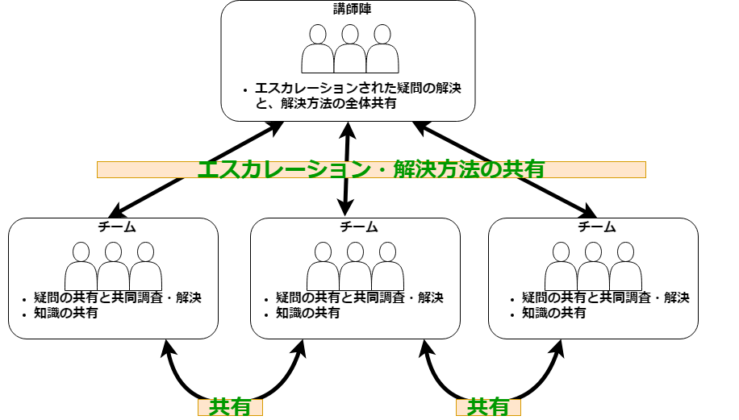
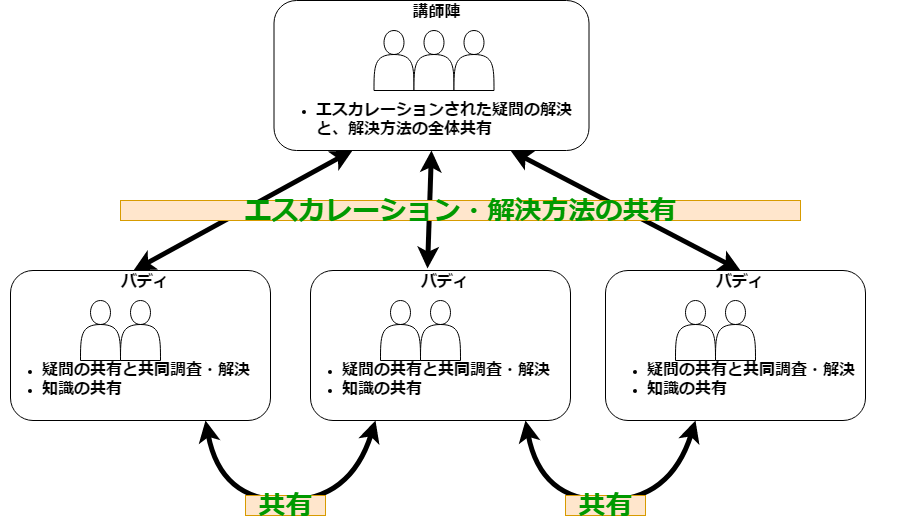

概要
==============================

本コースのルール
------------------------------

本コースでは以下のルール遵守を徹底します。

1. 講師の指示には原則必ず従う
1. ただし、意見や提案などで話し合いの結果、ルールの変更に合意が取れている場合は新ルールに従う

開発演習時のチーム
------------------------------

- 受講者3-4名でチームを作る
- 疑問点は一度チームで解決を試みる
- 解決できなかった問題は講師にエスカレーションする
- 明らかになった疑問や解決方法は全体で共有する

開発演習時以外でのチーム
------------------------------

- 受講者2名でチームを作る
- バディはお互いの理解度に責任を持つ
- 疑問点は一度バディと一緒に解決を試みる
- 解決できなかった問題は講師にエスカレーションする
- 明らかになった疑問や解決方法は全体で共有する

理解度テスト
------------------------------

必要とされるスキルをきちんと身に着けたかどうかを確認します。  
本コースでは以下の項目の最後に理解度テストを実施します。
  
- IT 基礎
- Linux基礎
- プログラミング
- オブジェクト指向プログラミング/デザインパターン
- データベースSQL基礎
- データベース設計基礎

項目の終わりに理解度テストを行います。  
テストの結果次第では**仮配属可**・**仮配属不可**の判断をします。  
(最終的な判断は各部門長に委ねられます) 

本コースの意図
------------------------------

本コースでは部分的にビデオコンテンツを使用します。

ビデオコンテンツを使用する意図

1. 受講者自ら予習復習ができる
1. 受講者それぞれのペースで学習を進めることができる
1. 仕事で新しい技術を学ぶ際にも、インターネット上から情報を探すことが多く、その練習のため

専門的なスキルを身に着けることはさることながら、「新しいスキルを習得する方法」を身に着けるよう心掛けてください。

コミュニケーションツール
------------------------------

- [Slack](https://slack.com)
    - [OCC Slack サイト](https://occ-corp.slack.com)
    - [チャンネル「team-freshman-57期」](https://app.slack.com/client/T0292CK02/C030EA1VBPC/user_profile/U01UNLJ7U5N)

- 疑問点、解決方法、有益情報、アイデアなどは Slack に書き込むようにしてください。そうすることで、情報を全体で共有することができます。
    - 例：`:question: 本研修はいつまでの予定ですか？`
