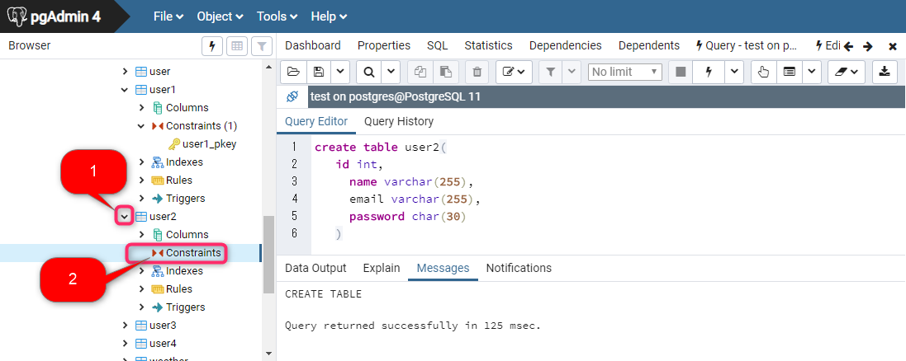
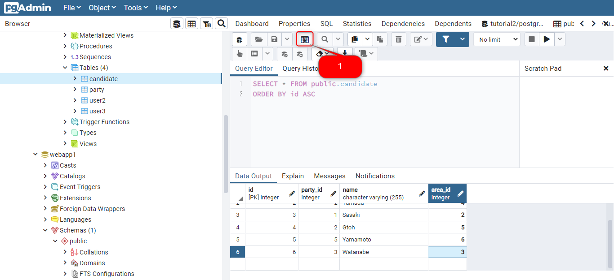

# SQL 基礎

## 事前準備

本教材は以下の環境を構築して使用します

- postgres 13.2 
    - [postgresql-13 をインストール](http://172.16.9.137/share/新入社員研修/software/postgresql-13.2-1-windows-x64.exe)、もしくは[オリジナルソースからpostgresql-13.2-1-windows-x64](https://www.postgresql.org/) をダウンロードします
        - GUIの管理ツールである pgadmin4 のインストールにチェックが入っていることを確認します。
    - [PostgreSQL を Windows にインストールするには](https://qiita.com/tom-sato/items/037b8f8cb4b326710f71) を参考にインストール、[PostgreSQLのダウンロード及びインストール方法](https://eng-entrance.com/postgresql-download-install)の**PATHの設定**を参考にPATHの設定を行います
    - ポートは `5432` とします
    - パスワードは `postgres` とします

## ビデオ版講義

- こちらの [資料](http://172.16.9.137/share/新入社員研修/教材/DB入門/SQL入門/) を使います [オリジナルソース](https://www.youtube.com/watch?v=j4kh9YBS7QU&list=PLXOP1_-wmgsAB9S0cgM2z3DCQTFoetEVB)

- SQL入門   レッスン01 SQL概要

    - [ビデオ教材](http://172.16.9.137/share/新入社員研修/教材/DB入門/SQL入門/SQL入門%20%20%20レッスン01%20SQL概要-j4kh9YBS7QU.mp4)

    - [オリジナルビデオ教材](https://www.youtube.com/watch?v=j4kh9YBS7QU&list=PLXOP1_-wmgsAB9S0cgM2z3DCQTFoetEVB)


- SQL入門   レッスン02 CREATE DATABASE

    - [ビデオ教材](http://172.16.9.137/share/新入社員研修/教材/DB入門/SQL入門/SQL入門%20%20%20レッスン02%20CREATE%20DATABASE-qMrK7EoU7xc.mp4)

    - [オリジナルビデオ教材](https://www.youtube.com/watch?v=qMrK7EoU7xc&list=PLXOP1_-wmgsAB9S0cgM2z3DCQTFoetEVB&index=2)

  - コマンドプロンプトからpostgres ユーザーでログインして、データベースに接続
    - ```psql -U postgres``` を入力して postgres ユーザーのパスワードを入力します
    
  - ビデオで実行しているSQL文リスト
  
  ```sql
  create database tutorial2;
  ```
    - `\c データベース名` でデータベースを切り替えできます
  
  機能 | MySQL | PostgreSQL 
  ------------ | ------------- | -------------
  テーブル一覧 | SHOW TABLES; | \dt
  テーブル情報の表示 | SHOW TABLE STATUS FROM データベース名; | \d テーブル名
  テーブル作成時のSQL文を表示 | SHOW CREATE TABLE テーブル名; | -
        
  - PostgreSQLは ```create if not exist``` 構文をサポートしていません

- SQL入門   レッスン03 DROP DATABASE

    - [ビデオ教材](http://172.16.9.137/share/新入社員研修/教材/DB入門/SQL入門/SQL入門%20%20%20レッスン03%20DROP%20DATABASE-RLK1QaNODd0.mp4)

    - [オリジナルビデオ教材](https://www.youtube.com/watch?v=RLK1QaNODd0&list=PLXOP1_-wmgsAB9S0cgM2z3DCQTFoetEVB&index=3)

  - ビデオで実行しているSQL文リスト
  
  ```sql
  drop database tutorial2;
  ```
  
- SQL入門   レッスン04 USE

    - [ビデオ教材](http://172.16.9.137/share/新入社員研修/教材/DB入門/SQL入門/SQL入門%20%20%20レッスン04%20USE-pYBbv3fJRXs.mp4)

    - [オリジナルビデオ教材](https://www.youtube.com/watch?v=pYBbv3fJRXs&list=PLXOP1_-wmgsAB9S0cgM2z3DCQTFoetEVB&index=4)

  - postgreSQLはUSE 構文をサポートしていません
  - PostgreSQL では以下の手順でデータベースを表示します
    - コマンドプロンプトを開いて以下を入力します
      - ```psql -U postgres``` を入力して postgres ユーザーのパスワードを入力します
        - ログインしたら、`\l` と入力してテーブル一覧表示します。

        機能 | MySQL | PostgreSQL 
        ------------ | ------------- | -------------
        データベース一覧を表示 | SHOW DATABSES | \l

        - ビデオで実行しているコマンド
          ```sql 
          \l
          ```

- SQL入門   SQL入門   レッスン05 データ型

    - [ビデオ教材](http://172.16.9.137/share/新入社員研修/教材/DB入門/SQL入門/SQL入門%20%20%20レッスン05%20データ型-x8bgefVA1ks.mp4)

    - [オリジナルビデオ教材](https://www.youtube.com/watch?v=x8bgefVA1ks&index=5&list=PLXOP1_-wmgsAB9S0cgM2z3DCQTFoetEVB)

- SQL入門   レッスン06 固定長と可変長

    - [ビデオ教材](http://172.16.9.137/share/新入社員研修/教材/DB入門/SQL入門/SQL入門%20%20%20レッスン06%20固定長と可変長-6qn0S7PuDqk.mp4)

    - [オリジナルビデオ教材](https://www.youtube.com/watch?v=6qn0S7PuDqk&list=PLXOP1_-wmgsAB9S0cgM2z3DCQTFoetEVB&index=6)

  - char(n) varchar(n) の n は文字数
- SQL入門   レッスン7 Constrain

    - [ビデオ教材](http://172.16.9.137/share/新入社員研修/教材/DB入門/SQL入門/SQL入門%20%20%20レッスン07%20Constrain-OSA_Ek7UHTs.mp4)

    - [オリジナルビデオ教材](https://www.youtube.com/watch?v=OSA_Ek7UHTs&index=7&list=PLXOP1_-wmgsAB9S0cgM2z3DCQTFoetEVB)
     
- SQL入門   レッスン08 CREATE TABLE

    - [ビデオ教材](http://172.16.9.137/share/新入社員研修/教材/DB入門/SQL入門/SQL入門%20%20%20レッスン08%20CREATE%20TABLE-Tl9gvy_OcU8.mp4)

    - [オリジナルビデオ教材](https://www.youtube.com/watch?v=Tl9gvy_OcU8&index=8&list=PLXOP1_-wmgsAB9S0cgM2z3DCQTFoetEVB)

  - "user" は postgreSQLでは予約語です。予約後であるためそのままでは使用できません。使用するためにはダブルクォテーション「"」をつけて表記しなくてはいけません。毎回ダブルクォテーション「"」をつけるのは繁雑であるため user1 に変更します
  
  - ビデオで実行しているSQL文リスト
   ```sql 
   create table user1(
   id int primary key,
	 name varchar(255),
	 email varchar(255),
	 password char(30)
   )
   
   create table user2(
   id int,
	 name varchar(255),
	 email varchar(255),
	 password char(30)
   ) 
   
   create table user1(
   id int primary key,
   name varchar(255)
   )
   ```
   - pgadmin から主キーをチェック
     - user2 テーブルが作成されていることを確認して をクリックします。
       の Constraints の下に primary key がないのを確認します。
       
     
- SQL入門   レッスン09 SHOW TABLES

    - [ビデオ教材](http://172.16.9.137/share/新入社員研修/教材/DB入門/SQL入門/SQL入門%20%20%20レッスン09%20SHOW%20TABLES-SL5NhsVGTeY.mp4)

    - [オリジナルビデオ教材](https://www.youtube.com/watch?v=SL5NhsVGTeY&list=PLXOP1_-wmgsAB9S0cgM2z3DCQTFoetEVB&index=9)

  - ビデオで実行しているSQL文リスト
   ```sql 
   \dt
   \d tutorial
   ```
   
  - コマンド比較表
  
   機能 | MySQL | PostgreSQL 
   ------------ | ------------- | -------------
   テーブル一覧 | SHOW TABLES; | \dt
   テーブル情報の表示 | SHOW TABLE STATUS FROM データベース名; | -
   テーブル作成時のSQL文を表示 | SHOW CREATE TABLE テーブル名; | -
	
  - テーブル一覧を表示するコマンドを入力
    - コマンドプロンプトからpostgres ユーザーでログインして、データベースに接続
      - ```psql -U postgres -d データベース名``` 
        - データベース接続先を変えたい場合は ```\connect データベース名```
        - ```\dt``` 
  - pgadmin からでも実行できます。
     ```SELECT * FROM pg_catalog.pg_tables;```

- SQL入門   レッスン10 DROP TABLE

    - [ビデオ教材](http://172.16.9.137/share/新入社員研修/教材/DB入門/SQL入門/SQL入門%20%20%20レッスン10%20DROP%20TABLE-dwm9lrKGsGs.mp4)

    - [オリジナルビデオ教材](https://www.youtube.com/watch?v=dwm9lrKGsGs&list=PLXOP1_-wmgsAB9S0cgM2z3DCQTFoetEVB&index=10)

  - ビデオで実行しているSQL文リスト
   ```sql 
   create table user6(
   id int primary key,
   "u name" varchar(30)
   )
   
   drop table user2;
   drop table user6;
   ```
   
  - Postgres ではカラム名に日本語つけても文字化けしません。 
  - Postgres でカラム名に日本語を含める場合には`` ではなく "" を使います。 

- SQL入門   レッスン11 ALTER TABLE

    - [ビデオ教材](http://172.16.9.137/share/新入社員研修/教材/DB入門/SQL入門/SQL入門%20%20%20レッスン11%20ALTER%20TABLE-KUltvDjKXzQ.mp4)

    - [オリジナルビデオ教材](https://www.youtube.com/watch?v=KUltvDjKXzQ&index=11&list=PLXOP1_-wmgsAB9S0cgM2z3DCQTFoetEVB)

  
  - ビデオで実行しているSQL文リスト 
   ```sql 
   alter table user1 add address varchar(255);
   alter table user1 rename u_name to name
   ```
  - postgres でテーブル名の変更は「コマンド比較表」の通りです。
    - コマンド比較表
  
    機能 | MySQL | PostgreSQL 
    ------------ | ------------- | -------------
    テーブル名の変更 | alter table 旧テーブル名 RENAME 新テーブル名; もしくは、 RENAME TABLE 旧テーブル名 TO 新テーブル名; | alter table 旧テーブル名 rename to 新テーブル名
    列定義を変更 | alter table テーブル名 modify 列名 データ型; | alter table テーブル名 alter column 列名 type データ型
    列名を変更 | alter table テーブル名 change column 旧カラム名 新カラム名 データ型 | ALTER TABLE user2 RENAME address3 TO address2
    複数列の削除 | alter table テーブル名 drop column 列名1, 列名2; | alter table テーブル名 drop column 列名1, drop column 列名2

- SQL入門   レッスン12 

    - [ビデオ教材](http://172.16.9.137/share/新入社員研修/教材/DB入門/SQL入門/SQL入門%20%20%20レッスン12%20INSERT%20DATA-vBP6Y77O2iA.mp4)

    - [オリジナルビデオ教材](https://www.youtube.com/watch?v=vBP6Y77O2iA&list=PLXOP1_-wmgsAB9S0cgM2z3DCQTFoetEVB&index=12)
    
  - ビデオを見る前に pgadmin の query で sql 文を実行
   ```sql
   alter table user1 add column age integer;
   ```
 
   - ビデオで実行しているSQL文リスト
   ```sql 
   insert into user1(id,name,email,password,age)
   values(2,'山田太', 'yamada@email.com',1234456,32);
   insert into user1(id, name) values(3, '田中吾郎')
   ```
  - コマンド比較表
  
  機能 | MySQL | PostgreSQL 
  ------------ | ------------- | -------------
  データの入力 | insert into テーブル名(列名1, 列名1) values("value1", "value2") | insert into テーブル名(列名1, 列名1) values (value1, value2) 
  - pgadmin を起動してテーブルにデータが入力されていることを確認します。
    - [テーブルにデータを入力する](https://itsakura.com/pgadmin4-db-create#s8) の1,2 を参考にデータ入力されていることを確認します。

- SQL入門   レッスン13 SELECT文

    - [ビデオ教材](http://172.16.9.137/share/新入社員研修/教材/DB入門/SQL入門/SQL入門%20%20%20レッスン13%20SELECT文-PkOB_-BcV3E.mp4)

    - [オリジナルビデオ教材](https://www.youtube.com/watch?v=PkOB_-BcV3E&list=PLXOP1_-wmgsAB9S0cgM2z3DCQTFoetEVB&index=13)

  - ビデオを見る前に pgadmin の query で sql 文を実行
  ```sql 
  insert into user1(id, name, email, password, age) values(4, '大西秀宜', 'oonishi@email.com', '7845455', 24);
  ```
  
  - ビデオで実行しているSQL文リスト
   
   ```sql 
   select id, name from user1;
   select name, email from user1;
   select email, name from user1;
   select * from user1;
   select id, name, email
   from user1;
   ```
   
- SQL入門   レッスン14

    - [ビデオ教材](http://172.16.9.137/share/新入社員研修/教材/DB入門/SQL入門/SQL入門%20%20%20レッスン14%20WHERE-f7i9pHwuWtk.mp4)

    - [オリジナルビデオ教材](https://www.youtube.com/watch?v=f7i9pHwuWtk&list=PLXOP1_-wmgsAB9S0cgM2z3DCQTFoetEVB&index=14)

  - ビデオを見る前に pgadmin の query で sql 文を実行 

  ```sql
  drop table user1;
  create table user1(
    id int primary key,
    name varchar(255),
    email varchar(255),
    password char(30),
    age integer,
    salary integer
  );

  insert into user1(id, name, email, password, age, salary) values(1, '鈴木一郎', 'suzuki@email.com', '123456789', 22, 5840000);
  insert into user1(id, name, email, password, age, salary) values(2, '山田太郎', 'yamada@email.com', '1234456', 32, 4200000);
  insert into user1(id, name, email, password, age, salary) values(3, '田中吾郎', 'tanaka@email.com', '6665456', 44, 3120000);
  insert into user1(id, name, email, password, age, salary) values(4, '大西秀宜', 'oonishi@email.com', '7845455', 24, 2980000);
  insert into user1(id, name, email, password, age, salary) values(5, '山村昭彦', 'yamamura@email.com', '45123345', 28, 8450000);
  insert into user1(id, name, email, password, age, salary) values(6, '村上晴彦', 'murakami@email.com', '7484541', 38, 12545000);
  insert into user1(id, name, email, password, age, salary) values(7, '小池陽子', 'koike@email.com', '4517545', 42, 6245250);
  insert into user1(id, name, email, password, age, salary) values(8, '安部沙織', 'abe@email.com', '7484555', 58, 7689250);
  insert into user1(id, name, email, password, age, salary) values(9, '前川博', 'maekawa@email.com', '495645', 29, 3178000);
  insert into user1(id, name, email, password, age, salary) values(10, '足立康史', 'adachi@email.com', '885477', 18, 4963200);
  insert into user1(id, name, email, password, age, salary) values(11, '高木弘樹', 'takagi@email.com', '965656', 39, 4921500);
  ```


  - ビデオで実行しているSQL文リスト
   
   ```sql 
   select * from user1 where age > 38;
   select * from user1 where age = 38;
   select * from user1 where age <> 38;
   select * from user1 where salary <> 5840000;
   select * from user1 where salary > 5840000;
   select * from user1 where salary >= 5840000;
   ```
   
- SQL入門   レッスン15

    - [ビデオ教材](http://172.16.9.137/share/新入社員研修/教材/DB入門/SQL入門/SQL入門%20%20%20レッスン15%20ANDとOR-Uv_Y5QTBl8U.mp4)

    - [オリジナルビデオ教材](https://www.youtube.com/watch?v=Uv_Y5QTBl8U&list=PLXOP1_-wmgsAB9S0cgM2z3DCQTFoetEVB&index=15)

  - ビデオで実行しているSQL文リスト
   
   ```sql 
   select * from user1 where age > 25 and salary > 3000000;
   select * from user1 where age > 25 and salary > 5000000;
   select * from user1 where age > 25 or salary > 5000000;
   ```
   
- SQL入門   レッスン16 LIKE

    - [ビデオ教材](http://172.16.9.137/share/新入社員研修/教材/DB入門/SQL入門/SQL入門%20%20%20レッスン16%20LIKE-7oPkfqsILfk.mp4)

    - [オリジナルビデオ教材](https://www.youtube.com/watch?v=7oPkfqsILfk&list=PLXOP1_-wmgsAB9S0cgM2z3DCQTFoetEVB&index=16)

  - ビデオで実行しているSQL文リスト
   
   ```sql 
   select * from user1 where name like '%山%';
   select * from user1 where name like '%彦%';
   select * from user1 where name like '%___彦%';
   select * from user1 where name like '%彦%';
   select * from user1 where name like '田%';
   select * from user1 where name not like '%田%';
   ```
   
   
  - SQL 比較表

    機能 | MySQL | PostgreSQL 
    ------------ | ------------- | -------------
    like 条件 | select * from user where name like "%山%" | select * from user1 where name like '%山%'

- SQL入門   レッスン17

    - [ビデオ教材](http://172.16.9.137/share/新入社員研修/教材/DB入門/SQL入門/SQL入門%20%20%20レッスン17%20BETWEEN-PvRc_i9uUY4.mp4)

    - [オリジナルビデオ教材](https://www.youtube.com/watch?v=PvRc_i9uUY4&list=PLXOP1_-wmgsAB9S0cgM2z3DCQTFoetEVB&index=17)

  - ビデオで実行しているSQL文リスト
   
   ```sql 
   select * from user1 where age between 28 and 48;
   select * from user1 where age not between 28 and 48;
   select * from user1 where age between 28 and 48 and salary > 5000000;
   ```

- SQL入門   レッスン18

    - [ビデオ教材](http://172.16.9.137/share/新入社員研修/教材/DB入門/SQL入門/SQL入門%20%20%20レッスン18%20IS%20NULL-eT2pEUp818w.mp4)

    - [オリジナルビデオ教材](https://www.youtube.com/watch?v=eT2pEUp818w&list=PLXOP1_-wmgsAB9S0cgM2z3DCQTFoetEVB&index=18)

  - ビデオを見る前に pgadmin の query で sql 文を実行 
  
    ```sql
    insert into user1(id, email, password, age, salary) values(12, 'sakaguchi@email.com', '8654794', 36, 7452000);
    insert into user1(id, name, email, password, age, salary) values(13, '大山博', 'ooyama@email.com', '4745455', 48, 4756000);
    insert into user1(id, name, email, password, age, salary) values(14, '', 'konishi@email.com', '1112233', 41, 8612000);
    ```

  - ビデオで実行しているSQL文リスト
   
   ```sql 
    select * from user1 where name is null;
    select * from user1 where name = '';
    select * from user1 where name = '' or name is null
   ```
   

 
    機能 | MySQL | PostgreSQL 
    ------------ | ------------- | -------------
    name が空白を抽出 | select * from user1 where name = "" or name is null; | select * from user1 where name = '';
    name が空白 or nullを抽出 | select * from user where name = "" or name is null; | select * from user1 where name = '' or name is null

- SQL入門   レッスン19 IN

    - [ビデオ教材](http://172.16.9.137/share/新入社員研修/教材/DB入門/SQL入門/SQL入門%20%20%20レッスン19%20IN--Q79jMWOMzg.mp4)

    - [オリジナルビデオ教材](https://www.youtube.com/watch?v=-Q79jMWOMzg&list=PLXOP1_-wmgsAB9S0cgM2z3DCQTFoetEVB&index=19)

  - ビデオで実行しているSQL文リスト
   
   ```sql 
    select * from user1 where age in (28, 38, 48);
    select * from user1 where age not in (28, 38, 48);
    select * from user1 where age > 30 limit 3;
   ```
   

- SQL入門   レッスン20 LIMIT

    - [ビデオ教材](http://172.16.9.137/share/新入社員研修/教材/DB入門/SQL入門/SQL入門%20%20%20レッスン20%20LIMIT-tI-ghaUsK28.mp4)

    - [オリジナルビデオ教材](https://www.youtube.com/watch?v=tI-ghaUsK28&list=PLXOP1_-wmgsAB9S0cgM2z3DCQTFoetEVB&index=20)

  - ビデオで実行しているSQL文リスト
   
   ```sql 
    select * from user1 limit 3 offset 3;
    select * from user1 limit 3 offset 6;
    
   ```


  - SQL 比較表

    機能 | MySQL | PostgreSQL 
    ------------ | ------------- | -------------
    データの入力 | select カラム名, ... from テーブル名 limit 開始位置, 行数; | select カラム名, ... from テーブル名 limit 行数 offset 開始位置
    
   
    
- SQL入門   レッスン21 DISTINCT

    - [ビデオ教材](http://172.16.9.137/share/新入社員研修/教材/DB入門/SQL入門/SQL入門%20%20%20レッスン21%20DISTINCT-Ug67baxAqRU.mp4)

    - [オリジナルビデオ教材](https://www.youtube.com/watch?v=Ug67baxAqRU&list=PLXOP1_-wmgsAB9S0cgM2z3DCQTFoetEVB&index=21)
  
  - ビデオを見る前に pgadmin の query で sql 文を実行
  
  ```sql
  insert into user1(id, name, email, password, age, salary) values(15, '大山博', 'ooyama@email.com', '4745455', 48, 4756000);
  insert into user1(id, name, email, password, age, salary) values(16, '大山博', 'ooyama@gmail.com', '4745455', 48, 4756000);
  ```

  - ビデオで実行しているSQL文リスト
   
   ```sql 
    select distinct name from user1;
    select distinct name, email from user1;
   ```
   
- SQL入門   レッスン22 ORDER BY

    - [ビデオ教材](http://172.16.9.137/share/新入社員研修/教材/DB入門/SQL入門/SQL入門%20%20%20レッスン22%20ORDER%20BY--73vVIXt-FI.mp4)

    - [オリジナルビデオ教材](https://www.youtube.com/watch?v=-73vVIXt-FI&list=PLXOP1_-wmgsAB9S0cgM2z3DCQTFoetEVB&index=22)

  - ビデオを見る前に pgadmin の query で sql 文を実行 
  ```sql
  insert into user1(id, name, email, password, age, salary) values(17, '青山孝史', 'aoyama@email.com', '8845666', 58, 8456000);
  ```

  - ビデオで実行しているSQL文リスト
   
   ```sql 
    select * from user1 order by age;
    select * from user1 order by age desc;
    select * from user1 order by age desc, salary;
    select * from user1 order by age desc, salary desc;
   ```
   
- SQL入門   レッスン23 AS

    - [ビデオ教材](http://172.16.9.137/share/新入社員研修/教材/DB入門/SQL入門/SQL入門%20%20%20レッスン23%20AS-hdj4QhVD3p8.mp4)

    - [オリジナルビデオ教材](https://www.youtube.com/watch?v=hdj4QhVD3p8&list=PLXOP1_-wmgsAB9S0cgM2z3DCQTFoetEVB&index=23)

  - ビデオを見る前に pgadmin の query で sql 文を実行 

  ```sql
  CREATE TABLE user2 (
    id int primary key,
    ser_name varchar(255),
    name varchar(255),
    email varchar(255),
    password char(30),
    age integer,
    salary integer,
    branch varchar(255)
  );
  insert into user2(id, ser_name, name, email, password, age, salary, branch) values(1, '鈴木', '一郎', 'suzuki@email.com', '123456789', 22, 5840000, 'Tokyo');
  insert into user2(id, ser_name, name, email, password, age, salary, branch) values(2, '山田', '太郎', 'yamada@email.com', '1234456', 32, 4200000, 'Osaka');
  insert into user2(id, ser_name, name, email, password, age, salary, branch) values(3, '田中', '吾郎', 'tanaka@email.com', '6665456', 44, 3120000, 'Nagoya');
  insert into user2(id, ser_name, name, email, password, age, salary, branch) values(4, '大西', '秀宜', 'oonishi@email.com', '7845455', 24, 2980000, 'Osaka');
  insert into user2(id, ser_name, name, email, password, age, salary, branch) values(5, '山村', '昭彦', 'yamamura@email.com', '45123345', 28, 8450000, 'Tokyo');
  insert into user2(id, ser_name, name, email, password, age, salary, branch) values(6, '村上', '晴彦', 'murakami@email.com', '7484541', 38, 12545000, 'Osaka');
  insert into user2(id, ser_name, name, email, password, age, salary, branch) values(7, '小池', '陽子', 'koike@email.com', '4517545', 42, 6245250, 'Tokyo');
  insert into user2(id, ser_name, name, email, password, age, salary, branch) values(8, '安部', '沙織', 'abe@email.com', '7484555', 58, 7689250, 'Tokyo');
  insert into user2(id, ser_name, name, email, password, age, salary, branch) values(9, '前川', '博', 'maekawa@email.com', '495645', 29, 3178000, 'Nagoya');
  insert into user2(id, ser_name, name, email, password, age, salary, branch) values(10, '足立', '康史', 'adachi@email.com', '885477', 18, 4963200, 'Tokyo');
  insert into user2(id, ser_name, name, email, password, age, salary, branch) values(11, '高木', '弘樹', 'takagi@email.com', '965656', 39, 4921500, 'Osaka');
  insert into user2(id, ser_name, email, password, age, salary, branch) values(12, '', 'sakaguchi@email.com', '8654794', 36, 7452000, 'Osaka');
  insert into user2(id, ser_name, name, email, password, age, salary, branch) values(13, '大山', '博', 'ooyama@email.com', '4745455', 48, 4756000, 'Tokyo');
  insert into user2(id, name, email, password, age, salary, branch) values(14, '', 'konishi@email.com', '1112233', 41, 8612000, 'Osaka');
  insert into user2(id, ser_name, name, email, password, age, salary, branch) values(15, '大山', '博', 'ooyama@email.com', '4745455', 48, 4756000, 'Nagoya');
  insert into user2(id, ser_name, name, email, password, age, salary, branch) values(16, '大山', '博', 'ooyama@gmail.com', '4745455', 48, 4756000, 'Osaka');
  insert into user2(id, ser_name, name, email, password, age, salary, branch) values(17, '青山', '孝史', 'aoyama@email.com', '8845666', 58, 8456000, 'Tokyo');
  ```
  
  - ビデオで実行しているSQL文リスト
   
   ```sql 
   select name from user1;
   select name as "Name" from user1;
   select salary, (salary - salary*0.1) as "NetSalary" from user1;
   select salary, (salary - salary*0.1) as "NetSalary" from user1;
   select concat(ser_name, ' ', name) as "FullName" from user2;
   select concat_ws(' ', ser_name, name) as "FullName" from user2;
   select concat_ws('+', ser_name, name) as "FullName" from user2;
   ```
   
  - SQL 比較表

  機能 | MySQL | PostgreSQL 
  ------------ | ------------- | -------------
  as 句 | select name as Name from user | select name as "Name" from user1;
  as 句 |  select salary, (salary - salary * 0.1) as NetSalary from user1; | select salary, (salary - salary * 0.1) as "NetSalary" from user1;
  as 句 | select salary, (salary - salary * 0.1) as NetSalary from user1; | select salary, (salary - salary * 0.1) as "NetSalary" from user1;
  as 句 | select concat(ser_name, ' ', name) as FullName from user2; | select concat(ser_name, ' ', name) as "FullName" from user2;
  concat_ws | select concat_ws(" ", ser_name,  name) as FullName from user2 | select concat_ws(' ', ser_name, name) as "FullName" from user2
  concat_ws | select concat_ws(" ", ser_name,  name) as FullName from user2 | select concat_ws('+', ser_name, name) as "FullName" from user2

- SQL入門   レッスン24 GROUP BY

    - [ビデオ教材](http://172.16.9.137/share/新入社員研修/教材/DB入門/SQL入門/SQL入門%20%20%20レッスン24%20GROUP%20BY-gK99AGqnlz8.mp4)

    - [オリジナルビデオ教材](https://www.youtube.com/watch?v=gK99AGqnlz8&list=PLXOP1_-wmgsAB9S0cgM2z3DCQTFoetEVB&index=24)

  - ビデオで実行しているSQL文リスト
   
   ```sql 
   select branch as branch, count(*) as number from user2 group by branch;
   select branch as branch, sum(salary) as "Salary_SUM" from user2 group by branch; 
   select branch as branch, avg(salary) as "Salary_SUM" from user2 group by branch; 
   ```
   
   - SQL 比較表

  機能 | MySQL | PostgreSQL 
  ------------ | ------------- | -------------
  branch 事の人数を数える | select branch as branch, count(*) as number from user2 group by branch; | select branch as branch, count(*) as number from user2 group by branch;
  branch 事に合計の売上を出す | select branch as branch, sum(salary) as Salary_SUM from user2 group by branch;  | select branch as branch, sum(salary) as "Salary_SUM" from user2 group by branch; 
  branch 事に平均の売上を出す | select branch as branch, avg(salary) as Salary_AVG from user2 group by branch;  | select branch as branch, avg(salary) as "Salary_AVG" from user2 group by branch; 
  
  
  
- SQL入門   レッスン25 DESC

    - [ビデオ教材](http://172.16.9.137/share/新入社員研修/教材/DB入門/SQL入門/SQL入門%20%20%20レッスン25%20DESC-XVYdEPZKXZE.mp4)

    - [オリジナルビデオ教材](https://www.youtube.com/watch?v=XVYdEPZKXZE&list=PLXOP1_-wmgsAB9S0cgM2z3DCQTFoetEVB&index=25)
    
    - PostgreSQL は DESC をサポートしていませんのでこのレッスンは飛ばします。

- SQL入門   レッスン26 HAVING

    - [ビデオ教材](http://172.16.9.137/share/新入社員研修/教材/DB入門/SQL入門/SQL入門%20%20%20レッスン26%20HAVING-ZAwXQQQ_P8U.mp4)

    - [オリジナルビデオ教材](https://www.youtube.com/watch?v=ZAwXQQQ_P8U&list=PLXOP1_-wmgsAB9S0cgM2z3DCQTFoetEVB&index=26)


  - ビデオで実行しているSQL文リスト
   
   ```sql 
   select branch as "Branch", avg(salary) as "Salary_AVG" from user2 group by branch
   select branch as "Branch", avg(salary) as "Salary_AVG" from user2 group by branch having avg(salary) > 5000000
   ```


  - コマンド比較表
  
    機能 | MySQL | PostgreSQL 
    ------------ | ------------- | -------------
    group by を使ってグループ化 | select branch as Branch, avg(salary) as Salary_AVG from user2 group by branch; | select branch as "Branch", avg(salary) as "Salary_AVG" from user2 group by branch
    group by と having を使ってグループ化した後の絞り込み| select branch as Branch, avg(salary) as Salary_AVG from user2 group by branch having avg(salary) > 5000000; | select branch as "Branch", avg(salary) as "Salary_AVG" from user3 group by branch having avg(salary) > 5000000


- SQL入門   レッスン27 UPDATE

    - [ビデオ教材](http://172.16.9.137/share/新入社員研修/教材/DB入門/SQL入門/SQL入門%20%20%20レッスン27%20UPDATE-MFwU28IcfzY.mp4)

    - [オリジナルビデオ教材](https://www.youtube.com/watch?v=MFwU28IcfzY&list=PLXOP1_-wmgsAB9S0cgM2z3DCQTFoetEVB&index=27)


  - ビデオで実行しているSQL文リスト
   
   ```sql 
   update user2 set age=age+1 where id=2;
   update user2 set age=age+1;
   ```
   
- SQL入門   レッスン28 DELETE

    - [ビデオ教材](http://172.16.9.137/share/新入社員研修/教材/DB入門/SQL入門/SQL入門%20%20%20レッスン28%20DELETE-yyXNZJYJ_uk.mp4)

    - [オリジナルビデオ教材](https://www.youtube.com/watch?v=yyXNZJYJ_uk&list=PLXOP1_-wmgsAB9S0cgM2z3DCQTFoetEVB&index=28)


 - ビデオを見る前に pgadmin の query で sql 文を実行 

  ```sql
  CREATE TABLE user3 (
    id int primary key,
    ser_name varchar(255),
    name varchar(255),
    email varchar(255),
    password char(30),
    age integer,
    salary integer,
    branch varchar(255)
  );
  insert into user3(id, ser_name, name, email, password, age, salary, branch) values(1, '鈴木', '一郎', 'suzuki@email.com', '123456789', 22, 5840000, 'Tokyo');
  insert into user3(id, ser_name, name, email, password, age, salary, branch) values(2, '山田', '太郎', 'yamada@email.com', '1234456', 32, 4200000, 'Osaka');
  insert into user3(id, ser_name, name, email, password, age, salary, branch) values(3, '田中', '吾郎', 'tanaka@email.com', '6665456', 44, 3120000, 'Nagoya');
  insert into user3(id, ser_name, name, email, password, age, salary, branch) values(4, '大西', '秀宜', 'oonishi@email.com', '7845455', 24, 2980000, 'Osaka');
  insert into user3(id, ser_name, name, email, password, age, salary, branch) values(5, '山村', '昭彦', 'yamamura@email.com', '45123345', 28, 8450000, 'Tokyo');
  insert into user3(id, ser_name, name, email, password, age, salary, branch) values(6, '村上', '晴彦', 'murakami@email.com', '7484541', 38, 12545000, 'Osaka');
  insert into user3(id, ser_name, name, email, password, age, salary, branch) values(7, '小池', '陽子', 'koike@email.com', '4517545', 42, 6245250, 'Tokyo');
  insert into user3(id, ser_name, name, email, password, age, salary, branch) values(8, '安部', '沙織', 'abe@email.com', '7484555', 58, 7689250, 'Tokyo');
  insert into user3(id, ser_name, name, email, password, age, salary, branch) values(9, '前川', '博', 'maekawa@email.com', '495645', 29, 3178000, 'Nagoya');
  insert into user3(id, ser_name, name, email, password, age, salary, branch) values(10, '足立', '康史', 'adachi@email.com', '885477', 18, 4963200, 'Tokyo');
  insert into user3(id, ser_name, name, email, password, age, salary, branch) values(11, '高木', '弘樹', 'takagi@email.com', '965656', 39, 4921500, 'Osaka');
  insert into user3(id, ser_name, email, password, age, salary, branch) values(12, '', 'sakaguchi@email.com', '8654794', 36, 7452000, 'Osaka');
  insert into user3(id, ser_name, name, email, password, age, salary, branch) values(13, '大山', '博', 'ooyama@email.com', '4745455', 48, 4756000, 'Tokyo');
  insert into user3(id, name, email, password, age, salary, branch) values(14, '', 'konishi@email.com', '1112233', 41, 8612000, 'Osaka');
  insert into user3(id, ser_name, name, email, password, age, salary, branch) values(15, '大山', '博', 'ooyama@email.com', '4745455', 48, 4756000, 'Nagoya');
  insert into user3(id, ser_name, name, email, password, age, salary, branch) values(16, '大山', '博', 'ooyama@gmail.com', '4745455', 48, 4756000, 'Osaka');
  insert into user3(id, ser_name, name, email, password, age, salary, branch) values(17, '青山', '孝史', 'aoyama@email.com', '8845666', 58, 8456000, 'Tokyo');
  ```
  
  - ビデオで実行しているSQL文リスト
   
   ```sql 
   delete from user3 where id = 9;
   delete from user3 where age > 50;
   delete from user3;
   ```
   
- SQL入門   レッスン29 TRUNCATE

    - [ビデオ教材](http://172.16.9.137/share/新入社員研修/教材/DB入門/SQL入門/SQL入門%20%20%20レッスン29%20TRUNCATE-A-IFExfTrVQ.mp4)

    - [オリジナルビデオ教材](https://www.youtube.com/watch?v=A-IFExfTrVQ&list=PLXOP1_-wmgsAB9S0cgM2z3DCQTFoetEVB&index=29)


  - ビデオを見る前に pgadmin の query で sql 文を実行 

  ```sql
  CREATE TABLE user3 (
    id int primary key,
    ser_name varchar(255),
    name varchar(255),
    email varchar(255),
    password char(30),
    age integer,
    salary integer,
    branch varchar(255)
  );
  insert into user3(id, ser_name, name, email, password, age, salary, branch) values(1, '鈴木', '一郎', 'suzuki@email.com', '123456789', 22, 5840000, 'Tokyo');
  insert into user3(id, ser_name, name, email, password, age, salary, branch) values(2, '山田', '太郎', 'yamada@email.com', '1234456', 32, 4200000, 'Osaka');
  insert into user3(id, ser_name, name, email, password, age, salary, branch) values(3, '田中', '吾郎', 'tanaka@email.com', '6665456', 44, 3120000, 'Nagoya');
  insert into user3(id, ser_name, name, email, password, age, salary, branch) values(4, '大西', '秀宜', 'oonishi@email.com', '7845455', 24, 2980000, 'Osaka');
  insert into user3(id, ser_name, name, email, password, age, salary, branch) values(5, '山村', '昭彦', 'yamamura@email.com', '45123345', 28, 8450000, 'Tokyo');
  insert into user3(id, ser_name, name, email, password, age, salary, branch) values(6, '村上', '晴彦', 'murakami@email.com', '7484541', 38, 12545000, 'Osaka');
  insert into user3(id, ser_name, name, email, password, age, salary, branch) values(7, '小池', '陽子', 'koike@email.com', '4517545', 42, 6245250, 'Tokyo');
  insert into user3(id, ser_name, name, email, password, age, salary, branch) values(8, '安部', '沙織', 'abe@email.com', '7484555', 58, 7689250, 'Tokyo');
  insert into user3(id, ser_name, name, email, password, age, salary, branch) values(9, '前川', '博', 'maekawa@email.com', '495645', 29, 3178000, 'Nagoya');
  insert into user3(id, ser_name, name, email, password, age, salary, branch) values(10, '足立', '康史', 'adachi@email.com', '885477', 18, 4963200, 'Tokyo');
  insert into user3(id, ser_name, name, email, password, age, salary, branch) values(11, '高木', '弘樹', 'takagi@email.com', '965656', 39, 4921500, 'Osaka');
  insert into user3(id, ser_name, email, password, age, salary, branch) values(12, '', 'sakaguchi@email.com', '8654794', 36, 7452000, 'Osaka');
  insert into user3(id, ser_name, name, email, password, age, salary, branch) values(13, '大山', '博', 'ooyama@email.com', '4745455', 48, 4756000, 'Tokyo');
  insert into user3(id, name, email, password, age, salary, branch) values(14, '', 'konishi@email.com', '1112233', 41, 8612000, 'Osaka');
  insert into user3(id, ser_name, name, email, password, age, salary, branch) values(15, '大山', '博', 'ooyama@email.com', '4745455', 48, 4756000, 'Nagoya');
  insert into user3(id, ser_name, name, email, password, age, salary, branch) values(16, '大山', '博', 'ooyama@gmail.com', '4745455', 48, 4756000, 'Osaka');
  insert into user3(id, ser_name, name, email, password, age, salary, branch) values(17, '青山', '孝史', 'aoyama@email.com', '8845666', 58, 8456000, 'Tokyo');
  ```
  
  - ビデオで実行しているSQL文リスト
   
   ```sql 
   truncate table user3;
   
   ```
   
  
- SQL入門   レッスン30 他のテーブルデータを追加

    - [ビデオ教材](http://172.16.9.137/share/新入社員研修/教材/DB入門/SQL入門/SQL入門%20%20%20レッスン30%20他のテーブルデータを追加-4B3_0W62ezo.mp4)

    - [オリジナルビデオ教材](https://www.youtube.com/watch?v=4B3_0W62ezo&list=PLXOP1_-wmgsAB9S0cgM2z3DCQTFoetEVB&index=30)

  - ビデオを見る前に pgadmin の query で sql 文を実行 
  ```sql
    drop table user2;
    CREATE TABLE user3 (
    id int Primary key,
    ser_name varchar(255),
    name varchar(255),
    email varchar(255),
    password char(30),
    age integer,
    salary integer,
    branch varchar(255)
    );
  insert into user3(id, ser_name, name, email, password, age, salary, branch) values(201, '鈴木', '一郎', 'suzuki@email.com', '123456789', 23, 5840000, 'Tokyo');
  insert into user3(id, ser_name, name, email, password, age, salary, branch) values(202, '山田', '太郎', 'yamada@email.com', '1234456', 35, 4200000, 'Osaka');
  insert into user3(id, ser_name, name, email, password, age, salary, branch) values(203, '田中', '吾郎', 'tanaka@email.com', '6665456', 45, 3120000, 'Nagoya');
  insert into user3(id, ser_name, name, email, password, age, salary, branch) values(204, '大西', '秀宜', 'oonishi@email.com', '7845455', 25, 2980000, 'Osaka');
  insert into user3(id, ser_name, name, email, password, age, salary, branch) values(205, '山村', '昭彦', 'yamamura@email.com', '45123345', 29, 8450000, 'Tokyo');
  insert into user3(id, ser_name, name, email, password, age, salary, branch) values(206, '村上', '晴彦', 'murakami@email.com', '7484541', 39, 12545000, 'Osaka');
  insert into user3(id, ser_name, name, email, password, age, salary, branch) values(207, '小池', '陽子', 'koike@email.com', '4517545', 43, 6245250, 'Tokyo');
  insert into user3(id, ser_name, name, email, password, age, salary, branch) values(208, '安部', '沙織', 'abe@email.com', '7484555', 59, 7689250, 'Tokyo');
  insert into user3(id, ser_name, name, email, password, age, salary, branch) values(209, '前川', '博', 'maekawa@email.com', '495645', 30, 3178000, 'Nagoya');
  insert into user3(id, ser_name, name, email, password, age, salary, branch) values(210, '足立', '康史', 'adachi@email.com', '885477', 19, 4963200, 'Tokyo');
  insert into "user3"(id, ser_name, name, email, password, age, salary, branch) values(211, '高木', '弘樹', 'takagi@email.com', '965656', 40, 4921500, 'Osaka');
  insert into user3(id, ser_name, email, password, age, salary, branch) values(212, '', 'sakaguchi@email.com', '8654794', 37, 7452000, 'Osaka');
  insert into user3(id, ser_name, name, email, password, age, salary, branch) values(213, '大山', '博', 'ooyama@email.com', '4745455', 49, 4756000, 'Tokyo');
  insert into user3(id, name, email, password, age, salary, branch) values(214, '', 'konishi@email.com', '1112233', 42, 8612000, 'Osaka');
  insert into user3(id, ser_name, name, email, password, age, salary, branch) values(215, '大山', '博', 'ooyama@email.com', '4745455', 49, 4756000, 'Nagoya');
  insert into user3(id, ser_name, name, email, password, age, salary, branch) values(216, '大山', '博', 'ooyama@gmail.com', '4745455', 49, 4756000, 'Osaka');
  insert into user3(id, ser_name, name, email, password, age, salary, branch) values(217, '青山', '孝史', 'aoyama@email.com', '8845666', 59, 8456000, 'Tokyo');
  CREATE TABLE user2 (
  id int Primary key,
  ser_name varchar(255),
  name varchar(255),
  email varchar(255),
  password char(30),
  age integer,
  salary integer,
  branch varchar(255)
  );
    insert into user2(id, ser_name, name, email, password, age, salary, branch) values(101, '鈴木', '一郎', 'suzuki@email.com', '123456789', 23, 5840000, 'Tokyo');
  insert into user2(id, ser_name, name, email, password, age, salary, branch) values(102, '山田', '太郎', 'yamada@email.com', '1234456', 35, 4200000, 'Osaka');
  insert into user2(id, ser_name, name, email, password, age, salary, branch) values(103, '田中', '吾郎', 'tanaka@email.com', '6665456', 45, 3120000, 'Nagoya');
  insert into user2(id, ser_name, name, email, password, age, salary, branch) values(104, '大西', '秀宜', 'oonishi@email.com', '7845455', 25, 2980000, 'Osaka');
  insert into user2(id, ser_name, name, email, password, age, salary, branch) values(105, '山村', '昭彦', 'yamamura@email.com', '45123345', 29, 8450000, 'Tokyo');
  insert into user2(id, ser_name, name, email, password, age, salary, branch) values(106, '村上', '晴彦', 'murakami@email.com', '7484541', 39, 12545000, 'Osaka');
  insert into user2(id, ser_name, name, email, password, age, salary, branch) values(107, '小池', '陽子', 'koike@email.com', '4517545', 43, 6245250, 'Tokyo');
  insert into user2(id, ser_name, name, email, password, age, salary, branch) values(108, '安部', '沙織', 'abe@email.com', '7484555', 59, 7689250, 'Tokyo');
  insert into user2(id, ser_name, name, email, password, age, salary, branch) values(109, '前川', '博', 'maekawa@email.com', '495645', 30, 3178000, 'Nagoya');
  insert into user2(id, ser_name, name, email, password, age, salary, branch) values(110, '足立', '康史', 'adachi@email.com', '885477', 19, 4963200, 'Tokyo');
  insert into user2(id, ser_name, name, email, password, age, salary, branch) values(111, '高木', '弘樹', 'takagi@email.com', '965656', 40, 4921500, 'Osaka');
  insert into user2(id, ser_name, email, password, age, salary, branch) values(112, '', 'sakaguchi@email.com', '8654794', 37, 7452000, 'Osaka');
  insert into user2(id, ser_name, name, email, password, age, salary, branch) values(113, '大山', '博', 'ooyama@email.com', '4745455', 49, 4756000, 'Tokyo');
  insert into user2(id, name, email, password, age, salary, branch) values(114, '', 'konishi@email.com', '1112233', 42, 8612000, 'Osaka');
  insert into user2(id, ser_name, name, email, password, age, salary, branch) values(115, '大山', '博', 'ooyama@email.com', '4745455', 49, 4756000, 'Nagoya');
  insert into user2(id, ser_name, name, email, password, age, salary, branch) values(116, '大山', '博', 'ooyama@gmail.com', '4745455', 49, 4756000, 'Osaka');
  insert into user2(id, ser_name, name, email, password, age, salary, branch) values(117, '青山', '孝史', 'aoyama@email.com', '8845666', 59, 8456000, 'Tokyo');
  ```
  
  
  - ビデオで実行しているSQL文リスト
   
   ```sql 
   insert into user2(id, name, email) select id, name, email from user3;
   ```
   
- SQL入門   レッスン31 CREATE SELECT

    - [ビデオ教材](http://172.16.9.137/share/新入社員研修/教材/DB入門/SQL入門/SQL入門%20%20%20レッスン31%20CREATE%20SELECT-r9ru6Avfvq8.mp4)

    - [オリジナルビデオ教材](https://www.youtube.com/watch?v=r9ru6Avfvq8&list=PLXOP1_-wmgsAB9S0cgM2z3DCQTFoetEVB&index=31)

  - コマンド比較表
 
    機能 | MySQL | PostgreSQL 
    ------------ | ------------- | -------------
    テーブルを作成し算出されるデータを格納します | create table user4 select * from user3 where salary > 5000000 | create table user4 as select * from user3 where salary > 4000000;

    - PostgreSQL は DESCRIBE をサポートしていません。
    
   - ビデオで実行しているSQL文リスト
   ```sql 
   create table user4 as select * from user3 where salary > 4000000;
   ```
   
- SQL入門   レッスン32 CREATE LIKE

    - [ビデオ教材](http://172.16.9.137/share/新入社員研修/教材/DB入門/SQL入門/SQL入門%20%20%20レッスン32%20CREATE%20LIKE-zgvEU2sovNs.mp4)

    - [オリジナルビデオ教材](https://www.youtube.com/watch?v=zgvEU2sovNs&list=PLXOP1_-wmgsAB9S0cgM2z3DCQTFoetEVB&index=32)

    - このレッスンは飛ばします。 
    

- SQL入門   レッスン33 数値関数

    - [ビデオ教材](http://172.16.9.137/share/新入社員研修/教材/DB入門/SQL入門/SQL入門%20%20%20レッスン33%20数値関数-zmbVOLlvS1g.mp4)

    - [オリジナルビデオ教材](https://www.youtube.com/watch?v=zmbVOLlvS1g&list=PLXOP1_-wmgsAB9S0cgM2z3DCQTFoetEVB&index=33)

   - ビデオで実行しているSQL文リスト
   ```sql 
   select abs(5123);
   select floor(5123.235);
   select truncate(5123.935, 2);
   select truncate(5123.935, 4);
   select div(4,2);
   select div(456,4);
   select mod(889,2);
   select mod(888,2);
   ```
   
   
  - コマンド比較表
 
    機能 | MySQL | PostgreSQL 
    ------------ | ------------- | -------------
    テーブルを作成し算出されるデータを格納します | select truncate(5123.93545, 4); | select trunc(5123.935, 2);
    割り算 | select 4 div 2; | select div(4,2);
    剰余 | select 889 mod 2 | select mod(889,2);

- SQL入門   レッスン34 数値関数2

    - [ビデオ教材](http://172.16.9.137/share/新入社員研修/教材/DB入門/SQL入門/SQL入門%20%20%20レッスン34%20数値関数2--n_Cw7DeJZA.mp4)

    - [オリジナルビデオ教材](https://www.youtube.com/watch?v=-n_Cw7DeJZA&list=PLXOP1_-wmgsAB9S0cgM2z3DCQTFoetEVB&index=34)

    - このレッスンは飛ばします。

- SQL入門   レッスン35 文字関数

    - [ビデオ教材](http://172.16.9.137/share/新入社員研修/教材/DB入門/SQL入門/SQL入門%20%20%20レッスン35%20文字関数-lI3860MtT7I.mp4)

    - [オリジナルビデオ教材](https://www.youtube.com/watch?v=lI3860MtT7I&list=PLXOP1_-wmgsAB9S0cgM2z3DCQTFoetEVB&index=35)

   - ビデオで実行しているSQL文リスト
   ```sql 
   select ser_name, name, random() as random from user3;
   select ser_name, name from user3;
   select concat(ser_name, ' ', name) as "FullName" from user3;
   select upper('user1');
   select lower('user1');
   select lower('user');
   ```
   
    機能 | MySQL | PostgreSQL 
    ------------ | ------------- | -------------
    ランダムに番号を表示 | select ser_name, name, rand() as random from user3; | select ser_name, name, random() as random from user3;
    concat を使った文字の連結 | select concat(ser_name, " ", name) as FullName from user3; | select concat(ser_name, ' ', name) as "FullName" from user3;
    区切り文字を指定 | select concat_ws(" ",ser_name, name) as FullName from user3 | select concat_ws(' ',ser_name, name) as "FullName" from user3
    英文字列を大文字に変換 | select upper("user") | select upper('user1');
    英文字列を小文字に変換 | select lower("user") | select lower('user1');

- SQL入門   レッスン36 文字関数2

    - [ビデオ教材](http://172.16.9.137/share/新入社員研修/教材/DB入門/SQL入門/SQL入門%20%20%20レッスン36%20文字関数2-PICEfPIGOHM.mp4)

    - [オリジナルビデオ教材](https://www.youtube.com/watch?v=PICEfPIGOHM&list=PLXOP1_-wmgsAB9S0cgM2z3DCQTFoetEVB&index=36)
    - このレッスンは飛ばします。
  
- SQL入門   レッスン37 文字関数3

    - [ビデオ教材](http://172.16.9.137/share/新入社員研修/教材/DB入門/SQL入門/SQL入門%20%20%20レッスン37%20文字関数3-VATVvAOL_Q0.mp4)

    - [オリジナルビデオ教材](https://www.youtube.com/watch?v=VATVvAOL_Q0&list=PLXOP1_-wmgsAB9S0cgM2z3DCQTFoetEVB&index=37)
    - このレッスンは飛ばします。
  
- SQL入門   レッスン38 文字関数4

    - [ビデオ教材](http://172.16.9.137/share/新入社員研修/教材/DB入門/SQL入門/SQL入門%20%20%20レッスン38%20文字関数4-9_KjOKUQxRA.mp4)

    - [オリジナルビデオ教材](https://www.youtube.com/watch?v=9_KjOKUQxRA&list=PLXOP1_-wmgsAB9S0cgM2z3DCQTFoetEVB&index=38)
    - このレッスンは飛ばします。
  
- SQL入門   レッスン39 日付関数

    - [ビデオ教材](http://172.16.9.137/share/新入社員研修/教材/DB入門/SQL入門/SQL入門%20%20%20レッスン39%20日付関数-VjS3D89gBNk.mp4)

    - [オリジナルビデオ教材](https://www.youtube.com/watch?v=VjS3D89gBNk&list=PLXOP1_-wmgsAB9S0cgM2z3DCQTFoetEVB&index=39)

   - ビデオで実行しているSQL文リスト
   ```sql 
   select current_date;
   select current_time;
   select current_date + INTERVAL '10 day';
   ```
   
    機能 | MySQL | PostgreSQL 
    ------------ | ------------- | -------------
    今日の日付を表示 | select curtime(); | select current_date;
    今の時間を表示 | select curtime(); | select current_time;
    指定された時間間隔を現在の日付から加算 | select adddate(curdate(),10); | select current_date + INTERVAL '10 day';
    指定された時間間隔を指定した日付から加算 | select adddate("2017-5-2", 150); | - 

- SQL入門   レッスン40 日付関数2

    - [ビデオ教材](http://172.16.9.137/share/新入社員研修/教材/DB入門/SQL入門/SQL入門%20%20%20レッスン40%20日付関数2-WPkUJb8fQ28.mp4)

    - [オリジナルビデオ教材](https://www.youtube.com/watch?v=WPkUJb8fQ28&list=PLXOP1_-wmgsAB9S0cgM2z3DCQTFoetEVB&index=40)
    - このレッスンは飛ばします。

- SQL入門   レッスン41 日付関数3

    - [ビデオ教材](http://172.16.9.137/share/新入社員研修/教材/DB入門/SQL入門/SQL入門%20%20%20レッスン41%20日付関数3-9dJ4cj5TKPg.mp4)

    - [オリジナルビデオ教材](https://www.youtube.com/watch?v=9dJ4cj5TKPg&list=PLXOP1_-wmgsAB9S0cgM2z3DCQTFoetEVB&index=41)
    - このレッスンは飛ばします。
  
- SQL入門   レッスン42 集計関数

    - [ビデオ教材](http://172.16.9.137/share/新入社員研修/教材/DB入門/SQL入門/SQL入門%20%20%20レッスン42%20集計関数-npH529Zp6xM.mp4)

    - [オリジナルビデオ教材](https://www.youtube.com/watch?v=npH529Zp6xM&list=PLXOP1_-wmgsAB9S0cgM2z3DCQTFoetEVB&index=42)

   - ビデオで実行しているSQL文リスト
   ```sql 
   select sum(salary) as "Salary_total" from user3;
   select branch, sum(salary) as "Salary_total" from user3 group by branch;
   select branch, avg(salary) as "Salary_AVG" from user3 group by branch;
   select branch, count(*) as "Number" from user3 group by branch;
   select max(salary) from user3;
   select min(salary) from user3;
   select ser_name, name, salary from user3 order by salary desc limit 5;
   select ser_name, name, salary from user3 order by salary limit 5;
   ```
   
- SQL入門   レッスン43 ビュー概要

    - [ビデオ教材](http://172.16.9.137/share/新入社員研修/教材/DB入門/SQL入門/SQL入門%20%20%20レッスン43%20ビュー概要-REcmAfEQgV4.mp4)

    - [オリジナルビデオ教材](https://www.youtube.com/watch?v=REcmAfEQgV4&list=PLXOP1_-wmgsAB9S0cgM2z3DCQTFoetEVB&index=43)

 - ビデオで実行しているSQL文リスト
   ```sql 
   create view user_view as select ser_name, name, email from user3;
   select * from user_view;
   ```
   
- SQL入門   レッスン44 ビューの操作

    - [ビデオ教材](http://172.16.9.137/share/新入社員研修/教材/DB入門/SQL入門/SQL入門%20%20%20レッスン44%20ビューの操作-b-_GLxw7prY.mp4)

    - [オリジナルビデオ教材](https://www.youtube.com/watch?v=b-_GLxw7prY&list=PLXOP1_-wmgsAB9S0cgM2z3DCQTFoetEVB&index=44)

   - ビデオで実行しているSQL文リスト
   ```sql 
   drop view user_view;
   create view user_name as select ser_name, name, email, age from user3;
   ```
   
  - コマンド比較表
 
    機能 | MySQL | PostgreSQL 
    ------------ | ------------- | -------------
    view の再定義 | alter view user_view as select ser_name, name, email, age from user3 where branch = 'Osaka' | drop view user_name; create view user_name as select ser_name, name, email, age from user3 where branch = 'Osaka';


- SQL入門   レッスン45 JOIN

    - [ビデオ教材](http://172.16.9.137/share/新入社員研修/教材/DB入門/SQL入門/SQL入門%20%20%20レッスン45%20JOIN-cl44SbjH4jw.mp4)

    - [オリジナルビデオ教材](https://www.youtube.com/watch?v=cl44SbjH4jw&list=PLXOP1_-wmgsAB9S0cgM2z3DCQTFoetEVB&index=45)
  
  - ビデオを見る前に pgadmin の query で sql 文を実行
  
  ```sql
  CREATE TABLE party (
  id int Primary key,
  name varchar(255)
   );
  insert into party(id, name) values(1, 'A政党');
  insert into party(id, name) values(2, 'B政党');
  insert into party(id, name) values(3, 'C政党'); 
  insert into party(id, name) values(4, 'D政党');
  CREATE TABLE candidate (
  id int Primary key,
  party_id integer,
  name varchar(255)
   );
  insert into candidate(id, party_id, name) values(1,1,'Suzuki');
  insert into candidate(id, party_id, name) values(2,2,'Yamada');
  insert into candidate(id, party_id, name) values(3,1,'Sasaki'); 
  insert into candidate(id, party_id, name) values(4,2,'Gtoh');
  insert into candidate(id, party_id, name) values(5,5,'Yamamoto');
  insert into candidate(id, party_id, name) values(6,3,'Watanabe');
  ```
  
   - ビデオで実行しているSQL文リスト
   ```sql 
   select c.name, p.name from candidate as c join party as p on c.party_id = p.id;
   select c.name, p.name from candidate as c inner join party as p on c.party_id = p.id;
   ```
   
- SQL入門   レッスン46 WHERE JOIN

    - [ビデオ教材](http://172.16.9.137/share/新入社員研修/教材/DB入門/SQL入門/SQL入門%20%20%20レッスン46%20WHERE%20JOIN-EuPt9vJdTos.mp4)

    - [オリジナルビデオ教材](https://www.youtube.com/watch?v=EuPt9vJdTos&list=PLXOP1_-wmgsAB9S0cgM2z3DCQTFoetEVB&index=46)

   - ビデオで実行しているSQL文リスト
   ```sql 
   select c.name, p.name from candidate as c, party as p where c.party_id = p.id;
   ```
   
- SQL入門   レッスン47 複数JOIN

    - [ビデオ教材](http://172.16.9.137/share/新入社員研修/教材/DB入門/SQL入門/SQL入門%20%20%20レッスン47%20複数JOIN-_HzL8phhr8I.mp4)

    - [オリジナルビデオ教材](https://www.youtube.com/watch?v=_HzL8phhr8I&list=PLXOP1_-wmgsAB9S0cgM2z3DCQTFoetEVB&index=47)

   - ビデオで実行しているSQL文リスト
   ```sql 
   alter table candidate add area_id int;
   create table area(
    id int primary key,
	name varchar(255)
   );
   insert into area(id, name) values(1,'東京1区'),(2,'神奈川2区'),(3,'大阪3区'),(4,'兵庫1区'),(5,'福岡3区'),(6,'新潟1区')    
   select c.name, p.name, a.name from candidate as c join party as p on p.id = c.party_id join area as a on a.id = c.area_id;
   ```
   
  - コマンド比較表 
    
    機能 | MySQL | PostgreSQL 
    ------------ | ------------- | -------------
    area テーブルに選挙区のデータを入力 | insert into area(id, name) values(1,"東京1区"),(2,"神奈川2区"),(3,"大阪3区"),(4,"兵庫1区"),(5,"福岡3区"),(6,"新潟1区"); | insert into area(id, name) values(1,'東京1区'),(2,'神奈川2区'),(3,'大阪3区'),(4,'兵庫1区'),(5,'福岡3区'),(6,'新潟1区')    

   
  - area_idに直接データを入れる作業
     - candidate テーブルを右クリック → View/Edit Data → All Rows
     -  をクリックして保存します。
   
   
- SQL入門   レッスン48 LEFT JOIN

    - [ビデオ教材](http://172.16.9.137/share/新入社員研修/教材/DB入門/SQL入門/SQL入門%20%20%20レッスン48%20LEFT%20JOIN-HYdc0V95dZg.mp4)

    - [オリジナルビデオ教材](https://www.youtube.com/watch?v=HYdc0V95dZg&list=PLXOP1_-wmgsAB9S0cgM2z3DCQTFoetEVB&index=48)

   - ビデオで実行しているSQL文リスト
   ```sql 
   select c.name, p.name from candidate as c left join party as p on p.id = c.party_id;
   select c.name, p.name from candidate as c left outer join party as p on p.id = c.party_id;
   ```
   
- SQL入門   レッスン49 RIGHT JOIN 

    - [ビデオ教材](http://172.16.9.137/share/新入社員研修/教材/DB入門/SQL入門/SQL入門%20%20%20レッスン49%20RIGHT%20JOIN-ECNgtXM85EM.mp4)

    - [オリジナルビデオ教材](https://www.youtube.com/watch?v=ECNgtXM85EM&list=PLXOP1_-wmgsAB9S0cgM2z3DCQTFoetEVB&index=49)

   - ビデオで実行しているSQL文リスト
   ```sql 
   select c.name, p.name from candidate as c right join party as p on p.id = c.party_id;
   select c.name, p.name from candidate as c right outer join party as p on p.id = c.party_id;
   ```
   
- SQL入門   レッスン50 FULL JOIN

    - [ビデオ教材](http://172.16.9.137/share/新入社員研修/教材/DB入門/SQL入門/SQL入門%20%20%20レッスン50%20FULL%20JOIN-mlILwwsL0sg.mp4)

    - [オリジナルビデオ教材](https://www.youtube.com/watch?v=mlILwwsL0sg&list=PLXOP1_-wmgsAB9S0cgM2z3DCQTFoetEVB&index=50)
   - ビデオで実行しているSQL文リスト
   ```sql 
   select c.name, p.name from candidate as c full outer join party as p on p.id = c.party_id;
   ```
   
  - コマンド比較表 

    機能 | MySQL | PostgreSQL 
    ------------ | ------------- | -------------
    FULL OUTER JOIN | ない |  select c.name, p.name from candidate as c full outer join party as p on p.id = c.party_id
    
- SQL入門   レッスン51 トリガー概要

    - [ビデオ教材](http://172.16.9.137/share/新入社員研修/教材/DB入門/SQL入門/SQL入門%20%20%20レッスン51%20トリガー概要-nN3T9pPTgKk.mp4)

    - [オリジナルビデオ教材](https://www.youtube.com/watch?v=nN3T9pPTgKk&list=PLXOP1_-wmgsAB9S0cgM2z3DCQTFoetEVB&index=51)
    - このレッスンは飛ばします。

- SQL入門   レッスン52 トリガー操作

    - [ビデオ教材](http://172.16.9.137/share/新入社員研修/教材/DB入門/SQL入門/SQL入門%20%20%20レッスン52%20トリガー操作-Yoakc-mLF-g.mp4)

    - [オリジナルビデオ教材](https://www.youtube.com/watch?v=Yoakc-mLF-g&list=PLXOP1_-wmgsAB9S0cgM2z3DCQTFoetEVB&index=52)
    - このレッスンは飛ばします。

- SQL入門   レッスン53 サブクエリー

    - [ビデオ教材](http://172.16.9.137/share/新入社員研修/教材/DB入門/SQL入門/SQL入門%20%20%20レッスン53%20サブクエリー-4_dcoD8RHPA.mp4)

    - [オリジナルビデオ教材](https://www.youtube.com/watch?v=4_dcoD8RHPA&list=PLXOP1_-wmgsAB9S0cgM2z3DCQTFoetEVB&index=53)

   - ビデオで実行しているSQL文リスト
   ```sql 
   select salary from user3;
   select max(salary) from user3;
   select * from user3 where salary = (select max(salary) from user3);
   select * from user3 where salary > (select avg(salary) from user3);
   ```
   
- SQL入門   レッスン54 文字コード

    - [ビデオ教材](http://172.16.9.137/share/新入社員研修/教材/DB入門/SQL入門/SQL入門%20%20%20レッスン54%20文字コード-yRLF_WyzRzw.mp4)

    - [オリジナルビデオ教材](https://www.youtube.com/watch?v=yRLF_WyzRzw&list=PLXOP1_-wmgsAB9S0cgM2z3DCQTFoetEVB&index=54)
    - このレッスンは飛ばします。 
- SQL入門   レッスン55 照合順序

    - [ビデオ教材](http://172.16.9.137/share/新入社員研修/教材/DB入門/SQL入門/SQL入門%20%20%20レッスン55%20照合順序-DLXRJ8u_6lU.mp4)

    - [オリジナルビデオ教材](https://www.youtube.com/watch?v=DLXRJ8u_6lU&list=PLXOP1_-wmgsAB9S0cgM2z3DCQTFoetEVB&index=55)
    - このレッスンは飛ばします。
