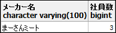

# 総合演習

### 問題1

* `syain_master`から給与が125000円から243000円の範囲にない社員の名前及び給与を表示してみましょう。
  * 表示項目：社員名、給与
  * 対象テーブル：`syain_master`

**(実行結果)**

* [解答例](practice_answer.md#1)
 
------------------

### 問題2

* `syain_master`から社員名の二文字目が「城」である社員の名前を表示してみましょう。
  * 表示項目：社員名
  * 対象テーブル：`syain_master`

**(実行結果)**

* [解答例](practice_answer.md#2)

------------------

### 問題3

* `syain_master`から社員名に「城」または「田」が含まれ、住所に「市」が含まれる社員の名前及び年齢、住所を表示してみましょう。
  * 表示項目：社員名、年齢、住所
  * ソート順：年齢の高い順
  * 対象テーブル：`syain_master`

**(実行結果)**

* [解答例](practice_answer.md#3)

------------------

### 問題4

* `syouhin`から単価が500円以下、商品数が1500より下の商品名、単価、商品数、ランクを表示してみましょう。
  * 表示項目：商品名、単価、商品数、ランク
  * ソート順：ランクの昇順
  * 対象テーブル：`syouhin`

**(実行結果)**

* [解答例](practice_answer.md#4)

------------------

### 問題5

* `syain_master`から給料が180000円から250000円の範囲にあり、支店コードが1または2の社員の名前及び給料、支店コードを表示してみましょう。
  * 表示項目：社員名、給料、支店コード
  * 対象テーブル：`syain_master`

**(実行結果)**

* [解答例](practice_answer.md#5)

------------------

### 問題6

* `syain_master`から給料が150000円より上である社員の給料の合計額を表示してみましょう。
  * 表示項目：給料の合計額
  * 対象テーブル：`syain_master`

**(実行結果)**

* [解答例](practice_answer.md#6)

------------------

### 問題7

* `syouhin`の商品数が12.5%増えます。増えた商品数を増加分として、商品名、単価、増えた後の商品数、増加分を表示してみましょう。
  * 表示項目：商品名、単価、商品数、増加分
  * ソート順：増えた後の商品数　降順
  * 対象テーブル：`syouhin`
 
**(実行結果)**

* [解答例](practice_answer.md#7)

------------------

### 問題8

1. `syouhin`から店舗コードと商品コードがともに「1」ではない商品を表示してみましょう。
2. 上の結果から、商品数が1500未満で単価が商品の平均額以上の商品を表示してみましょう。
  * 表示項目：店舗コード、商品コード、商品名、商品数、単価
  * ソート順：店舗コードの昇順、商品コードの昇順
  * 対象テーブル：`syouhin`

**(実行結果1)**

**(実行結果2)**

* [解答例](practice_answer.md#8)

------------------

### 問題9

* 商品の味付けを行います。以下の判定に従って、`syouhin`から商品名、メーカー名、ランク、味を表示してみましょう。
  * 表示項目：商品名、メーカー名、ランク、味
  * ソート順：ランクの昇順
  * 対象テーブル：`syouhin`

* 判定(ランク → 味)
  * A → 絶品
  * B → 美味い
  * c → 普通
  * D以下 → いまいち

**(実行結果)**

* [解答例](practice_answer.md#9)

------------------

### 問題10

* `syouhin`からメーカー毎の価格の最低額、最高額、合計額、商品の種類を表示してみましょう。
  * 表示項目：メーカー名、最低額、最高額、合計額、種類
  * 対象テーブル：`syouhin`

**(実行結果)**

|:-:|

* [解答例](practice_answer.md#10)

------------------

### 問題11

* 「くわっちー精肉店」及び「まーさんミート」に所属している社員の名前とメーカー名を表示してみましょう。
  * 表示項目：社員名、メーカー名
  * 対象テーブル：`syain_master`, `syouhin`

**(実行結果)**

* [解答例](practice_answer.md#11)

------------------

### 問題12

* 全ての商品に対する担当者名を表示したい。店舗コード、商品コード、商品名、メーカー名、社員名及びアルバイト名を表示してみましょう。
  * 表示項目：店舗コード、商品コード、商品名、メーカー名、社員名、アルバイト名
  * 対象テーブル：`syouhin`, `syain_master`, `arbeit`

**(実行結果)**

* [解答例](practice_answer.md#12)

------------------

### 問題13

* 社員とアルバイトで各々の給料の平均額より多い社員とアルバイトを表示したい。社員の給料の平均は`syain_master`から、アルバイトの給料の平均は`arbeit`からそれぞれ算出し、名前、給料、雇用形態を表示してみましょう。
  * 表示項目：名前、給料、雇用形態
  * ソート順：給料の高い順(社員及びアルバイト混合)
  * 対象テーブル：`syain_master`, `arbeit`

**(実行結果)**

* [解答例](practice_answer.md#13)

------------------

### 問題14

* 社員名に「城間」が含まれる社員が担当している店舗コードに該当する全ての社員の名前と年齢、メーカー名を表示してみましょう。
  * 表示項目：社員名、年齢、メーカー名
  * 対象テーブル：`syain_master`, `syouhin`

**(実行結果)**

* [解答例](practice_answer.md#14)

------------------

### 問題15

* 担当者が決まっていない商品の名前、メーカー名を表示してみましょう。
  * 表示項目：商品名、メーカー名
  * 対象テーブル：`syouhin`, `syain_master`

**(実行結果)**

* [解答例](practice_answer.md#15)

------------------

### 問題16

* 社員数が最大のメーカー名及び社員数を表示してみましょう。
  * 表示項目：メーカー名、社員数
  * ソート順：店舗コードの昇順

**(実行結果)**

* [解答例](practice_answer.md#16)
