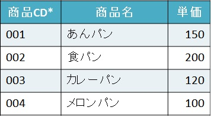
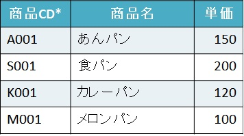
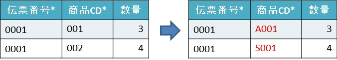
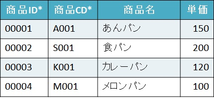
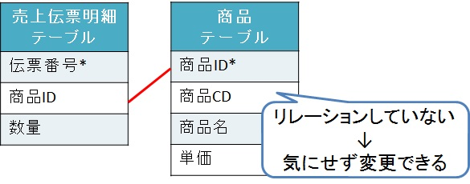

# CD、IDとは

## CDとは

Codeの略で、コード、記号の意味。  
データベースではユーザが見てわかるように決めている値(ニックネーム)を指す。

## IDとは

Identifierの略で、アイディー(アイデンティティ)、識別子の意味。  
データベースでは変更することがない内部的な識別子のことを指す。  
基本的に連番で、空いた番号を埋めることはしない。

### だったら「ID」より見てわかる「CD」を主キーにしたらいいのでは？

実は、CDを主キーに設定していた場合、  
システム的に不都合なケースが出てくることがある。

例えば、商品CDを主キーとしている以下のような商品テーブルがあったとする。
- 商品テーブル  

ユーザは商品CD「001」は「あんパン」、「003」はカレーパンというように  
商品CDで商品名を判断している。

だが、途中で体制が変わり、  
商品CD体系も以下のように変わることになったとする。
- 商品テーブル(商品CD体系の変更予定案)  

商品CDの体系が変わることは、
データ上でどう変化するのか？

まず、商品CDは主キーとなっている。  
主キーとは、一意であり、NULLでなく、変更のない値に対して設定するものなのに、  
その主キーである商品CDが変わってしまうのだ。  

主キーとは「変更のない値に対して設定するもの」と言っているが、  
実は値を変更することが可能である。

もし仕方なく変えることになり、  
商品テーブルの情報を商品CDを使って呼び出す以下の売上伝票明細テーブルがあった時、  
そこに対しても商品CDを変換しなければならないという影響が出てくる。
- 売上伝票明細テーブル  

こういう状態にならないためにある考え方が「ID」となる。  

[IDとは](#IDとは)で説明したが、  
データベースでは変更することがない内部的な識別子を設定する。  
内部的というのはユーザが見ることはない、  
システム側(SQLやプログラム)だけでしか見えない部分のことを指す。

先ほどの商品テーブルにIDを設定していた場合を見てみる。  
- 商品テーブル(ID付き)  

では、売上伝票を見てみる。
- 売上伝票明細テーブル  

この二つのテーブルの関係(リレーション)を見てみる。
- 売上伝票明細テーブルと商品テーブルの関係(リレーション)  

この状態なら、商品CDを変更しても売上伝票明細テーブルに直接的な影響はない。  

よって、すべてのテーブルを商品IDで結合するように設定してれば、  
気兼ねなく商品CDを変更できる。

---

## まとめ

CDは、ユーザが見てわかるように決めているため、変更することがある。  
その変更に対応するためにはもう頑張ってやるしかない。  

IDは、システム側しか使わない識別子で、変更することはない。  
変わることがないため、特に頑張って修正することもない。

なのでIDを使うときは、IDで結合して、画面に出力するときはCDを使えばいいので、  
**データベース設計する際はIDを導入したほうがいい！**

実はユーザによってはCDを変更しないため、それがIDとなっていることも多い。  
だが、いつ何時、体系が変わってもおかしくないように、  
そして私たちシステムを設計する側が大変な目に合わないように、  
IDの導入をして、それで結合するようにしたほうがいい。  
