# 正規化について

## 正規化とは

データの冗長性(同じもの)をなくす手法。  
正規化には段階があり、  
第一正規化～第五正規化まで存在する。  

しかし、実際は第三正規化まで行えば十分な場合が多い。  
なので、今回教える正規化は第三正規化のところまで。
例題等も第三正規化まで行った状態を使って説明する。

それぞれ正規化した状態のテーブルを「正規形」という。
第一正規化が終われば、その時点の状態は第一正規形、  
第二正規化が終われば、第二正規形と続いていく。

では、もし冗長性が残った状態だとデータにどのような影響が出てくるか？

次のデータを使って見ていく。
- 非正規形(正規化していない状態)
  - 貸出履歴テーブル  
  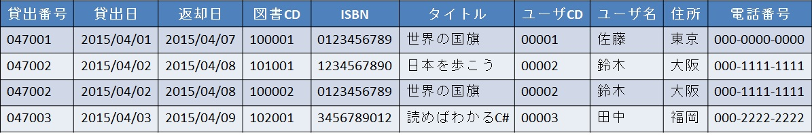


- 第三正規形(第三正規化まで済んだ状態)
  - 貸出履歴テーブル  
  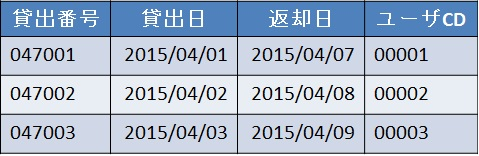
  - 貸出履歴明細テーブル  
  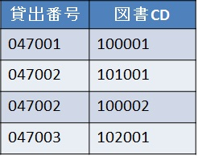
  - 書籍テーブル  
  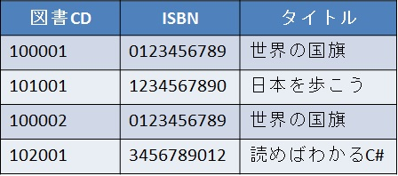
  - ユーザテーブル  
  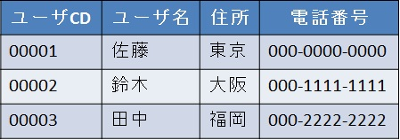

---

- 登録  
  新しい書籍を登録してみる。

  - 第三正規形  
    単純に図書CD、ISBN、タイトルを書籍テーブルに登録すればOK！  
    - 書籍テーブル  
    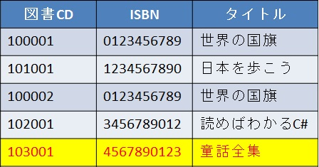
      - SQL  
      ```SQL
      INSERT INTO 書籍テーブル (図書CD, ISBN, タイトル)  
           VALUES ('103001', '4567890123', '童話全集');
      ```

  - 非正規形  
    新しい商品を登録しようとしても、図書CD、ISBN、タイトル以外の項目も  
    - 貸出履歴テーブル  
    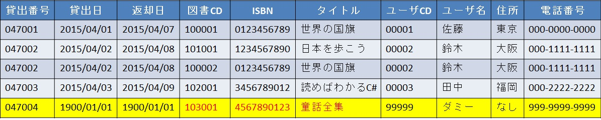
      - SQL  
      ```SQL
      INSERT INTO 貸出履歴テーブル (貸出番号, 貸出日, 返却日,  
                                  図書CD, ISBN, タイトル,  
                                  ユーザCD, ユーザ名, 住所, 電話番号)  
           VALUES ('047004', '1900/01/01', '1900/01/01',  
                   '103001', '4567890123', '童話全集'  
                   '99999', 'ダミー', 'なし', '999-9999-9999');
      ```

---

- 更新  
  ユーザ情報（ユーザ名、住所）を更新してみる。

  - 第三正規形  
    ユーザCDで絞って、ユーザ名、住所を変更すればOK！  
    - ユーザテーブル  
    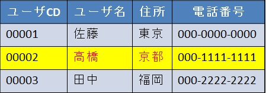
       - SQL  
       ```SQL
       UPDATE ユーザテーブル  
           SET ユーザ名 = '高橋', 住所 = '京都'  
         WHERE ユーザCD = '00002';
       ```

  - 非正規形  
    実はこちらも、ユーザCDで絞って、ユーザ名、住所を変更すればOK！  
    ただし、第三正規形と同じく一人のユーザ情報の更新なのに、  
    貸出履歴テーブルにある更新対象のユーザ情報をすべて更新することになる。  
    - 貸出履歴テーブル  
    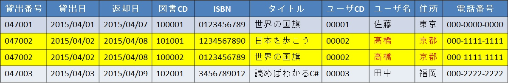
       - SQL  
       ```SQL
       UPDATE 貸出履歴テーブル  
           SET ユーザ名 = '高橋', 住所 = '京都'  
         WHERE ユーザCD = '00002';
       ```
       第三正規形のSQLと見比べると、テーブル以外は見た目上変わらないが、  
       もし対象のユーザCDが貸出履歴テーブルに100万もあったら、処理上では100万個分のデータが更新される。

---

- 削除  
  書籍を削除してみる。
  - 第三正規形  
    図書CDを指定すればOK！  
    - 書籍テーブル  
    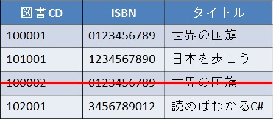
       - SQL  
       ```SQL
       DELETE FROM 書籍テーブル  
              WHERE 図書CD = '100002';
       ```

  - 非正規形  
    こちらも図書CDを指定すればOK！  
    ただし、指定した図書CDが存在する他の貸出履歴まで削除される。  
    また、過去に1度しか貸し出されたことのない書籍を含む貸出履歴データが削除されると、  
    書籍情報が失われてしまう。  
    - 貸出履歴テーブル  
    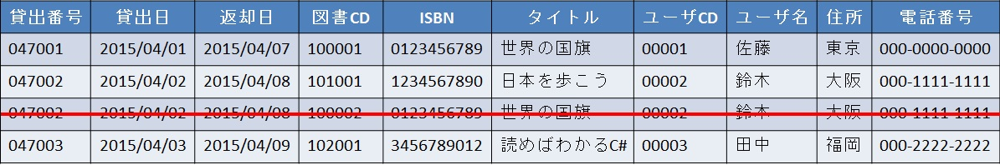
      - SQL  
      ```SQL
      DELETE FROM 貸出履歴テーブル  
            WHERE 図書CD = '100002';
      ```
      更新と同じく、第三正規形のSQLと見比べると、テーブル以外は見た目上変わらないが、  
      もし対象の書籍CDが貸出履歴テーブルに100万もあったら、処理上では100万個分のデータが更新される。

---

## まとめ

実際に正規化をしている状態と、していない状態を見比べると、  
データの登録、更新、削除の単純さが見えてくる。  

- 正規形
 - 一つのデータの登録、更新、削除で済む。
 - 同じデータがないので管理もしやすい。
- 非正規形
 - 登録時は他のデータの値まで用意する 。
 - 更新・削除時は思わぬデータまで更新・削除してしまう可能性が高い上、  
   同じデータに対しての更新・削除処理が多く走ってしまう場合がある。
 - 同じデータがいくつも存在するので管理しづらい。

まとめると、  
正規形・・・冗長性がない状態で、データ操作が単純で管理しやすい。  
非正規形・・・冗長性がある状態で、データ操作がすごくやりづらい、管理しづらい。  

今回は単純なテーブルを使用したが、項目数(列)が多くなると不便さがさらに増えるため、
正規化はデータ操作や管理をしやすくする為にも必要な手法となる。
