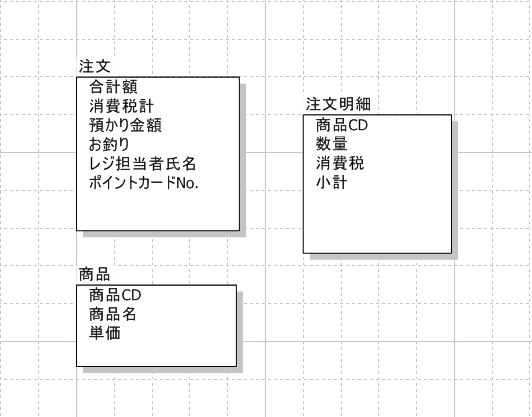
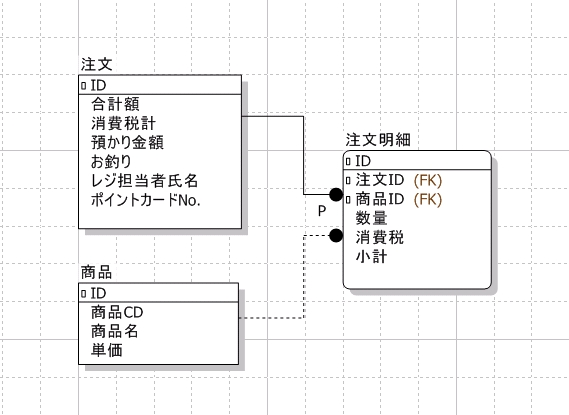
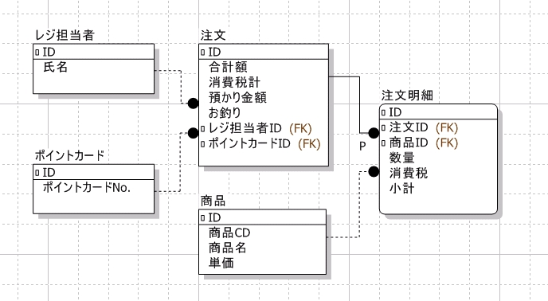
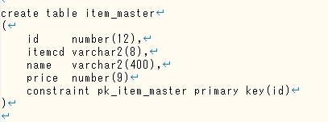

# データベース設計の前に

「情報をデータ化して持ったもの」がデータベース。
ではどのようにしてデータベースを構築するか考えよう。

> テーブルの見た目は単なる表なので、Excel でも作れそうな気がするけど…

*データベースは Excel で表を作るのとは訳が違う！*

* データベースで出来ること

    利用者視点
      - 条件にあうデータだけを抽出する  
      > WHERE ~  
      - 複数のテーブルを崩さすに結合して抽出する  
      > INNER JOIN, OUTER JOIN ~  
      - 特定の条件のデータを更新・削除する  
      > DELETE, UPDATE  
      WHERE  

    開発者視点
      - テーブルの関連を定義する  
      > 主キー・外部キーの設定
      - 格納できるデータを定義する  
      > 型、初期値、NULLを認めるか  
      - データをバックアップ  
      - アクセス権を設定する  
    等…

見た目はどちらも似たような表を扱っているが
これだけできることが違う！

データベースでは Excel のようにその場で表を作って終わりではない。  
運用・保守をしていかなければならない。
より扱いやすいデータベースを構築するためにもきちんと設計を行うことが大切。  

でも、データベース設計って何をするのか？

## データベース設計の流れ

一言でデータベース設計とは言っても幾つかの工程に分かれている。  
設計を大まかに分けると次の通り。  

**データベース設計の流れ**  

* 業務分析
* 概念設計
* 論理設計
* 物理設計
* データベース実装

もう少し噛み砕いてみよう 

*業務分析*  
* 業務フローを分析する  
  - システム化する業務を分析する

*概念設計*  
* 業務をモデル化する  
  - 業務と記録するデータを一つ一つを洗いだす  

  - 業務の関連を図にまとめる（ER図の作成）  

*論理設計*
* データをどのように管理するか考える  
  - テーブルを整理する（正規化）  

  - データ型の定義  

*物理設計*
* 実際に作成するテーブルを定義する  
  - DDL文の発行  

  - パフォーマンスチューニング

*データベース実装*
* 設計を基にデータベースを構築

以上がおおまかなデータベース設計の工程となる。

この中でも業務分析～論理設計はとても重要。  
（論理設計までのアウトプットがデータベースの中核となる）

* 業務分析を怠ると…
  - システムと業務・要望にギャップが発生する
    →追加の変更が発生し、業務分析からやり直し

* 概念設計を怠ると…
  - 必要な情報をDBから取得できない  
  →テーブル追加・正規化作業が発生  

* 論理設計を怠ると…
  - データの更新、登録、削除が複雑化  
   →運用が大変になる  
   →テーブル構成を考慮してプログラムを作る必要が有る  
  - 拡張性が無くなる  
    →新機能の追加が難しくなる  

**※基本的にシステム開発工程が完了し運用が始まってしまうとデータベースの変更は簡単には出来ません。**  
データベース設計をしっかりと行わないと、プログラム開発時やシステムの運用時に影響が出ます。
具体的には、プログラムの内容がとても複雑になり、開発やコードの変更にとても時間がかかるようになります。
また、システム運用時の障害やバグを発見した時の修正を行う際にも、プログラムが複雑になっているため、原因を特定するために時間が掛かるようになります。
このようになるのは、しっかりとデータベース設計を行わないことで、解決しようとしている問題の構造と、データベースの設計の間に「ゆがみ」が発生するからです。
データベースの「ゆがみ」の「ツケ」を、プログラム開発時や運用時に払うことになります。
データベース設計をしっかりと行い、解決しようとしてる問題の構造と、データベースの「ゆがみ」が少なくなるようにしましょう。

## まとめ  

もう一度おさらい。  
データベース設計は次の工程で行なわれる。  

> **データベース設計の流れ**
> * 業務分析
> * 概念設計
> * 論理設計
> * 物理設計
> * データベース実装

データベース設計はプログラム開発とも関わる大事な工程！  
しっかりやりましょう。  

概念設計（モデル化・ER図作成）、論理設計（正規化）は特に重要な工程なので  
本カリキュラムではこの2つを中心に進めていく。  
