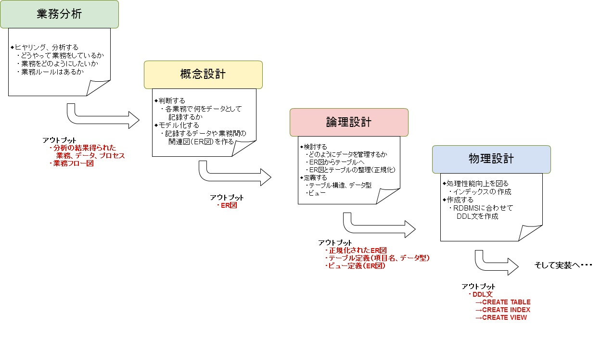

# データベース設計の流れ

データベース設計の流れとアウトプットのイメージは次の通り。

※教えていない単語がチラホラ見受けられるが、ここでの解説は割愛。

設計をやっていく中で、自分が今やっている工程は  

* フローのどの位置にあるのか
* そこでやるべきことは何か
* 結果、何が得られるか

ということを考えながら進めてみましょう。

---

**データベース設計の流れ**  

* 業務分析
* 概念設計
* 論理設計
* 物理設計
* データベース実装

