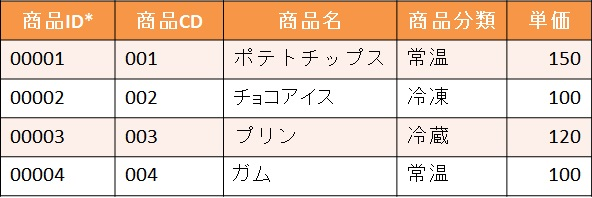
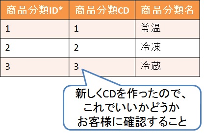
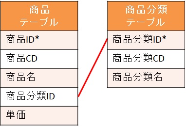

# DB設計の手順

これまで学んできた内容を踏まえ、
DB設計の手順について説明していく。

1. [ブロック分け](#ブロック分け)
1. [イベント系エンティティの抽出](#イベント系エンティティの抽出)
1. [イベント系エンティティの正規化](#イベント系エンティティの正規化)
1. [リソース系エンティティの分類を整理](#リソース系エンティティの分類を整理)
1. [ブロック間でのリソース統合](#ブロック間でのリソース統合)

「ブロック分け」と「イベント系エンティティの抽出」は  
[エンティティの洗い出し](db_design_guideline.md)で既に教えているのでそちらを参照。

---

## イベント系エンティティの正規化

ここで勉強した正規化が役に立つ。  
正規化がうまくいけば、それだけでリソース系エンティティも浮かび上がってくる。

**リソース系エンティティとは、人やモノといった名詞になるもの。**  
それが浮かび上がってくるということは、  
CD体系も見えてくるということになる。

ここまでくれば、リソース系エンティティも見出していける。  
そして、リソース系が見えてくれば、  
隠れていたイベント系も浮かび上がってくるだろう。  
(商品を値引する、単価を決定する、どこに所属する等)

ただし、ここで完全に正規形を完成させようと頑張る必要はない。
ここでいう完全でない正規形とは、  
第三正規形までは終えているが、
一部同じ内容が並んでいるなどをいう。  
- 商品テーブル  

こういった部分は、まだ残っている手順で行う。

## リソース系エンティティの分類を整理

正規化により、リソース系エンティティが見いだせてくると、
その中身に分類が発生することがある。

例えば、以下のような状態だ。
- 商品テーブル  

テーブルを見てわかるよう、商品にも常温、冷凍、冷蔵といった保管方法があった場合、  
これらを個別で「商品分類」というエンティティを作るのか、  
それとも「商品」エンティティ自身に「商品分類区分」という項目を作って、  
「区分=1」なら常温、「区分=2」なら冷凍・・・といった形で管理するかだ。

結論から言うと、  
「商品分類」というエンティティを作って、
そこに商品分類ID、商品分類CD、商品分類名のデータ(属性)を持った形にし、  
リレーションをつなげるといい。  
- 商品分類テーブル  

- 商品と商品分類のリレーション  

もし「商品」エンティティに分類区分を持たせていると、  
プログラム作成側がIF文で判断しなければならなくなるし、  
どの区分がどれを指すのかがわからなくなる。  
それを考えると、やはりエンティティを分けていたほうがいい。

また、エンティティがいっぱいになってくると、  
結合が大変になってくる。  
もちろん、結合が多ければその分のパフォーマンスが悪くなるが、  
その性能に関してはあとから考えればいい。

今、優先に考えるべきは、  
DBに必要な情報を入れていくことだからだ。

## ブロック間でのリソース統合

[ブロック分け](#ブロック分け)で分けたブロックで、  
共通しているリソースを統合する作業。

実はここの統合がDB設計において一番重要な部分になる。

イベント系は統合しないのかといわれると、  
ブロックで分けているときの見出したイベントは、  
そのブロック内でしか発生しない作業であるので、統合することはない。

一方、リソース系は商品や社員といった、
全体で共有できるエンティティが発生している。

ただ、部門ごとの使用方法が同じかどうか確認する必要はあるため、  
意識合わせのための調整(コミュニケーション)をすること。

それらをうまく統合できれば、  
システムとして長生きできる上に、
開発もスムーズに進むという恩恵が得られる。

## まとめ

いきなり全体を見ようとすると手が付けられなくなるので、  
まずは、イベント系を中心に考えていくこと。  

イベント系の整理ができて、  
浮かび上がってきたリソース系にもし同じ内容が繰り返しあるのであれば、  
それは無駄なので、さらに別のエンティティとして作ること。

部門間で共通するリソースは統合する。  
ただし、どう使うかは意識合わせが必要なので、調整(コミュニケーション)が必要。
