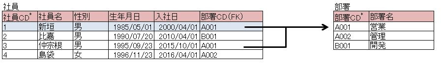
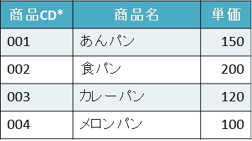
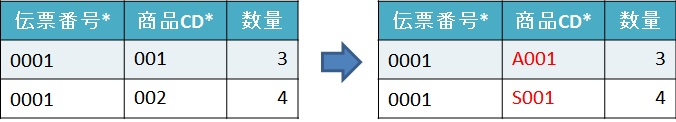
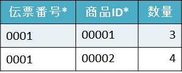
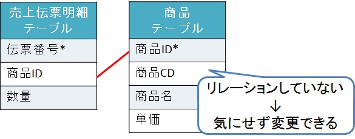

# ER図を作ってみよう！

* [ER図とは？](#er図とは)
* [キーの設定](#キーの設定)
* [CDとID](#cdとid)

## ER図とは？

ER図(Entity Relationship Diagram)のことで、  
データを
- 実体(Entity：エンティティ)
- 関連(relationship：リレーションシップ)
- 属性(attribute：アトリビュート)
という3つの構成要素でモデル化する、  
「ERモデル」を図で表したもの。

実体はテーブル、  
関連はテーブル同士のつながり、  
属性はテーブルの持つ情報(項目)である。

ERモデルの表現手法はいくつかある。
- Peter Chen記法
- **IDEF1x(ICAM DEFinition Language)記法** ←今回はこちらを使用する。
  - データベースの概念設計においてよく使用される。
    - 概念設計：従属関連（データのつながり）を設計する。
- IE(Information Engineering)記法

## IDEF1x(ICAM DEFinition Language)記法(アイデフワンエックス記法)

### 実体

実体にはいくつか定義がある。
- 依存実体(Identifier-Dependent Entity)
  - 依存して存在する。
  - 角の丸い四角で表す。
- 非依存実体(Identifier-Independent Entity)
  - 他の実体に依存せずに存在できる。
  - 四角で表す。

依存とは、親が存在するとき、子も存在するが、  
親が存在しないとき、子も存在できないことをいう。  
非依存はその逆で、親がいようがいまいが、子は存在できるということである。

依存を例えると、  
会社がなくなると、部署もなくなる。  

非依存は、  
会社がなくなっても、働いていた社員は存在している(会社と一緒に消えない)。  
ということになる。

ちなみに実体名は、四角の上に記述する。  

### 関連

実体間の関連は、四角形の間に線を引くことによって記述する。
- 依存実体との関連：実線  

- 非依存実体との関連：破線  

関連によってつながった実体間には親子関係が成り立つ。  
例えば、異なる実体に結び付けられた線の先には、  
黒く塗りつぶされた円を記述する。  

また、黒塗りの円のそばには、  
**「関連の多重度(カーディナリティ)」** を記述することができる。  
多重度とは、実体間が一対多(多対一)でつながっているかということ。  

一対多の説明は以下の画像が参考になる。  

テーブルの関連付けは一対多(多対一)にすること。  

### 属性

四角形の中には属性を記述する。
- 四角形の中に一本線を引いて、その線より上は主キー、  
  下は主キーでない属性を記述する。
- 外部キーとなる属性には、属性名の後ろに  
  **「FK」** という文字を括弧でくくって記述する。  
  

---

## キーの設定

### キーとは

ここでキーについて考えてみよう。  
キーとはテーブルの1つのレコードを特定できる項目（またはその組合せ）のこと。

データベースには多くの情報が入っており、その中から任意のデータを取得できる必要がある。  
（そうでない場合、ほしいデータが取得できず、管理している意味が無い）  

キーは、ある任意のデータを特定するために使用する*手ががり*のようなものである。

キーを識別子と呼ぶこともある。

### キーと関連

キーとはテーブル間のデータの関連を決めるものとして使われる。  

実際にキーを用いてリレーションしてみよう。  

リレーションの仕方  
- テーブルに主キーとなる項目を設定する  
- リレーションしたいテーブルの主キーを示す列　**外部キー**　を追加する  

あとは追加した外部キーでリレーションしたいテーブルを参照すればよい。  

例えば、次のようなそれぞれ独立した「社員」テーブルと「部署」テーブルに関連を追加することを考える。  

- テーブルに主キーとなる項目を設定する。
  - 「社員」テーブルは「社員CD」、「部署」テーブルは「部署CD」で特定できるので
    これらを主キーとする

以下は主キーを追加したもの。  
(列名に\*を追加)

- リレーションしたいテーブルの主キーを示す列**外部キー**を追加する
  - 大量に存在する「部署」のレコードの中で、この「社員」に対応するレコードはどれ？ という特定のための手がかり

ここで、次のように「社員」テーブルに外部キー「部署CD」を追加して、  
各社員の所属部署に対応する「部署」テーブルの主キー「部署CD」の値を入れてあげる  
（外部キーに（FK）をつける）

以上で関連の追加は完了となる。  
これで「社員」に対応する「部署」のレコードを取得することができる。  
試しに「社員CD」=1の社員の所属する部署名を調べてみよう。

テーブルの関連を見ると「社員CD」=1の所属する部署の名前は「営業」となる。

このように、キーは各テーブル間のデータを関連付けるために使われる。  
キーを設定することでリレーショナルデータベースが成り立つのである。

### キーの種類

上でも述べたとおり、  

> テーブルの1つのレコードを特定できる属性（またはその組合せ）  

キーは**属性**　または　**属性の組合せ**で構成される。

キーで一番基本となるのが***主キー***である。

- 主キー(プライマリキー)  
  データが特定可能な項目。  
  NULLは許されない。

主キーはその属性の中では同じ値が無い、NULLも入っていない。  
よって一意にデータを探し出すことができる。  
エンティティ内には、主キーとなるものが複数存在することもある。 

主キー以外には次のようなキーがある。

- ユニーク(一意)キー  
  1レコードを特定できる情報を持つ項目のこと。  
  NULLは許される。

- 候補キー  
  主キーである項目全体を指す。
  ユニークであること。

- 複合主キー  
  1つのテーブルに存在する2つ以上の列(カラム)に組み合わせることで
  特定できる主キーのこと。

- 外部キー(フォーリンキー)  
  エンティティ(テーブル)をまたがった、
  データの関連を示す。

主キーに求められるものとしては、  
- 値の変わらないもの  
- 出来るだけ、桁数が短いもの  
- 複合主キーとなる場合、連結が多くならないもの  

となっている。

主キーとする候補にCDやIDがある。

## CDとID

### CDとは

Codeの略で、コード、記号の意味。  
データベースではユーザが見てわかるように決めている値(ニックネーム)を指す。

### IDとは

Identifierの略で、アイディー(アイデンティティ)、識別子の意味。  
データベースでは変更することがない内部的な識別子のことを指す。  
基本的に連番で、空いた番号を埋めることはしない。

### だったら「ID」より見てわかる「CD」を主キーにしたらいいのでは？

実は、CDを主キーに設定していた場合、  
システム的に不都合なケースが出てくることがある。

例えば、商品CDを主キーとしている以下のような商品テーブルがあったとする。
- 商品テーブル  

ユーザは商品CD「001」は「あんパン」、「003」はカレーパンというように  
商品CDで商品名を判断している。

だが、途中で体制が変わり、  
商品CD体系も以下のように変わることになったとする。
- 商品テーブル(商品CD体系の変更予定案)  

商品CDの体系が変わることは、
データ上でどう変化するのか？

まず、商品CDは主キーとなっている。  
主キーとは、一意であり、NULLでなく、変更のない値に対して設定するものなのに、  
その主キーである商品CDが変わってしまうのだ。  

主キーとは「変更のない値に対して設定するもの」と言っているが、  
実は値を変更することが可能である。

もし仕方なく変えることになり、  
商品テーブルの情報を商品CDを使って呼び出す以下の売上伝票明細テーブルがあった時、  
そこに対しても商品CDを変換しなければならないという影響が出てくる。
- 売上伝票明細テーブル  

こういう状態にならないためにある考え方が「ID」となる。  

[IDとは](#idとは)で説明したが、  
データベースでは変更することがない内部的な識別子を設定する。  
内部的というのはユーザが見ることはない、  
システム側(SQLやプログラム)だけでしか見えない部分のことを指す。

先ほどの商品テーブルにIDを設定していた場合を見てみる。  
- 商品テーブル(ID付き)  

では、売上伝票を見てみる。
- 売上伝票明細テーブル  

この二つのテーブルの関係(リレーション)を見てみる。
- 売上伝票明細テーブルと商品テーブルの関係(リレーション)  

この状態なら、商品CDを変更しても売上伝票明細テーブルに直接的な影響はない。  

よって、すべてのテーブルを商品IDで結合するように設定してれば、  
気兼ねなく商品CDを変更できる。

主キーに求められるものを見ても、  
主キーを設定するなら、IDに設定することを勧める。

CDはニックネームでかつ業務の体系が変わることで変更になったりするため、  
主キーとしてはあまり適切ではない。

ただ、主キーをIDにするためには、  
基準にするものが必要で、それがCDにあたることが多い。  
なので最初はCDを主キーとする形でリレーションして  
そのあとIDを追加し、主キーをIDに設定すると  
主キーの設定はスムーズに行く。

- 商品テーブル(ID設定の流れ)  

また表を結合する時は、主キーを使って行うことが一般的であるため、  
主キーの設定はリレーショナルデータベースにおいて重要な部分でもある。

### CDとIDのどちらを主キーにするか

CDは、ユーザが見てわかるように決めているため、変更することがある。  
その変更に対応するためにはもう頑張ってやるしかない。  

IDは、システム側しか使わない識別子で、変更することはない。  
変わることがないため、特に頑張って修正することもない。

なのでIDを使うときは、IDで結合して、画面に出力するときはCDを使えばいいので、  
**データベース設計する際はIDを導入したほうがいい！**

実はユーザによってはCDを変更しないため、それがIDとなっていることも多い。  
だが、いつ何時、体系が変わってもおかしくないように、  
そして私たちシステムを設計する側が大変な目に合わないように、  
IDの導入をして、それで結合するようにしたほうがいい。  

---

## まとめ

実体はテーブル、  
関連はテーブル同士のつながり、  
属性はテーブル情報(項目)。

属性に主キーを設定し、実体間を関連付ける。

これらがすべてができてER図となる。

どんどん書いてみてほしい。
