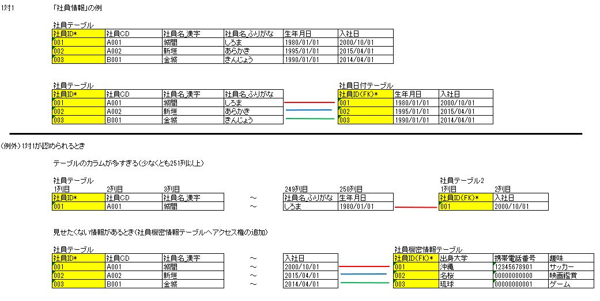
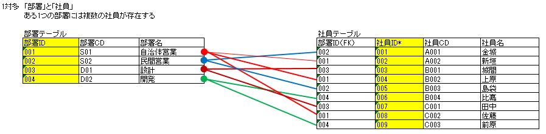
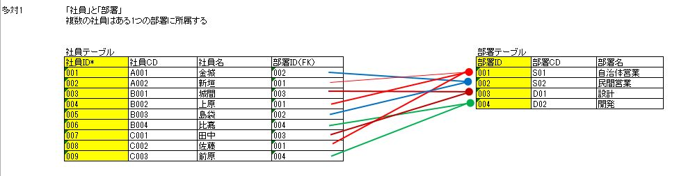
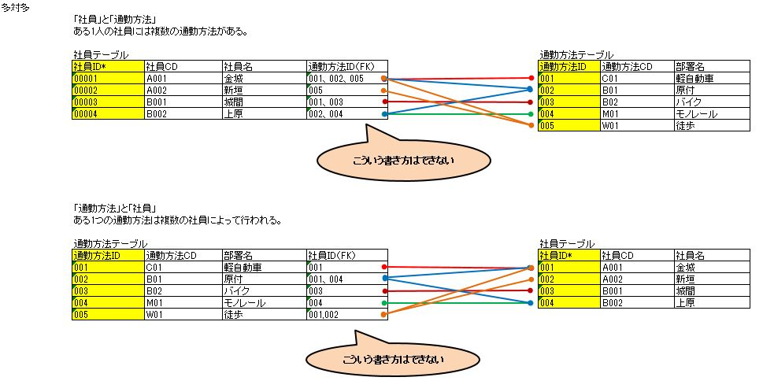
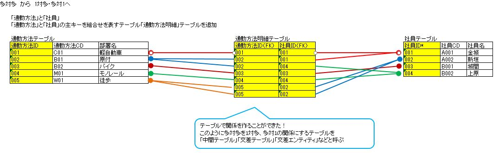
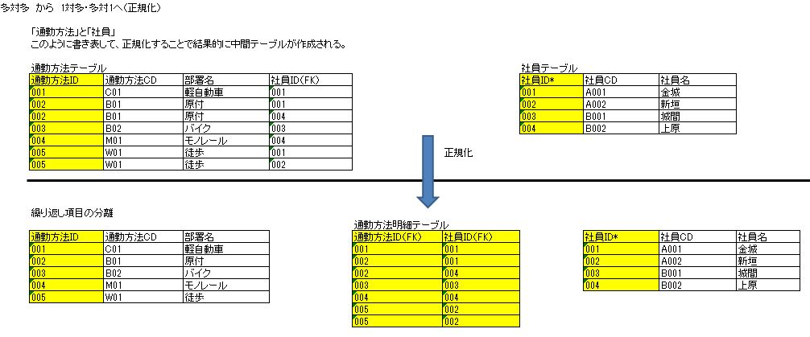

# 関連の例

関連には一対一、一対多、多対一、多対多がある。

|関連|---|使用できるか|備考|  
|---|---|---|---|
|一対一|One-to-One|基本的にNG|設計自体は可能だが、テーブルを分ける意味がない|  
|一対多|One-to-Many|OK|正常・問題なし。|  
|多対一|Many-to-One|OK|正常・問題なし。|  
|多対多|Many-to-Many|NG|設計自体が不可能。データベースで表現できない|  

## 一対一

テーブルを分ける意味がない。  
キー項目が同じなら同じテーブルで管理したほうがよい。  

## 一対多

正常・問題なし。

## 多対一

正常・問題なし。

## 多対多

DBでは表現できない。

多対多の関連の中にテーブル(エンティティ)を一つ追加して 
一対多、多対一の関係にすることで関連を表すことができる。
つまり、多対多を間接的に設計することができる

- 正規化して解決する方法もある

