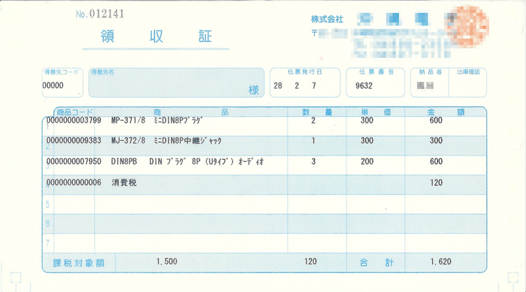

# エンティティの洗い出し演習

業務ルールと領収書を分析し、  
エンティティとそれに含まれる属性を列挙しなさい。

- 領収書

- 業務ルール
  - 得意先からの注文を受け、商品の在庫を確認し納品希望日に納品している。
  - 商品の情報として商品コード、商品名、単価、カテゴリ、在庫を管理している。
  - 得意先の情報として、得意先名、代表者名、住所、電話番号、FAX番号を管理している。

もし、わからないことがあれば、講師に確認すること。
