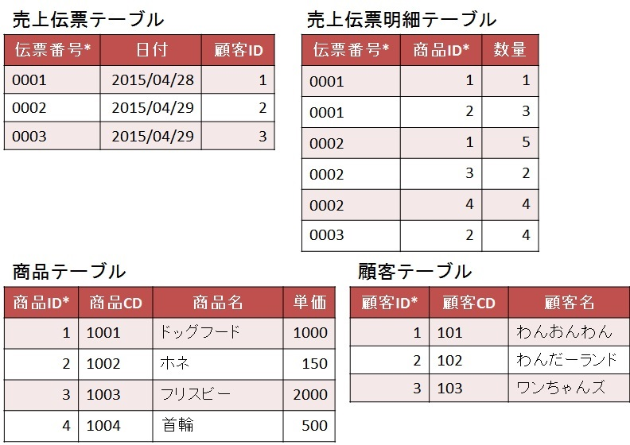

#  ER図設計演習

## ER図設計演習1

[正規化演習１](exercises_nomalization.md#演習1-以下の問題を正規化しなさい。)の練習問題で使った  
第三正規形に「ID」を設定した状態でER図を作成してみよう。

- 第三正規形(IDに主キーを設定)  

それぞれのテーブルの形を以下のような形に変更する。

- 第三正規形の実体と属性  

変更後は、以下のように線でつなげて行く。

- 第三正規形のER図  

左上を中心として、それぞれに線を張り巡らせていくとわかりやすい。

[ER.a5er](./ER.a5er)

---

## ER図設計演習2

[エンティティの洗い出し演習](exercises_entity.md)で洗い出したエンティティに
関連を追加し、ER図を完成させなさい。

* エンティティをER図にするには
	- 各エンティティに主キーを設定する
	- 関連するエンティティ間の依存関係を考える
	- カーディナリティ（多重度）を考慮する

* 必要が有ればIDや中間テーブルを加えても良い

もし、わからないことがあれば、講師に確認すること。
