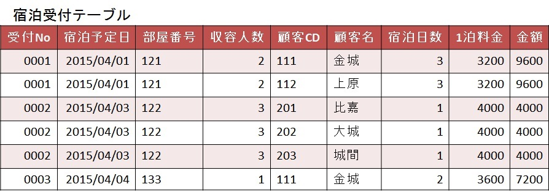

# 正規化演習

## 演習1　以下の問題を正規化しなさい。

以下の運用を踏まえて、非正規形を第一正規形、第二正規形、第三正規形にしなさい。
- 一日に何回か同じ顧客と取引をすることがある。
- 顧客CD、商品CDは変更しない。
- 商品は一つの伝票に一つのみ。
- 単価は商品ごとに設定している。
- 同じ伝票番号は存在しない。

- 売上伝票イメージ  

- 売上伝票テーブル(非正規形) 
  

※売上伝票テーブルに「合計」の項目がないのは、内容をわかりやすくするために除外している。  

※また、各テーブルには正規化の過程では、IDを付けないでCDを主キーの候補として考える。

[解答用紙](（DB設計）解答用紙.xlsx)

## 演習2　以下の問題を正規化しなさい。

### ホテルの予約システム

- 運用
  - 顧客には必ず顧客CDを振っている。
  - 部屋ごとに収容人数、宿泊日数、1泊料金は決まっている。

- 宿泊受付表

---

### 非正規形

---

[第一正規形 ~ 第三正規形までの例](nomalization-exercises.md)

## 演習3　以下の問題を正規化しなさい。

### 会社のクラブ部員管理

- 運用
  - クラブ毎に一意の値となるクラブCDが付与されている。
  - スポーツ系や文化系など、クラブは一つのクラブ分類に属する。
  - 部員は複数のクラブのかけもちが可能である。
  - 各クラブの部員に役職を定める事ができる。
    - 役職の定めに特に制限は無い。
  - クラブの役職情報は以下に示す役職CDで管理している。
  - クラブ部員名簿では、クラブに所属する部員の数及びその明細が確認できる。

- クラブ部員名簿

- 非正規形

[解答例](（DB設計）解答例.xlsx)
