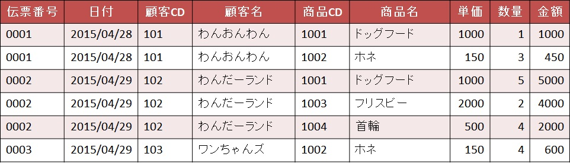
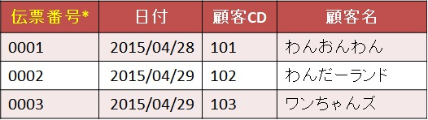

# 第一正規化

## 第一正規化とは  

非正規形(正規化していない状態)から  
第一正規形(繰り返し項目が無く、他の項目から計算できる項目がない状態)にすること。  

## 第一正規形にするためには

以下のことをする必要がある。
- [テーブルに存在する繰り返し項目の分離](#テーブルに存在する繰り返し項目の分離)
- [導出項目の排除](#導出項目の排除)
- [テーブルに主キーを設定](#テーブルに主キーを設定)

## 第一正規化 練習問題

以下の運用を踏まえて、非正規形を第一正規形にしなさい。
- 一日に何回か同じ顧客と取引をすることがある。
- 顧客CD、商品CDは変更しない。
- 商品は一つの伝票に一つのみ。
- 単価は商品ごとに設定している。
- 同じ伝票番号は存在しない。

- 売上伝票イメージ  

- 売上伝票テーブル  
  

※売上伝票テーブルに「合計」の項目がないのは、内容をわかりやすくするために除外している。  

※また、各テーブルには正規化の過程では、IDを付けないでCDを主キーの候補として考える。

上記のテーブルに対して、  
[第一正規形にするためには](#第一正規形にするためには)に記載した内容を実行していく。

---

#### テーブルに存在する繰り返し項目の分離  

繰り返している部分をまとめて、まとめた部分とまとめてない部分を分離する作業を行う。  

まず、テーブルの内容を見ていくと、以下の色を付けている部分が繰り返しになっているのがわかる。  
  

繰り返し部分(同じ内容)をまとめると、以下のようになる。  

繰り返し部分をまとめた後、まとめた項目を分離すると、以下のようになる。  

ただ、分離しただけの状態だと商品CDがあるテーブルがどこにもつながっていなくて宙ぶらりんの状態。  
このテーブル何のテーブル？という状態になっている。  
なので、このテーブルが何のテーブルか、どことつながっていたかを示すために、「伝票番号」を追加してあげる。  

あとは分離したテーブルに名前を付けて区別しやすくしておく。
- 売上伝票テーブル  

- 売上伝票明細テーブル  

ここまでが繰り返し項目の分離の作業になる。

---

#### 導出項目の排除

導出項目とは「導き出せる項目」のことを指す。  
つまり、テーブルに登録されているデータを使って出力できる項目は排除(削除)するということ。  

現在は[繰り返し項目の分離](#テーブルに存在する繰り返し項目の分離)まで終わっているため、  
その続きを行う。  

まず、売上伝票テーブルには導出項目というものがない。  
それぞれ単体で表現できる内容である。  

売上伝票明細テーブルには導出項目があるか見てみる。  
ここでもう一度。  
導出項目とは「導き出せる項目」である。  
そのため、**計算によって表現できる項目** も導出項目となる。
- 売上伝票明細テーブル  

注目してほしいのは売上伝票明細テーブルの「金額」という項目。  
ここは「単価」×「数量」で求められる。  
つまり、「金額」は導出項目であるというのがわかる。  

この金額を除外した売上伝票明細テーブルが以下になる。
- 売上伝票明細テーブル  
  

ここまでが導出項目の排除の作業になる。

---

#### テーブルに主キーを設定

主キーとは一意(ユニーク、重複しない唯一もの)であり、NULLは許されない。  
変更されない値に対して設定する。

運用をもう一度見てみる。
> - 一日に何回か同じ顧客と取引をすることがある。
> - 顧客CD、商品CDは変更しない。
> - 商品は一つの伝票に一つのみ。
> - 単価は商品ごとに設定している。
> - 同じ伝票番号は存在しない。

まずわかりやすいものは、
> - 同じ伝票番号は存在しない。

である。  
主キーの説明より、「伝票番号」は主キーに設定できる。
- 売上伝票テーブル(項目名についている「\*」マークは主キーを表す)  
  

ただ、売上伝票テーブルの「伝票番号」は主キーにできても、  
売上伝票明細テーブルでは同じ「伝票番号」があるので、そのまま主キーには設定できない。  
- 売上伝票明細テーブル  

そのため、売上伝票明細テーブルでは他の項目と組み合わせて主キーとする、  
複合主キーにする必要がある。  

その候補として挙げるために、もう一度運用を見てみると、
> - 顧客CD、商品CDは変更しない。
> - 商品は一つの伝票に一つのみ。

とある。  
ということは、「一つの伝票番号に対して、同じ商品は存在せず、CDも変更されない」ということになり、  
商品CDを主キーとして設定することができる。  
商品名は同じ場合や変更される可能性があることを考慮して、商品CDに設定する。  
- 売上伝票明細テーブル(項目名についている「\*」マークは主キーを表す)  

---

## 補足

第一正規化では繰り返し項目の分離と導出項目の排除を行なった。  
場合によっては、それが推奨されないことがあるので補足しておこう。

#### 重複の排除

まず、重複の排除をするときに注意してもらいたいのが、  
**同じ内容でもそれが1つの事実として成立するなら、  
それは重複ではないということ。**

例えば、本の貸出履歴。  
履歴を見るといっぱい同じ人が同じ本を繰り返し借りているように見えるが、  
これはすべて1つの事実として成り立つので、  
排除するものではない。
- 貸出履歴テーブル

#### デリベーション(導出)ルール

導出項目を排除すると教えられたと思うが、  
これは単純に計算して出せるものすべてが対象ではないということ。

排除する前に、**必ず可逆性を考慮しなければならない。**  
*可逆性*とは、一度別の形に直した後でも元の形に戻せること。  

一方からは変形できるが、  
その反対から元の形に戻すことが出来ないことを *「不可逆性」*という。

**可逆性を持つ項目は戻すことが可能なので排除してよいが**  
**不可逆性である場合は排除してはいけない！**

例えば、社員管理テーブルがあり、  
「生年月日」、「入社日」、「入社時の年齢」という項目があるとする。

生年月日から年齢を算出するとしよう。  
「生年月日」と「入社日」を比較すると求められる。

> * 生年月日：1990/05/01  
> * 入社日　：2010/04/01  
> ↓  
> 入社時の年齢：19才  

「生年月日」から「入社時の年齢」を算出可能だから  
「入社時の年齢」を排除しても元に戻すことが出来る。  
すなわち、可逆性を持つ。

では、上記の逆で年齢から生年月日を算出する場合を考えてみよう。  
「入社時の年齢」と「入社日」 がわかっている。  
さて、この人の生年月日はいつだろうか？

> * 入社時の年齢：19才  
> * 入社日     ：2010/04/01  
> ↓  
> 生年月日：1990/04/02～1991/04/01のうちどれか  

求めることは不可能である。  
おおよそ、年ぐらいは1990年か、1991年のどっちかとは計算できるだろうが、  
月日までは計算で算出できない。これは不可逆性となる。  

よって、  
「入社時の年齢」の排除は可逆性なので排除可能だが  
「生年月日」の排除は不可逆性なので排除しないほうが良い。

[導出項目の排除](#導出項目の排除)を説明したときでは、  
「金額」という項目を排除したが、これは「可逆性」であったからだ。

もう一度、第一正規化の導出項目を見てみる。
- 売上伝票明細テーブル  

単価と数量を用いて金額を「単価×数量=金額」と求められるので  
排除しても問題はない。 

可逆性のある項目は排除してもよいが、  
不可逆性の項目は削除してしまうと戻すことはできないため、  
その辺りの見極めも重要になってくることを頭に入れておいてほしい。  

---

以上で第一正規化は終了。  
この時点でのテーブル、つまり第一正規形は以下のようになっている。
- 売上伝票テーブル(項目名についている「\*」マークは主キーを表す)  

- 売上伝票明細テーブル(項目名についている「\*」マークは主キーを表す)  

