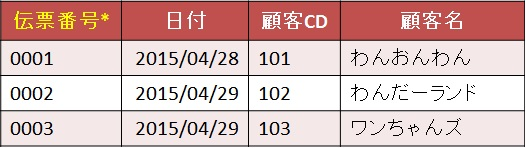
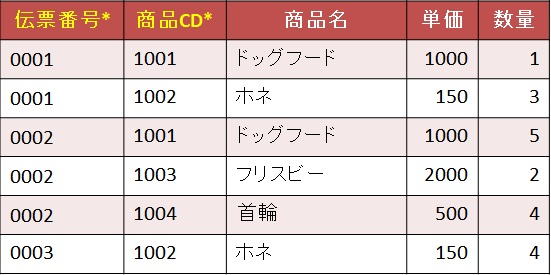
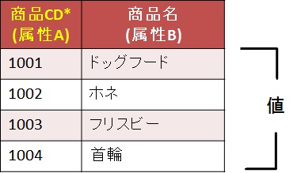
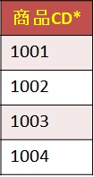
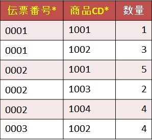
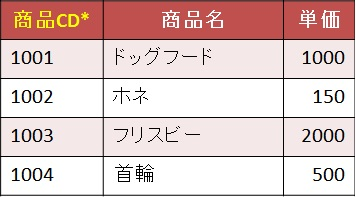

# 第二正規化

## 第二正規化とは  

第一正規形から  
第二正規形(部分関数従属性項目を別テーブルへ分離)にすること。  

## 第二正規形にするためには

以下のことをする必要がある。
- [部分関数従属性の分離](#部分関数従属性の分離)

## 第二正規化 練習問題

以下の運用を踏まえて、第一正規形を第二正規形にしなさい。
- 一日に何回か同じ顧客と取引をすることがある。
- 商品は一つの伝票に一つのみ。
- 単価は商品ごとに設定している。
- 同じ伝票番号は存在しない。

- 売上伝票テーブル(第一正規形)  

- 売上伝票明細テーブル(第一正規形)  

上記のテーブルに対して、  
[第二正規形にするためには](#第二正規形にするためには)に記載した内容を実行していく。

---

####  部分関数従属性の分離  

「部分関数従属性」という言葉だけみても、まったく意味がわからない。  
まず、「部分関数従属性」とは「部分」と「関数従属性」を組み合わせた言葉。  
なので、「関数従属性」から説明する。  

「関数従属性」とは、ある「属性A」の「値」が決まるとき、「属性B」の「値」が決まることで、  
表記すると「A→B」となる。  

例えば、売上伝票明細テーブルで  
「商品CD」(属性A)が「1001」(値)に決まると、  
「商品名」(属性B)は「ドックフード」(値)に決まる。ということが関数従属性の説明になる。  
- 商品CD(属性A)、商品名(属性B)  

> また身近なことで例えると、  
> 「買う機種」を「iPhone」と決めると、「メーカー」は「Apple」に決まる。

これが関数従属性である。

そこに「部分」が加わると、内容も少し付け加えられる。  
「部分関数従属性」とは、**複合主キーの一部分**だけで、他の値が決まる(関数従属性)ことである。  
※厳密には候補キーの一部分だが説明は割愛する

複合主キーがある売上伝票明細テーブルで考えてみよう。

「伝票番号」と「商品CD」が複合主キーであるが、  
*その複合主キーのうち、「商品CD」の「値」が決まることで、「商品名」の「値」が決まる*  
ということが成り立つ。  
つまり、「商品CD」が第二正規化の作業、部分関数従属性の分離の対象となる。  

売上伝票明細テーブルの商品CDを同じものを省いてピックアップすると以下となる。  
- 商品CD(重複排除)  

このテーブル上での部分関数従属性は「商品名」となる。  
が、もう一度運用の以下の内容を思い出してほしい。
> - 単価は商品ごとに設定している。

この内容から、「商品CD」の「値」が決まれば、  
「単価」の「値」も決まる。ということになる。  

よって、商品CDの部分関数従属性である「商品名」と「単価」を分離させるため  
売上伝票明細テーブルから排除する。  
- 売上伝票明細テーブル  

売上伝票明細テーブルから分離した「商品名」と「単価」は、  
「商品CD」の関数従属性なので、以下のテーブルを作成する。
- 商品テーブル  
  

ここまでが部分関数従属性の分離の作業になる。

---

以上で第二正規化は終了。  
この時点でのテーブル、つまり第二正規形は以下のようになっている。

- 売上伝票テーブル  

- 売上伝票明細テーブル  

- 商品テーブル  

