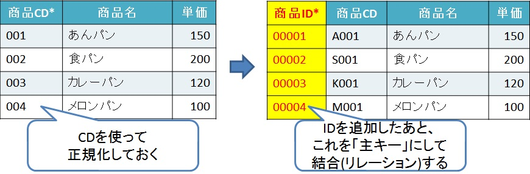

# キーの設定

## 主キー
## 外部キー
## 参照整合性制約

## 属性にキーを設定する

---

## 主キー

主キー以外にも、キーがつく言葉がいくつかあるため、  
一度整理する。

- ユニーク(一意)キー  
  1レコードを特定できる情報を持つ項目のこと。  
  NULLは許される。

- 候補キー  
  主キーのである項目全体を指す。
  ユニークであること。

- 主キー(プライマリキー)  
  候補キーの中から「意図的に」選ばれた項目で、  
  インスタンス(実際の値、実体、データ)が特定可能な識別子。  
  NULLは許されない。

- 複合主キー  
  1つのテーブルに存在する2つ以上の列(カラム)が組み合わさった主キーのこと。

- 外部キー(フォーリンキー)  
  エンティティ(テーブル)をまたがった、
  インスタンスの関連を示す。

主キーに求められるものとしては、
- 値の変わらないもの
- 出来るだけ、桁数が短いもの
- 複合主キーとなる場合、連結が多くならないもの

となっている。

主キーに求められるものを見ても、  
主キーを設定するなら、IDに設定することを勧める。

[CD、IDとは](about_code_identifier.md)でも説明はしているが、  
CDはニックネームでかつ業務の体系が変わることで変更になったりするため、  
主キーとしてはあまり適切ではない。

ただ、主キーをIDにするためには、  
基準にするものが必要で、それがCDにあたることが多い。  
なので最初はCDを主キーとする形で正規化して、  
そのあとIDを追加し、主キーをIDに設定すると  
主キーの設定はスムーズに行く。

- 商品テーブル(ID設定の流れ)  

また表を結合する時は、主キーを使って行うことが一般的であるため、  
主キーの設定はリレーショナルデータベースにおいて重要な部分でもある。

その主キーは、正規化で設定するのだ。

---
