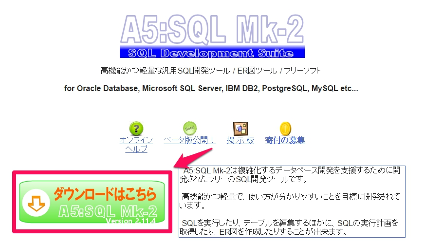
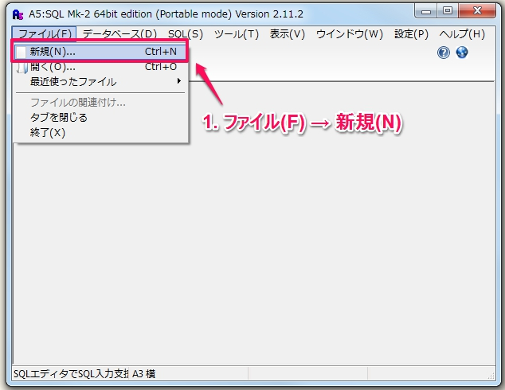
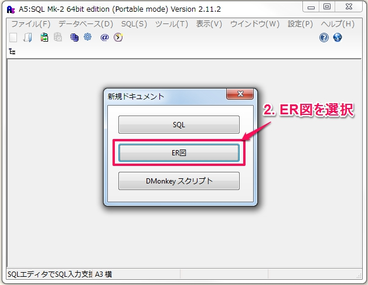
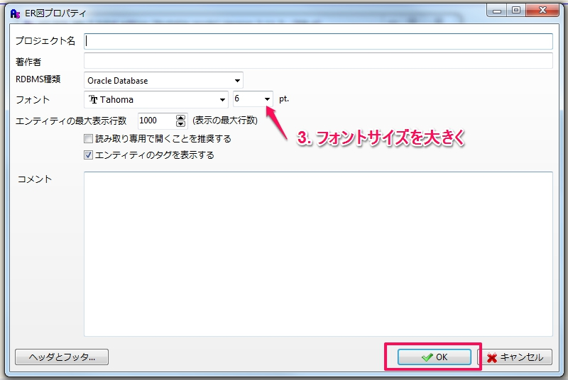
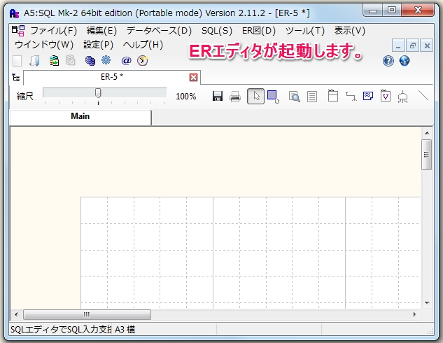

ER図を書くツールの使用準備
===

A5:SQL Mk-2
---

http://www.wind.sannet.ne.jp/m_matsu/developer/a5m2/

ERエディタ起動手順
---

A5M2.exe を起動後、ER 図を作成するエディタを立ち上げます。

1. [ファイル(F)] - [新規(N)]
2. ER 図 を選択
3. フォントサイズの初期値が小さいので12ぐらいに変更し、[OK]
4. ER エディタが起動する

  
  
  
  

- オンラインヘルプのERエディタも参照してください。  
http://www.wind.sannet.ne.jp/m_matsu/developer/a5m2/help2.11/
