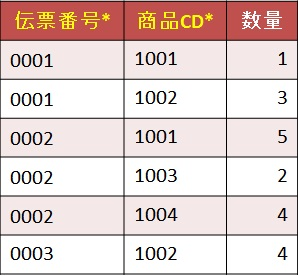
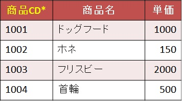

# 第三正規化

## 第三正規化とは  

第二正規形から  
第三正規形(推移関数従属性の項目を別テーブルに分離)にすること。  

## 第三正規形にするためには

以下のことをする必要がある。
- [推移関数従属性の分離](#推移関数従属性の分離)

## 第三正規化 練習問題

以下の運用を踏まえて、第二正規形を第三正規形にしなさい。
- 一日に何回か同じ顧客と取引をすることがある。
- 商品は一つの伝票に一つのみ。
- 単価は商品ごとに設定している。
- 同じ伝票番号は存在しない。  

- 売上伝票テーブル(第二正規形)  

- 売上伝票明細テーブル(第二正規形)  

- 商品テーブル(第二正規形)  

上記のテーブルに対して、  
[第三正規形にするためには](#第三正規形にするためには)に記載した内容を実行していく。

---

####  推移関数従属性の分離  

「推移関数従属性」という言葉だけみても、まったく意味がわからない。(二回目)  
ただ、「関数従属性」の部分は[第二正規化](./second_nomalization.md#部分関数従属性の分離)で説明した内容と同じであるため省略。  

「推移関数従属性」とは、  
**「属性A」の「値」が決まると「属性B」の「値」が決まり**  
**「属性B」の値から「属性C」の「値」が決まる。**  
ということである。  
これを表記すると「A→B→C」。  

ただし、「属性B」の「値」が決まると「属性A」の「値」が決まるという関係は成り立たないものとする。  
※「B→A」は成り立たない

言い方を変えると  
「属性A」の「値」が決まれば「属性C」の「値」が決まることになるので  
「A→C」ともいえる。  
※「C→A」は成り立たない

と言われても全然ピンとこない。  

例えば、モンスターがとあるエサで進化するゲームがあるとして、  
テーブルも第二正規化まで済んでいるとしよう。

- モンスターテーブル  

|モンスターCD*|モンスター名|進化用のエサCD|エサ名|進化モンスターCD|
|:--|:--|:--|:--|:--|
|501|ドラコ|001|お肉|502|
|502|ドラコン|002|お魚|503|
|503|ドラゴン|001|お肉|なし|

「モンスターCD」(属性A：主キー)が「501」(値)のとき、  
「進化用のエサCD」(属性B：テーブル内で主キーではないが一意になるキー)は「001」(値)に決まる。  

ここまでは普通の関数従属性。  
そして次の事柄が重要。  

- **「進化用のエサCD」が「001」に決まると、「エサ名」(属性C：非キー)が「お肉」(値)に決まる。**  

この部分だけ見ると、こちらも関数従属性の内容になる。  
つまり、「推移関数従属性」とは「関数従属性の関数従属性」で、  
以下の条件も含んでいて初めて推移関数従属性といえる。

- **「進化用のエサCD」が「001」に決まっても、「モンスターCD」が「501」と決まる関係にはならない。**  

まとめると  
> A:「モンスターCD」=「501」　→ B:「進化用のエサCD」=「001」　→ C:「エサ名」=「お肉」  
> ということは…  
> 「モンスターCD」がA :「501」　の　　進化用のエサ名は　C:「お肉」である。  
> ただし、「進化用エサCD」がB :「001」（つまりエサ名C:「お肉」）だからと言って 「モンスターCD」がA :「501」ということにはならない 

要するに、第三正規化でやりたいことは、  
「属性A」に対する「属性B」さえあれば「属性C」がわかるので  
「属性C」にあたる項目を分離させようということである。  

実際にやってみる。

今回の場合、
売上伝票テーブルを見ると推移関数従属性があるのがわかる。
- 売上伝票テーブル  

主キーの「伝票番号」の値が決まると、  
主キーでないが一意になるキー「顧客CD」が決まり、  
「顧客CD」が決まると、「顧客名」が決まる。  
「日付」の項目は、「日付」がわかっても、そこから一意に決まる項目は何もないため、  
日付の項目は分離せずそのままとなる。
- 売上伝票テーブル(伝票番号(属性A)、顧客CD(属性B)、顧客名(属性C))  

この「顧客名」を売上伝票テーブルから分離させるため、  
売上伝票テーブルの「顧客名」を排除する。
- 売上伝票テーブル  

売上伝票テーブルから分離した「顧客名」は、  
「顧客CD」の関数従属性なので、以下のテーブルを作成する。
- 顧客テーブル  

このテーブルでは「顧客CD」は一意で変更はないため、主キーに設定する。

ここまでが推移関数従属性の分離の作業になる。

---

以上で第三正規化は終了。  
この時点でのテーブル、つまり第三正規形は以下のようになっている。

- 売上伝票テーブル  

- 売上伝票明細テーブル  

- 商品テーブル  

- 顧客テーブル  

---

## ER図を作ってみよう

[第三正規化 練習問題](#第三正規化-練習問題)の練習問題で使った  
第三正規形に「ID」を設定した状態でER図を作成してみよう。

- 第三正規形(IDに主キーを設定)  

それぞれのテーブルの形を以下のような形に変更する。

- 第三正規形の実体と属性  

変更後は、以下のように線でつなげて行く。

- 第三正規形のER図  

左上を中心として、それぞれに線を張り巡らせていくとわかりやすい。

---

## まとめ

正規化したことにより、  
顧客情報や商品情報がシンプルになってわかりやすくなった。  
これは管理しやすくなったともいえる。

また、冗長性もなくなったので、  
データベースの容量削減にもつながる。

ただ、細かくしすぎるのもパフォーマンス上よくないという話もあるが、  
基本的にパフォーマンスは非正規形よりよくなるので、  
気にせず正規化してほしい。

実はこの第三正規化の後にも、第四、第五とあるのだが、  
今回教える正規化は第三正規化で終わりとした。  
実は第三正規化だけでも十分だったりすることが多い。  
興味のある方は第四、第五を見るといいかも。
