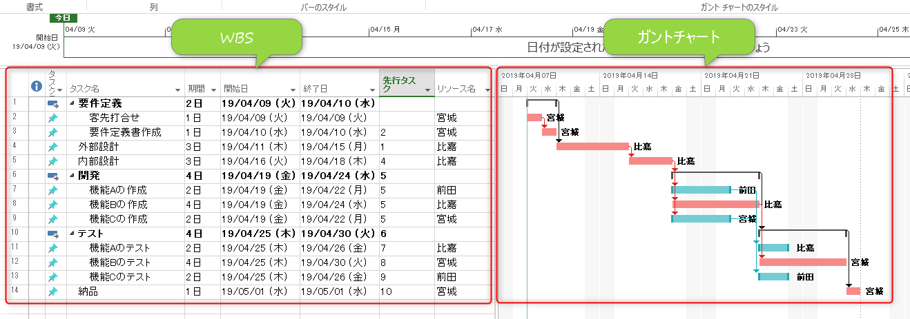
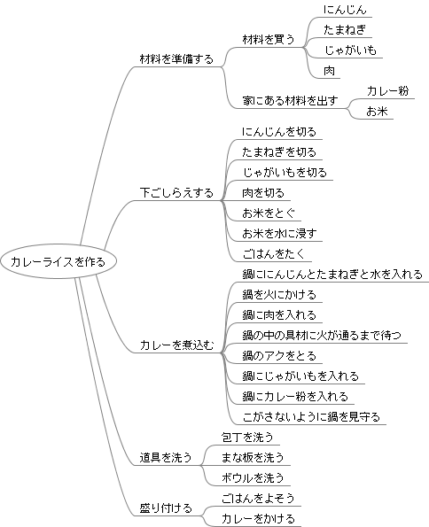

プロジェクトマネジメント入門
==============================

コース説明
------------------------------

プロジェクト、プロジェクトマネジメントについて学ぶ。

プロジェクトとは
------------------------------

> プロジェクト（英: project）は、何らかの目標を達成するための計画を指す。小さな目標の達成のためのものではなく、大きな目標を集団で実行するものを指すことがある。その計画の実現のための個々のタスク（仕事）の実行までを含めて指すこともある。

> PMIが制定しているPMBOK（第5版）の定義では、「プロジェクトとは、独自のプロダクト、サービス、所産を創造するために実施する有期性のある業務」とされている。つまり、会社などの通常業務や、継続的な運用管理、あるいは改善活動などは、特に開始と終了が定義されていないので、「プロジェクト」とは呼ばない。ただし、特定の期限までに特定の建築を行う、製品を開発する、システムを構築する、などは個々のプロジェクトになりうる。
> 複数のプロジェクトを「プログラム」と呼び、全体管理や全体最適を含む複数プロジェクトの管理を「プログラムマネジメント（プログラム管理）」と呼んでいる。

[Wikipedia プロジェクト](https://ja.wikipedia.org/wiki/%E3%83%97%E3%83%AD%E3%82%B8%E3%82%A7%E3%82%AF%E3%83%88)より引用

プロジェクトは以下の性質を持っています。

- 有期性
  - プロジエクトに始まりと終わりがあるという性質を指している。プロジェクトでは、納期までに成果物を完成させるためにスケジュール管理が重要である。多くのプロジェクトにおいて納期順守が優先度の高い事項である。
- 個別性
  - プロジェクトの非反復的な性質を指している。この非反復的な性質はプロジェクトがそれぞれ異なる目標を持っていたり、目標が似ていても環境が違っていたり、メンバーが変わっていたりすることから生じる。
- 不確実性
  - プロジエクトは、特殊な条件や状況を想定して実行される業務であるため、高い不確実性にさらされている。この不確実性は未知の情報、未確定な技術、予測不可能な環境等のリスクを発生させ、信頼性の高い計画の立案を困難にする。

プロジェクトマネジメントとは
------------------------------

> プロジェクトマネジメント（プロジェクト管理、英語: Project Management）とはプロジェクトを成功裏に完了させることを目指して行われる活動のことである。これにはプロジェクトを構成する各活動の計画立案、日程表の作成、および進捗管理が含まれる。
> システム開発を成功させるためには、プロジェクトを適切に管理することが求められる。

[Wikipedia プロジェクトマネジメント](https://ja.wikipedia.org/wiki/%E3%83%97%E3%83%AD%E3%82%B8%E3%82%A7%E3%82%AF%E3%83%88%E3%83%9E%E3%83%8D%E3%82%B8%E3%83%A1%E3%83%B3%E3%83%88)より引用

プロジェクトマネジメントの構成要素
- 戦略マネジメント
- ファイナンスマネジメント
- システムズマネジメント
- 組織マネジメント
- 目標マネジメント
- 資源マネジメント
- リスクマネジメント
- 情報マネジメント
- 関係性マネジメント
- バリューマネジメント
- コミュニケーションマネジメント

上記「目標マネジメント」はさらに以下の要素に分けられます。

- ライフサイクルマネジメント
- スコープマネジメント
- タイムマネジメント
- コストマネジメント
- アーンドバリューマネジメント
- 品質マネジメント
- 報告・変更・課題管理
- 引き渡し管理

本研修では上記の「スコープマネジメント」「コストマネジメント」「タイムマネジメント」で使用される「**WBS**」を使ってスケジュール管理の基本を学びます。

WBS とは
------------------------------

> WBSはプロジェクトの目標を達成するために、プロジェクトの成果物やフェーズに基づき、実行されるべきすべての作業を体系的に階層組織化して表したものです。スコープマネジメントだけでなくタイムマネジネメント、コストマネジメントの基礎データともなります。下位レベルになるほど詳細になります。

- WBSの例

WBSで定義すべき情報
- タスク(Task)
- 期間(Duration)
- 先行タスク(Dependency)
- リソース(Resource)

上記を定義すると、以下も同時に定義されます。(導出されます)
- スケジュール(Schedule)
- コスト(Cost) : リソース×期間
- タスクの余裕(Float Buffer)
- クリティカルパス(Ctical Path)

カレーライスを作る例

  - カレーライスを作るタスクの洗い出しの例

  

  - [カレーライスを作るWBSの例](カレーライスを作る.pod)

ローリングウェーブ計画法（段階的詳細化）
------------------------------

WBSは、計画段階で作ります。

そうはいっても、ソフトウェアの開発が伴うプロジェクトでは不確定要素が多く、設計が終わってみないと次の作業が見えてこないというケースがあります。
こういう場合でも、WBSは作成します。

例えば、今から作業に着手する上流工程のWBSは詳細に作っておいて、下流工程のWBSは粗く作っておきます。上流工程で仕様が明らかになった段階で、下流工程のWBSを詳細化していきます。
 
波は海岸近くでは細かく砕け散りますが、遠くの方は大きく見えることから、プロジェクトマネジメントの世界では、段階的詳細化のことをローリングウェーブ計画法と呼ばれます。

プロジェクト管理用ソフト
------------------------------

本コースでは [Projectlibre](https://ja.osdn.net/projects/sfnet_projectlibre/) を使用して WBS を作成します。

本研修では WBS で予定と実績を管理してもらいます。

- 予定と実績の作成方法
    - [ベースラインの設定](http://nanashiresearcher.blog.fc2.com/blog-entry-73.html)

プロジェクト立ち上げ演習
------------------------------

以下について決定してください。

- チーム名
- チームの合意形成ルール
    - 例: 「多数決」「PMが決定権を持つ」「話し合いをし、最終的にPMが決定する」など
- プロジェクトマネージャを誰が担当するか

WBS 作成演習
------------------------------

疑似プロジェクトのWBSを作成してみましょう。

以下いずれかのテーマを選択し、全てのタスクを洗い出して「WBS」を作成してください。
- 「展示会へのブース出展プロジェクト」
- 「宴会プロジェクト」
- 「海外旅行プロジェクト」

タスクで決めること
- タスク名
- 所要期間
- 先行タスク
- 担当者
- 成果物

WBS作成ツール
- [Excelスケジュール管理表](http://172.16.7.40/share/%E6%96%B0%E5%85%A5%E7%A4%BE%E5%93%A1%E7%A0%94%E4%BF%AE/software/161209_schedule_r1.xlsm) ([使い方の解説](https://kantan-shikaku.com/ks/schedule-table/))
- [GanttProject](https://ja.osdn.net/projects/sfnet_ganttproject/)
