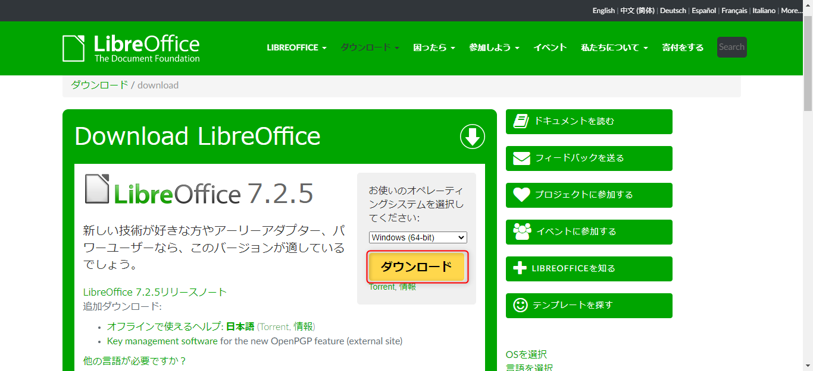
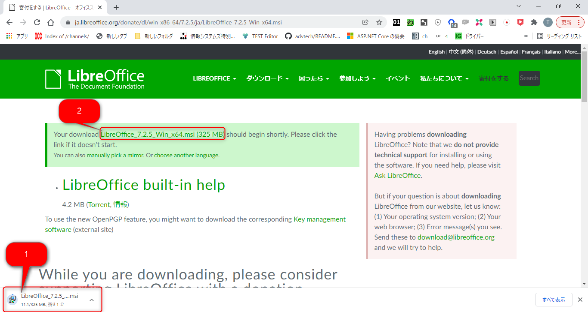
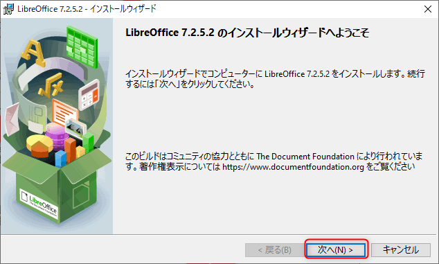
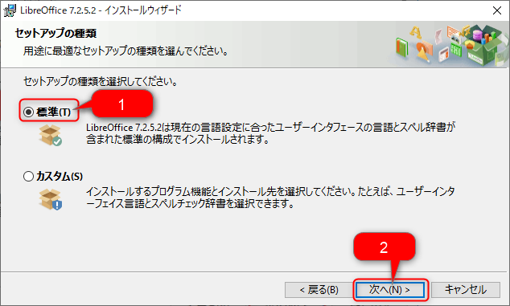
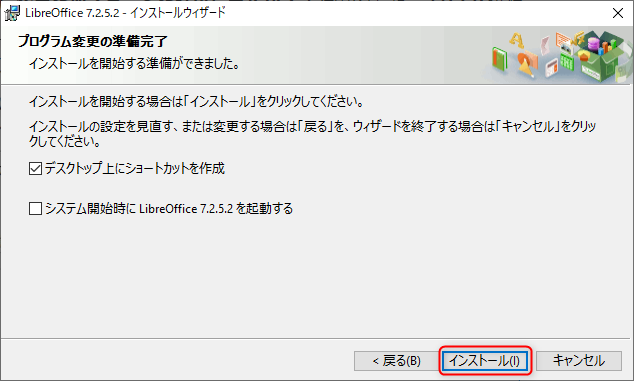
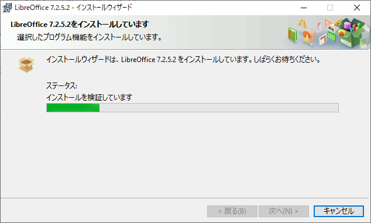
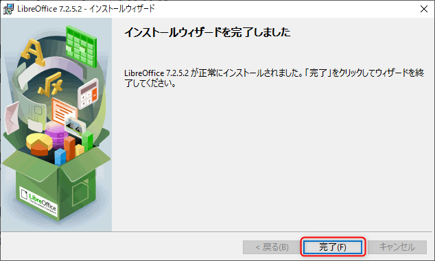

LibreOffice
==============================

- LibreOffice のダウンロード

    [Download LibreOffice](https://ja.libreoffice.org/download/download/) を開いて、ダウンロードをクリックする。
    
    

- LibreOffice のインストーラーを起動

1. 自動でのインストーラーがダウンロードされる。
    もし、自動でダウンロードが始まらない場合は、をクリックして手動でダウンロードする。自動でインストーラーがダウンロードされない場合は、をクリックしてダウンロードしてインストーラーを起動する。
    ダウンロードが完了したら、 をクリックしてインストーラー起動する。
    

1. インストーラーを起動したら以下の画面が表示されますので、**次へ(N)>** をクリックします。
    
1. の **標準** になっていることを確認して、の **次へ** をクリックする。
    
1. 以下の画面が表示されますので、**インストール(I)>** をクリックします。 
    
1. **このアプリがデバイスに変更を加えることを許可しますか？** と聞かれたら、
**はい** を選択

1. 以下のように表示されてインストールが始まります。

1. 以下のように表示されてインストール完了したことを確認します。

以上
