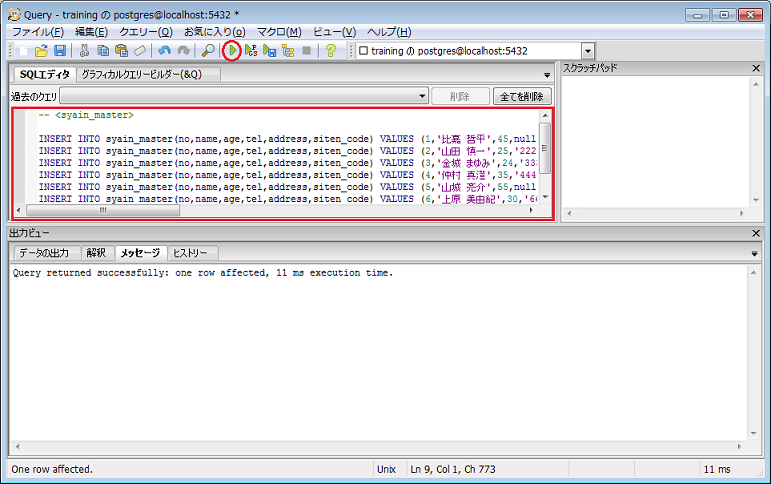

# PostgreSQL

## 1. PostgreSQLのインストール準備

* 各パソコンにデータベースをインストールします。インストール手順は以下の通りです。

1-1. Administrator権限を持つユーザでWindowsにログインします。

1-2. 日本PostgreSQLユーザ会のホームページへアクセスし、最新バージョンを取得します。「ダウンロード」をクリックしてください。
  * ホームページ：[NPO法人　日本PostgreSQLユーザ会](http://www.postgresql.jp/)

1-3. ダウンロードリンクより、OS「Windows」のリンク先をクリックします。

1-4. 各パソコンのOSに対応した、最新バージョンをクリックします。
  * Windows7 32bitの場合は「`Win x86-32`」
  * windows7(8.1) 64bitの場合は「`Win x86-64`」

1-5. 「実行ボタン(R)」をクリックします。

## 2. PostgreSQLのインストール

2-1. 「Next >」ボタンをクリックします。

2-2. インストール先を入力し、「Next >」ボタンをクリックします。
  * デフォルトの「`C:\Program Files\PostgresSQL\9.4`」でOK

2-3. データベースのデータ保存先を入力し、「Next >」ボタンをクリックします。
  * デフォルトの「`C:\Program Files\PostgresSQL\9.4\data`」でOK

2-4. データベースのスーパーユーザ（管理者権限を持ったユーザ）のパスワードを入力し、「Next >」ボタンをクリックします。
  * パスワード：`admin`

2-5. Portは初期値のままで、「Next >」ボタンをクリックします。

2-6. Localeに「Japanese,Japan」を選択し、「Next >」ボタンをクリックします。

2-7. 「Next >」ボタンをクリックします。

2-8. 「Stack Builder」のチェックを外し、「Finish」ボタンをクリックします。

2-9. 画面が閉じればインストール完了です。

## 3. データのセットアップ

* パソコンにデータベースをインストールした段階では、まだデータが何も入っていない状態です。あらかじめ用意しておいたデータを、データベース内部へ取り込みます。

3-1. スタートメニューから、`pgAdminⅢ`を起動します。

3-2. `localhost`の`postgresSQL`をダブルクリックし、パスワードを入力します。
  * パスワード：`admin`

3-3. データベースの上で右クリックし、新しいデータベースを作成します。
  * データベース名：`training`

3-4. 作成したデータベース「`training`」を選択した状態で、「`SQL`」と書かれたアイコンをクリックし、クエリーツールを起動します。

3-5. ファイル「`create_table.sql`」の内容をすべて貼り付けた状態で、再生ボタンをクリックし、SQLを実行します。

3-6. ファイル「`insert_data.sql`」の内容をすべて貼り付けた状態で、再生ボタンをクリックし、SQLを実行します。

