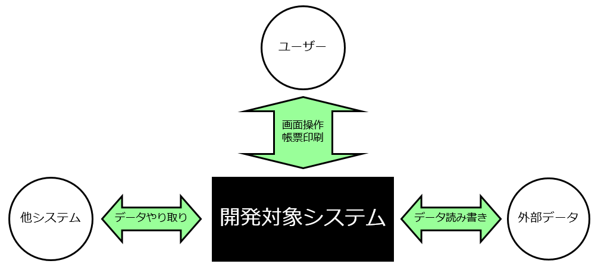
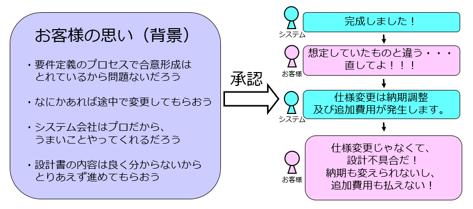

外部設計
=========================

スケジュール
------------
- 09:15 ～ 10:00　座学
- 10:00 ～ 14:30　演習
- 14:30 ～ 16:00　レビュー（お客様説明・承認）
- 16:00 ～ 17:30　発表
- 17:30 ～ 18:00　振り返り、修正等

目標
------------
- 「外部設計」という言葉の意味について説明できるようになる。
- 外部設計書を作成できるようになる。
- 作成した外部設計書についてお客様へ説明し、承認をいただくことができるようになる。
- 外部設計の前後にある要件定義や内部設計との関係を理解する。

外部設計とは
------------

外部設計とは、要件定義の次に行われる開発工程のことです。

システムがどのように動作するかを明文化してお客様に理解して頂き、承認していただくことを目的とします。

要件定義の段階でお客様からボールを投げて頂いたので、それを外部設計という形でお返しします。

何が「外部」なのか?
------------

開発対象システムの外側とのやり取りに必要な情報を、外部設計で設計・定義していきます。

外部設計の失敗例
------------
外部設計とは、要件定義の次に行われる開発工程のことです。
お客様への説明が不十分、または認識違いがあることが多い。

＜ポイント＞
- 外部設計（上流工程）の重要度をしっかり説明すること。
- 双方の認識違いが無いか確認すること。
- あやふやな点は、はっきりさせること。
- お客様に設計内容を確実に理解してもらうこと。

外部設計の意義、必要性
------------
- 要件定義の漏れ、認識違いを発見することができる。
- システムの画面レイアウトや操作性等、要件定義の段階ではあやふやだった部分を決定することができる。
- システム全体を俯瞰（ふかん）することで仕様の理解度が上がり、バグの発生を未然に防ぐことができる。
- 次のプロセス（内部設計）へのインプットとなる。

演習
------------

本演習で作成する外部設計書（成果物）

- 外部設計書
  - 画面一覧
  - 画面遷移図
  - 画面仕様書

設計書テンプレート
------------

本演習で使用する設計書のテンプレートおよびサンプル。

[新人専門教育（開発演習-外部設計）設計書テンプレート.xlsx](新人専門教育（開発演習-外部設計）設計書テンプレート.xlsx)

レビュー
------------
「お客様」へ「説明」し、「承認」をいただきましょう。

＜ポイント＞
- 外部設計の重要度をしっかり説明すること。
- 双方の認識違いが無いか確認すること。
- あやふやな点は、はっきりさせること。
- お客様に設計内容を確実に理解してもらうこと。

※１回目で承認をもらえるとは限りません。

発表
------------
「お客様」へ「説明」し、「承認」をいただきましょう。
