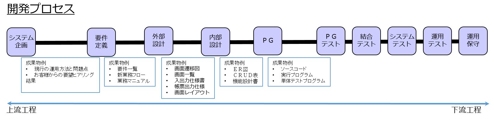

内部設計
=========================

スケジュール
--------------

- 09:15 ～ 10:00　座学
- 10:00 ～ 14:30　演習
- 14:30 ～ 16:00　レビュー
- 16:00 ～ 17:30　発表
- 17:30 ～ 18:00　振り返り、修正等

目標
------------

- 「内部設計」という言葉の意味について説明できるようになる。
- 内部設計書を作成できるようになる。
- 内部設計の前後にある外部設計や製造(PG)との関係を理解する。

内部設計とは？
--------------

開発対象システムの要件や外部設計をシステム内部でどのように実現するのかを仕様として定義するのが「内部設計」です。

- システム開発中の工程のひとつ。
- 内部設計で要件を仕様（設計書）に変換する。
- システムの具体的な動作を決める作業。

開発内部向けであるため、通常はお客様とのレビューは必要ありません。

- 要件定義・外部設計　⇒　利用者にみえる。
- 内部設計・開発　　　　⇒　利用者にみえない。

そのため、開発者がプロとしての見識に基づいて行う工程です。

内部設計をする理由
----------------

### 理由1. プログラムを製造するためには「何をどうするか?」を具体的に決める必要があります。

例)

- ログイン画面でアカウント情報は実際にはどのテーブルからとってくる？
- 集計ボタンを押したら、実際にはどのテーブルからどの情報をどのような条件でもってきて、どのように集計する？

これらを具体的に定義してはじめて、プログラムを製造することができます。

### 理由2. 外部設計で決めた仕様の実現性や妥当性を検証する

内部設計で「実際に製造するには・・・」を具体的にイメージすることで外部設計の漏れに気が付くことができます。

例)

- ログイン画面で使用するアカウントテーブルを設計した。じゃあアカウントテーブルにデータを登録する登録画面も必要じゃないの？
- 感謝カードテーブルを設計したら登録画面の項目不足に気が付いた

### 理由3. 製造工程において何をすればよいかのイメージでき、ボリューム感(どれくらい工数がかかるか)が把握できる

例)

- 登録ボタンと更新ボタンは同じようなプログラムでいけそうだな・・・。
- 集計ボタンの機能にはかなり苦労しそうだな・・・。
- この納期でこれだけの開発は無理があるのでは・・・。

### 理由4. 設計と実装の分業ができる

内部設計書が必要十分な内容になっていれば、設計者とは別の開発者であっても実装を進めることができます。

### 理由5. 今後、改修や機能追加をする際の資料として使えます

いつでも同じ開発者が開発をするとは限らず、システム完成から1年後、別の開発者が改修を行ったり、機能を追加することもあります。

その際、内部設計書が必要十分な内容になっていれば、新たに参画した開発者でも開発当初の意図や設計指針を把握することができます。

内部設計で行うこと
------------

開発案件毎に違いはあるが、一般的に内部設計では以下の作業を行う。

- データベース設計
    - DB設計
    - ER図作成
- UI仕様のチェック
    - 処理を行うために必要な項目が画面レイアウトに含まれているか?
    - 画面に表示する項目(画面仕様書)がDB項目(DB設計、ER図)に含まれているか? または計算によって表示(導出)可能か?
- 機能設計
    - 項目の入力チェック
        - 〇〇入力画面の「名前」は必須入力？。
        - 〇〇入力画面の「日付」は未来日はＮＧ？。
    - ボタンの動作
        - 登録ボタンを押したら〇〇チェックをして、〇〇テーブルに〇〇する。
    - 初期設定
        - 〇〇登録画面の〇〇日には今日の日付を初期設定。

演習
------------

成果物
--------------

* テーブル定義書
* ER図
* CRUD図
* 機能設計書

上記を作り変えた後に以下を完成させること。

* WBS

設計書テンプレート・サンプル
--------------

[設計書テンプレート.zip](設計書テンプレート.zip)

[設計書サンプル.zip](設計書サンプル.zip)

レビュー
--------------

全ての成果物が完成したら講師とアポイントを取り、レビューを受けて承認をもらってください。

＜ポイント＞
- どの技術者が見ても同一・同質のコーディングが可能である内部設計書になっているか。
- 要件がすべて実現されているか。
- 外部設計と整合しているか。

ヒント
--------------

* **テーブル定義書**
  * *Keyword*
    * 第三正規形
  * *Input*
    * 外部設計書
      * 画面仕様書
      * 画面遷移図
  * *Check*
    * 画面に表示する項目が定義されているか
    * 足りない情報はないか
    * 無駄、重複している情報はないか

* **ER図**
  * *Input*
    * 外部設計書
      * 画面一覧
      * 画面仕様書
      * 画面遷移図
    * 内部設計書
      * テーブル定義書
  * *Check*
    * 主キー、外部キーの設定は正しいか
    * 関連の設定に不整合はないか

* **CRUD図**
  * *Input*
    * 外部設計書
      * 画面仕様書
    * 内部設計書
      * テーブル定義書
  * *Check*
    * エンティティに対してCRUDの操作がちゃんとあるか

* **機能設計書**
  * *Input*
    * 外部設計書
      * 画面仕様書
      * 画面遷移図
  * *Check*
    * 画面レイアウトや画面遷移図と不整合はないか
    * 考慮漏れはないか
