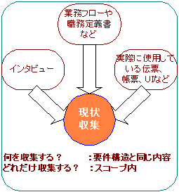
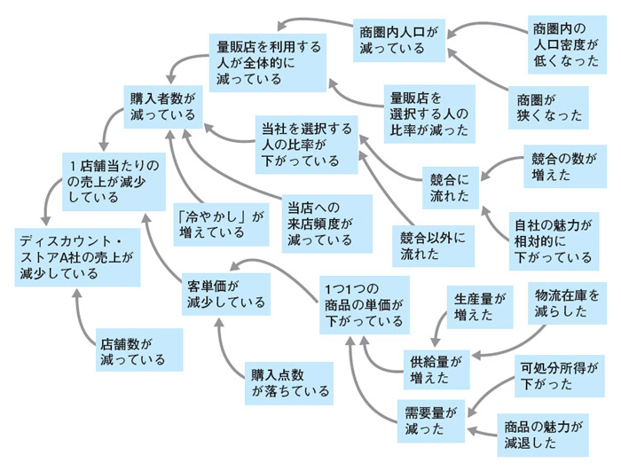

# 現状分析

## 現状収集

意識していないが、 巌然(げんぜん)としてそこに存在している仕事を明確にする

## 問題構造分析(因果関係図)

（図 http://itpro.nikkeibp.co.jp/article/COLUMN/20070226/263272/ より）

問題をそのまま捉えるのではなく、因果関係を明確にし、問題の本質を捉える

## 現状収集の演習

お客様にヒアリングをし、現状、感謝カードがどのように運用されているのかを明確にする。

手順
1. チーム内で必要な質問を洗い出す
1. お客様とヒアリングの日時調整を行う
1. ヒアリングでお客様に上記質問をする
1. 質問結果が正しく伝わっているか、お客様と確認する
