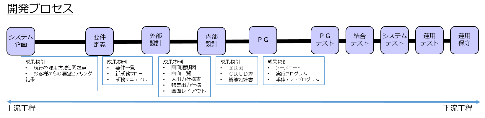
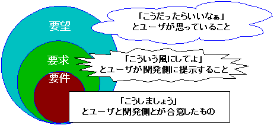
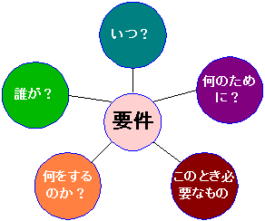

要件定義
==============================

[日程](Schedule.md)
------------------------------

[研修目標](GoalOther.md)
------------------------------

目次
------------------------------
1. 開発プロセスの流れ

1. 要件定義とは何か？
    - 要件を定義すること
    - システム開発中の工程のひとつ
    - システムが提供する価値を決める作業
    - 以降の工程を決定する作業
    - 最も重要な工程と言える
1. 要件とは何か？
    - お客様とシステム開発で「なに」を作るか決めること。
    - 「なに」を作るか決めることで、システムを開発することができる。
    - 「要件とは、必要な条件。欠くことのできない条件」 --- （三省堂「大辞林」より）
    - 
    - 要望 「こうだったらいいなぁ」
    - 要求 「こういう風にしてよ」
    - 要件 「こうしましょう」
1. 要求から要件へ
    1. 要求を精査する
    1. アィディアを織り込む（お客様はシステムに詳しくないため、プロとしての知見を織り込む）
    1. 合意形成する
        - 重要なのは双方が納得すること
        - (要件に正しい答えはない。 適宜、提案（アィディアを売り込む）をして、そして合意する！)
1. 要件の構造
    - 
1. 要件定義の工程
    1. [スコープの確認](scope.md)
    1. [現状分析](analysis.md)
    1. [要求収集](hearing.md)
    1. [課題設定](problem.md)
    1. [新業務設計](tobe.md)
    1. [要件決定](decision.md)
1. [要望一覧](../development/demand_list.md)
1. [まとめ](review.md)
1. [演習：要件定義演習](xercise.md)
1. [マジカ](magica)
1. [実習1：現行業務をマジカで書く](problem1.md)
1. [実習2：新業務をマジカで書く](problem2.md)
