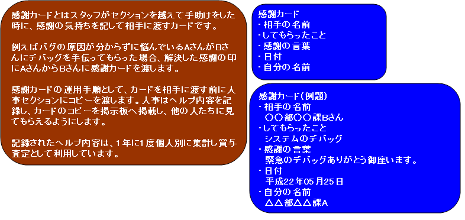

## 実習１：現行業務をマジカで書く

(日本航空 事例: http://itpro.nikkeibp.co.jp/article/JIREI/20080130/292399/)

## 実習資料

1.  [感謝カードの問題点・要望](./images/感謝カードの問題点・要望.pdf)
2.  [これがマジカだ！](./images/これがマジカだ！.pdf)
3.  [要件一覧](./images/要件一覧.xlsx)
4.  [要求事項確認書（１．３版）](./images/要求事項確認書（１．３版）.xls)
