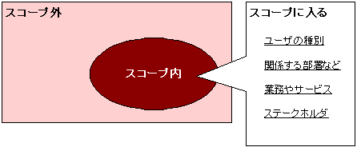

# スコープ（対象範囲）の確認

本来はプロジェクトの開始時に定義されているべきもの

あわせて押さえておくべきもの

- プロジェクトのゴール
- 納期
- 予算
- 技術的制約条件
- 業務的制約条件
- 組織的制約条件
- プロジェクトメンバ・チームの制約条件

※ [ステークホルダーとは](http://e-words.jp/w/%E3%82%B9%E3%83%86%E3%83%BC%E3%82%AF%E3%83%9B%E3%83%AB%E3%83%80%E3%83%BC.html)
