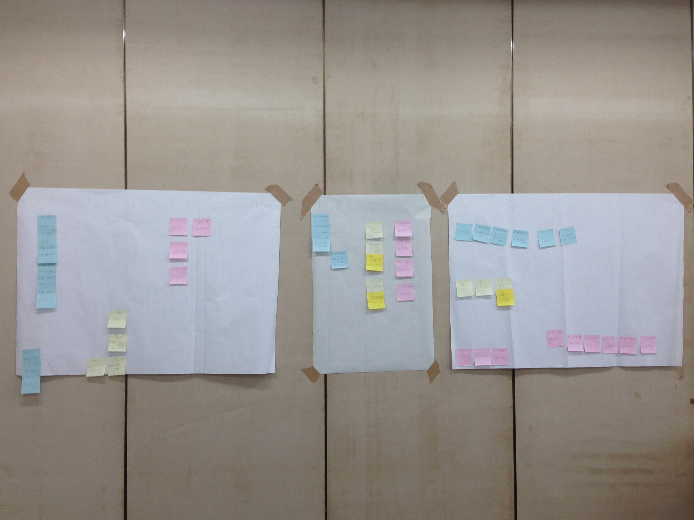

# 開発の前に
[自己紹介](https://github.com/noriyukishiroma/profile/blob/master/2015_prof.md)

## 大切な事
- メンバーとのコミュニケーションは密に
	- 作業は自分の担当分だけではない
	- 技術力の問題で作業が止まらないように。今出来る事を考えよう
- チーム内での情報の共有は怠らない
 	- 機能を実装した後に間違えに気づいたり･･･
 	- ユーザーへの報告がうまくいかず、思ったとおりに要求が伝わらなかったり･･･
- なぜ？と思い、考え続ける事が重要
- システムを作る事が目的ではない
- これまでの研修で学んだ事を生かして行動しよう
	- ヒントは今までの研修の中にたくさんありますよ

## 困ったときは？
- まずググろう!
- そして周りに聞いてみよう!

※最初から誰かに聞いた方が早かったなんてこともしばしば。case-by-caseでいきましょう。   
※質問するときは何が分からないのか、何を知りたいのかを明確にすると伝わりやすいですよ。

## 昨年は
- ruby on rails
- 2人,3人の2チームに分かれて開発
- マニュアル駆動開発
- ソース管理はGithub

- 役割分担
	- **チーム定時ﾀﾞｯｼｭ(3人)**
 		- 役割
 			- PM,Controller担当
			- Model,Controller担当
			- View担当
		- 中身より外装が先に完成
		- M,Cの担当者の負担が大きかった

	- **チーム一平ちゃん(2人)**
		- 役割 
			- PM,View担当
			- Model,Controller担当
		- 各人の作業量に差が生じた
- 反省	
	- MVCで作業を分けるのでなく、優先順位の高い作業から取り掛かった方が良かった
	- どの作業もこだわると収集がつかなくなる。最低限自分の作業ができたら他の人の状況確認をするべきだった

---
- 進捗管理
	- 毎朝進捗の報告会
	- チーム定時ﾀﾞｯｼｭ
		- ポストイットでスケジュール管理  

		- 進捗が悪かった為ユーザーと何度も要件定義をし直す
	- チーム一平ちゃん
		- Milestoneで細かく目標立て
		- GithubのissueをHuboardを使って管理

- 反省
	- 各作業が全体の作業の何%か把握したほうが良かった
	- ユーザーに提案をするとき
		- 提示した案が了承されるとは限らない  
		- 案を複数用意してユーザーに選択してもらうとより話し合いがスムーズになるかも！