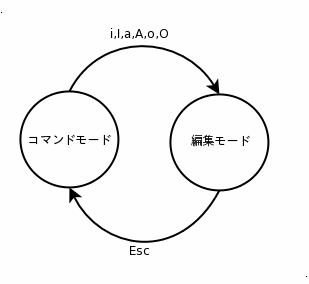

# エディタ(ドキュメント)


Linux で使える代表的なエディタとして、 `vi` と `Emacs` があります。

`vi` もしくは `vim` とよばれるエディタはほとんどのディストリビューションにデフォルトで入っています。
今後 Linux を業務で扱う人は、必ず使うエディタです。

`Emacs` は多機能で拡張に優れているため開発等で利用する人が多いです。デフォルトでは Linux にはインストールされておらず、使う場合にはインストールする必要があります。

この章では、デフォルトでインストールされている `vi` エディタについて説明します。

## vi エディタを使えることは必須の能力

vi はテキストファイルを編集する、エディタです。これをテキストエディタと言います。

テキストファイルとはテキストで形成されるファイルのことです。  
ファイルの種類にはテキストファイル、画像ファイル、音楽ファイル、HTMLファイル等様々な種類があります。

テキストエディタとは、テキストファイルを編集するアプリケーションのことです。  
Windows で言えば、メモ帳や秀丸エディタ、さくらエディタがテキストエディタです。

Linux を扱うためには、テキストエディタを使うことは必須です。  
なぜなら、Linux では設定ファイルやプログラミングを行う際に、テキストファイルを編集することがあるからです。

## vi はどの OS でも使えて、効率的にテキストが編集できる

vi は Unix 系 OS ( Linux や FreeBSD , MacOSX 等) で標準搭載されているテキストエディタです。  
そのため、vi の使い方を覚えると、どの OS でもファイルの編集ができるようになります。  
それによって、使い慣れていない OS の設定を変更したい場合でも、vi を使って、設定ファイルを編集することができます。  

vi は Windows などに搭載されている一般的なテキストエディタとは操作が異なります。  
また、多くの機能を持っているので、それを使いこなすことで、テキストの編集作業が効率化されます。
その操作に関して学習していきます。  

## コマンドモードと編集モード

viには **"コマンドモード"** と **"編集モード"** が存在します。  
viを使用する場合は、これらの２つのモードを意識して操作をする必要があります。  
それが普通のテキストエディタとの違いです。

- コマンドモード  

  カーソルの移動や検索・置換等の**テキスト入力以外の編集**を行うモードです。  
  エディタの起動時はコマンドモードの状態になっています。

- 編集モード  

  テキストの入力を行うモードです。  
  コマンドモード時に、挿入キーの入力、または挿入操作を実行すると編集モードへ切り替えられます。  
  編集モード時に、Escキーを入力することでコマンドモードへ切り替えます。

 

### viの起動とテキスト入力

viはコマンドラインから、以下のコマンドで起動します。  

```command
$ vi <your file name>
```

それでは実際にテキスト入力をしてみましょう。以下の手順であなたの名前を `Myname.txt` に書き込み、保存してください。  

1. `$ vi MyName.txt` を実行し vi を起動します。
2. 「i」を入力し編集モードへ移行します。
3. あなたの名前を入力してください。
4. Escキーを押しコマンドモードへ移行します。
5. 「:w」を入力しEnterキーを押し、ファイルを保存します。
6. 「:q」を入力しEnterキーを押し、vi を終了します。

上記のようにコマンドモード - 編集モード - コマンドモード と切り替えながら操作を行います。
コマンドには以下のように様々な機能があります。

 1: 編集モードへ遷移するコマンド

|コマンド|説明          |
|:--------:|:--------------|
|i|カーソルの**左側から**文字を挿入|
|I|行頭から文字を挿入|
|a|カーソルの**右側から**文字を挿入|
|A|行末から文字を挿入|
|o|カーソルの**次の行から**文字を挿入|
|O|カーソルの**前の行から**文字を挿入|

 2: コマンドモードへ遷移するコマンド

|コマンド|説明          |
|:--------:|:--------------|
| Escキー |編集モードからコマンドモードへ遷移|

 3: カーソル移動 

|コマンド|説明          |
|:--------:|:--------------|
|h|カーソルを左へ移動|
|j|カーソルを下へ移動|
|k|カーソルを上へ移動|
|l|カーソルを右へ移動|
|0|カーソルを行頭へ移動|
|\$|カーソルを行末へ移動|
|Ctrl+F|カーソルを1画面分下へスクロール|
|Ctrl+B|カーソルを1画面分上へスクロール|
|(数字)G|(数字)行へカーソルを移動|

 4: ファイル操作 

|コマンド|説明          |
|:--------:|:--------------|
|:w|現在編集している内容をファイルに保存|
|:w ファイル名|現在編集している内容をファイル名に保存|
|:q|viを終了|
|:wq|編集を保存してviを終了|
|:q!|編集内容を破棄してviを終了|

 5: 検索

|コマンド|説明          |
|:--------:|:--------------|
|/(検索ワード)|検索ワードをカーソルより下に検索|
|?(検索ワード)|検索ワードをカーソルより上に検索|
|n|次の候補を検索|
|N|前の候補を検索|

 6: コピー・カット・ペースト他

|コマンド|説明          |
|:--------:|:--------------|
|yy|カーソルの１行をコピー|
|dd|カーソルの１行を切り取り|
|p|カーソルの位置に切り取った行を貼付け|
|u|直前の動作を取り消す|
|.|直前の変更操作の繰り返し|


### 演習 ###

以下のテキストを `practice.txt` というファイルに書き写しましょう

```
Debian プロジェクト憲章 (v1.4)

1. この憲章におけるあらゆる記述は、 誰かにこのプロジェクトに対する作業を義務づけようとするものではない。 委任された、 または割り当てられた仕事をしたくない場合には、それをする必要はない。 しかし、この憲章の規則に反した、 またこの憲章に従って適切になされた決定に反した行動を、 意図的にとってはならない。

2. あるひとりの個人は複数のポストを兼任できるが、プロジェクトリーダ、 プロジェクト書記、技術委員会議長の三つのポストは例外であり、 この三つのポストには別々の人がつかなければならない。 またプロジェクトリーダは自分自身を代行者に選んではならない。

3. ある個人は、公にその旨を表明することによって、 いつなんどきでもこのプロジェクトを去ったり、 特定のポストから辞任できる。
```

