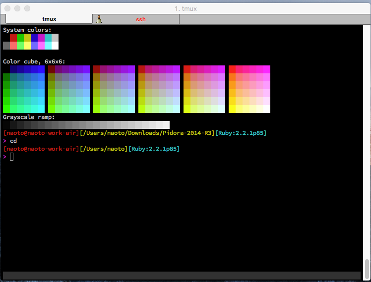

# Linux 概要

## Linux とは

LinuxとはOSの一種。OSとはオペレーチィングシステムの略で、コンピュータを使う際の土台になるものである。
LinuxはオープンソースのOS。 オープンソースとは、無償で改変可能なプログラム。
Linuxは世界中の有志たちがボランティア的に作り上げ、無償で使え、中身も完全に公開されている状態で世に公開されている。
Linux（リナックス、そのほかリヌックス、ライナックス[3]など）は、UnixライクなOSカーネルであるLinuxカーネル、およびそれをカーネルとして周辺を整備したシステム（GNU/Linuxシステムも参照）。

[参照-3分でわかるLinux](https://eng-entrance.com/you_can_do_linux)  
[参照-Wikipedia: Linux](https://ja.wikipedia.org/wiki/Linux)

## 開発者

- リーナス・トーバルズ
- 1991年 にフィンランドの大学生だったリーナス・トーバルズにより開発が開始される。
- Unix と呼ばれる OS を参考に作られている。
- OSS として Linux コミュニティで開発されている。

## CUI

`CUI` とは `Command User Interface` または `Character User Interface` の事で、
キーボードで文字によりコマンドを入力する事で出力を行うインタフェースの事である。

[Wikipedia: キャラクタユーザインタフェース](https://ja.wikipedia.org/wiki/キャラクタユーザインタフェース)

## ディストリビューション

Linuxディストリビューションとは、Linuxを一般利用者がインストールしたり、利用できる形にまとめ上げたもの（配布形態）

大きな区分として下記のようなものがある

- Debian 系
  - Ubuntu
- RedHat 系
  - RedHat Linux
  - CentOS
  - FedoraOS
- Slackware 系
- 独立系
  - Gentoo Linux
  - CoreOS

出展 [Wikipedia: Linuxディストリビューション](https://ja.wikipedia.org/wiki/Linuxディストリビューション)

