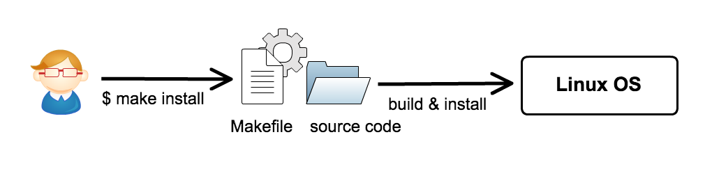
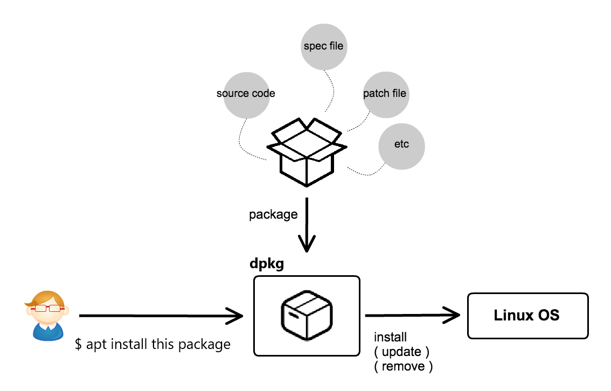
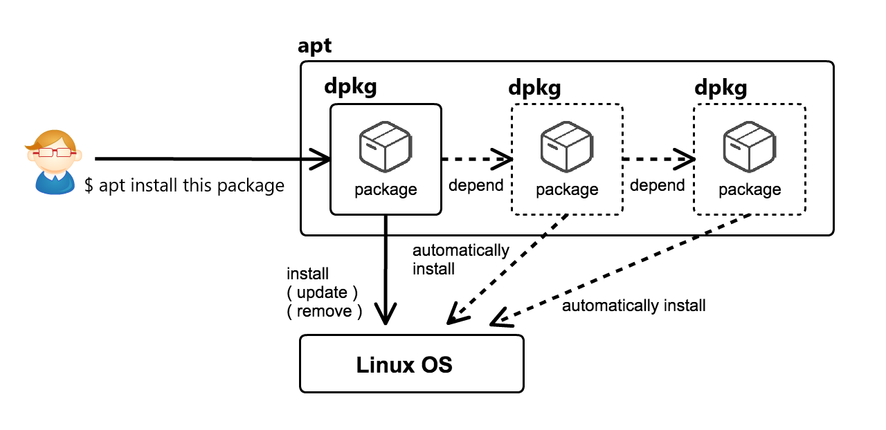
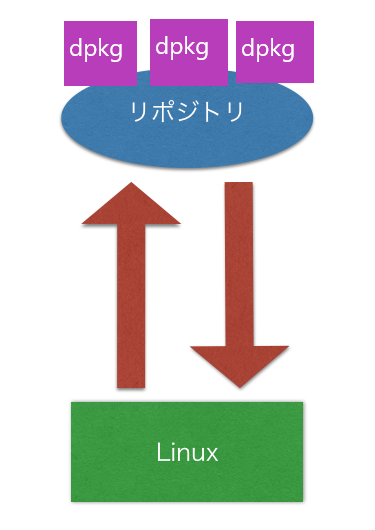

# パッケージマネージャ(ドキュメント)


## パッケージマネージャとは

> パッケージマネージャとは、コンピュータに何のソフトウェアがインストールされたかを記録し、新しいソフトウェアのインストール・新しいバージョンへのソフトウェアの更新・以前インストールしたソフトウェアの削除を容易に行えるようにするプログラムです。名前が示すように、パッケージマネージャはパッケージを取り扱います。パッケージとは、ファイル群を一つにし、インストールや削除をまとめてできるようにしたものです。
パッケージマネージャの仕事は、システムにインストールされたパッケージ群の管理に役立つインタフェースを、ユーザに提供することです。
- [参照](https://www.debian.org/doc/manuals/aptitude/pr01s02.ja.html)


1. `make` インストール
  - 主にソースを自分でビルドしてインストールする時に使用する。
  - Makefile に書かれた設定にそって動作する。
2. `dpkg` インストール
  - `dpkg` ファイルとしてまとめられたプログラムをインストールする。
  - インストール情報はDBに保存されバージョン管理や `update`, `uninstall` などを行う事ができる。
3. `apt` インストール
  - リポジトリにある依存されたパッケージを apt を用いて管理する事ができる。

### Makefile



### dpkg

- パッケージ単体のインストールを行います。


### APT

> APT (Advanced Packaging Tool[2]、あるいは Advanced Package Tool[3][4]ともいう) とは、ソフトウェアのインストールとアンインストール（削除）を自動的に行ない、ソフトウェアの管理を簡単に行えるようにするための仕組みの1つ。

[Wikipedia: APT](https://ja.wikipedia.org/wiki/APT)

- `dpkg` をまとめて管理して、依存関係を解決しながらパッケージをインストール、アップデート、アンインストールする事ができます。



`apt` は登録されたリポジトリに存在する `dpkg` を取得しインストール、アップデート、アンインストールする事ができます。



リポジトリの情報は `/etc/apt/sources.list` にあります。  
`cat` コマンドで確認してみましょう。  
URLがいくつか書かれてるのでブラウザを使ってそのURLにアクセスしてみましょう。  

```url
http://archive.ubuntu.com/ubuntu/
```

ファイルが存在しているのがわかりますね。

## インストール済みのパッケージを確認

`apt` のコマンドを使って確認します。

```command
$ apt list --installed
```

たくさんのパッケージがインストールされている事がわかります。  
インストールされているパッケージが最新のものではなく古くなってる可能性があります。
プロキシの設定をして、更新できるパッケージがないか確認します。

## プロキシの設定 && 更新できるパッケージの確認

まずはスーパーユーザになってください。
```command
$ sudo su
```

次にプロキシの設定をします。
.bashrc を開きます。
```command
vi ~/.bashrc
```
一番下に下記をコピして貼り付けます。
```command
$ export http_proxy="http://proxy.occ.co.jp:8080"
$ export https_proxy="http://proxy.occ.co.jp:8080"
```

更新できるパッケージがないか確認するために下記のコマンドを実行しましょう。 
```command
$ apt list --installed
```

インストール可能なパッケージの「一覧」を更新します。
下記のコマンドを入力して実際にアップデートしましょう
```command
$ sudo apt update
```

インストール済みのパッケージ更新をおこない、新しいバージョンにアップグレードします。
下記のコマンドを入力して実際にアップグレードしましょう。
```command
$ sudo apt upgrade -y
```

インストールするか確認されるので `y` をタイプしアップデートを継続します。  
パッケージをインストールする時はパッケージの関連が必要となります。  
`A` というパッケージをインストールする時に `A` というパッケージが `B` というパッケージに依存していた場合は `B` というパッケージも一緒にインストールされます。  
`B` というパッケージが `C` というパッケージに依存していた場合は `A` をインストールすると `B` と `C` もインストールされる事になります。  
無闇にインストールを実行するとおもいがけず色々なパッケージがインストールされてしまうため気をつけましょう。

## パッケージのインストール


ためしに `w3m` というパッケージをインストールしてみましょう。

```command
$ sudo apt install w3m
```

これで `w3m` がインストールされました。  
`w3m` というコマンドはターミナル上で動くブラウザです。  
`w3m` というコマンドを実行してみましょう。

```command
$ w3m http://google.com
```

google が表示されましたか?

## パッケージの削除

続けてインストールされたパッケージを削除してみましょう。  

```command
$ sudo apt remove w3m
```

これで `w3m` コマンドも実行できなくなりました。  
パッケージマネージャは `apt` の他に `yum` や `dfn` がありディストリビューションによって使用されているものが違います。  
それぞれのパッケージマネージャはの使い方は `man` コマンド等で調べるなどして使いましょう。


## 演習

`man` コマンドで表示されるマニュアルを日本語化してみましょう。  
インストールが必要なパッケージは `manpages-ja` です。  
環境変数の `$LANG` に `ja_JP.utf8` をセットする事でマニュアルが日本語化されます。  

- [参照](https://www.atmarkit.co.jp/ait/articles/1806/28/news043.html)

