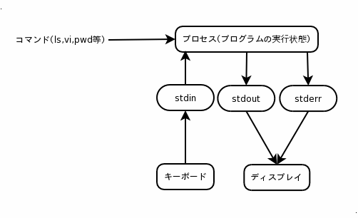
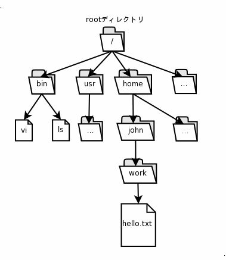
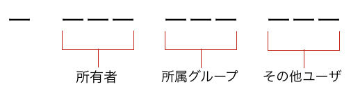
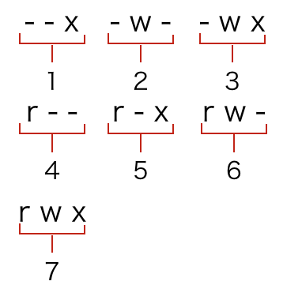

# Linux 実習(ドキュメント)

## コマンド

Linux ではコマンドラインと呼ばれる画面からコマンドを実行する事で操作を行なっていきます。  
コマンドラインとはテキストを利用してOSへ指示を送るインターフェースです。  
入力・出力（結果）ともにテキスト形式で表示されるのが一般的になります。  
初期状態では標準コマンドと言われるコマンドが準備されています。

実際にコマンドを入力してみましょう。

```command
$ pwd
```

※ここで\$や#で始まる部分はプロンプト文字列とと呼ばれる物です。  
実際にコマンドとして入力は不要です。

`pwd` というコマンドは自分が現在いるディレクトリの絶対パスを表示します。

他にも様々な標準コマンドが準備されています。

- `ls` : ディレクトリの中身を表示する。
- `cd` : ディレクトリを移動する。
- `mkdir` : ディレクトリを作成する。

wsl を使って c ドライブに移動するときには、下記のコマンドを入力します。

```command
$ cd /mnt/c/
```

それぞれの詳細な使い方は `man` というコマンドで見る事ができます。

```command
$ man ls
```

### 演習

1. `/home/centos/` の中に `report` というディレクトリを作成してください。  
2. 作成した `report` ディレクトリに移動してください。

`ls`, `cd`, `mkdir` の3つのコマンドで作れるので `man` コマンドで調べながら実行してください。

## 標準入力、標準出力、標準エラー出力

コマンドラインには1つの入力と2つの出力があります。

- 標準入力
  - プログラムがキーボード入力を読み取るファイル
  - 対応するファイルは `/dev/stdin`
- 標準出力
  - プログラムが出力を書き込むファイル、ディスプレイへ表示する等の動作
  - 対応するファイルは `/dev/stdout`
- 標準エラー出力
  - プログラムがエラーメッセージを書き込むファイル、デフォルトではディスプレイへ出力
  - 対応するファイルは `/dev/stderr`



## リダイレクトとパイプ

標準出力は通常ディスプレイに対応するファイルに書き込みを行いますが、書き込む先を変更することができます。  
標準入力、標準エラー出力も 同様に対象となるファイルを変更することができます。   
ファイルの出力先・対象を変更することを**リダイレクト**といいます。  
コマンドラインでは `>` や `>>` で記述します。  

```command
$ echo "foo"
$ echo "bar" > education
$ ls
$ cat education
$ echo "bazz" >> education
$ cat education
```

`echo` コマンドは引数に渡された文字を標準出力へ出力するコマンドです。  
`$ echo "foo"` というコマンドを実行すると `foo` という文字が画面に表示されます。  
続いて `$ echo "bar" > education` というコマンドを実行してみると画面へは出力されずかわりに `education` というファイルが作成されています。  
`cat` コマンドを使って `education` ファイルの中身を見て見ましょう。`bar` という文字が書き込まれてるはずです。  
`>` を使うと標準入力を別のファイルへ変更する事ができます。  

続いて `$ echo "bazz" >> education` というコマンドを実行してみましょう。  
先程と同じく `$ cat education` でファイルの中身を見てみると `bar` と `bazz` という2行が表示されます。  
`>>` は `>` とやる事は同じですが `>` は **新規にファイルを作る又は既存のファイルに上書き** なのに対し `>>` は **新規にファイルを作る又は既存のファイルに追記** という違いがあります。  

また、標準出力と標準入力をつなげる機能のことを**パイプ**といいます。  
コマンドラインでは`|`で記述します。  

```command
$ cat education
$ cat education | grep "z"
$ echo "bizz" >> education
$ echo "fizz" >> education
$ cat education | grep "z"
```

`education` の中には `bar` と `bazz` という2行が入っています。  
`cat education | grep "z"` というコマンドを実行してみましょう。  
`grep` というコマンドは標準入力から受けとった文字列に引数で渡された文字(この場合は `z`)があれば標準出力へ書きこむというコマンドです。  
簡単に言ってしまえば引数で渡された文字を含む行を探す検索コマンドになります。  
`education` ファイルに `bizz` と `fizz` という文字列を追記し `z` という文字で検索してみましょう。  

これらを利用すればコマンドAの結果をコマンドBへ入力したり、結果の受け渡しが可能になります。  

### 演習

1. echoコマンドを利用して自分の名前をname.txtへ出力してください。  
その後、日付・時間をname.txtへ追記してください。  
※日付・時間は`date` コマンドで出力できます。 

このような結果になれば成功です。

```text
[centos@ip-172-31-20-101 report]$ cat name.txt 
shingaki naoto
Fri Apr  8 10:56:49 UTC 2016
```

## ファイルシステム

>ファイルシステムは、コンピュータのリソースを操作するための、オペレーティングシステム (OS) が持つ機能の一つ。
>ファイルとは、主に補助記憶装置に格納されたデータを指すが、デバイスやプロセス、カーネル内の情報といったものもファイルとして提供するファイルシステムもある。

[Wikipedia ファイルシステム](http://ja.wikipedia.org/wiki/%E3%83%95%E3%82%A1%E3%82%A4%E3%83%AB%E3%82%B7%E3%82%B9%E3%83%86%E3%83%A0)

記憶装置にファイルやディレクトリを作成・削除等の管理を行うシステム、OSの基本機能として存在しOSによって形式が変わります。

Windows では`FAT`や`VFAT`、`NTFS`が使用されています。
Linux では`ext3`や`ext4`があります。
MacOS では`HFS+`等様々なファイルシステムが存在します。

ファイルシステムの中(場所)をあらわすにはパスと呼ばれる概念があります。
パスには2つの種類があり、絶対パスと相対パスと呼ばれる2つの呼び方です。

- 絶対パス
  - `/` (rootディレクトリ)を基準にあらわす。  
    例: 現在ホームディレクトリ `/home/user` にいる場合 `hello.txt` を表すのには `/home/user/work/hello.txt` と表記する必要がある。
- 相対パス
  - 現在位置からの相対的な関係でパスを表す  
    例:現在ホームディレクトリ `/home/user` にいる場合 `hello.txt` を表すのには `work/hello.txt` となる。  
    ※上の階層を`..` や現在のディレクトリを `.` として表すなどの表現の方法があります。  

ルートという呼び方は頂点を表す単語で Linux においてはスーパーユーザを表すユーザ名としての `root` とファイルパスの頂点を表す `/` が有りますがそれぞれ別の意味になる事に注意してください。



## マルチユーザ
--------------------------------

Linuxでは1台のコンピュータを複数人で使うことを想定し、ユーザという概念があります。  
ユーザには大きく分けて2つの種類が存在します。  

- スーパーユーザ(管理者)
- 一般ユーザ

スーパーユーザとは全ての権限を持つユーザです。  
Linux では標準で root というスーパーユーザが準備されている事がほとんどですが、ディストリビューションによっては root ユーザになる事を禁止されています。  
一般ユーザとスーパーユーザで別ける理由に、一般ユーザの操作ミスでシステムに致命的なダメージを受けることを抑制したり、ファイルの閲覧に制限がありセキュリティの保持に役立つ等様々な恩恵があるからです。  
このようにユーザが複数存在できるシステムをマルチユーザシステム、もしくはマルチユーザと呼びます。  
ユーザ同士には以下の関係が存在します。  

- 同一ユーザ(自分自身、uidが等しい)
- 同一グループ(所属等、gidが等しい)
- その他ユーザ(同一ユーザでも同一グループでもない他人のこと)

ユーザの権限等の設定はセキュリティに関わることが多いので正確に設定しなくてはいけません。  
通常使用する場合には一般ユーザで作業を行い、システム全体に関る所だけをスーパーユーザになって変更を行います。
登録された一般ユーザがスーパーユーザになるためのコマンドとして `sudo` があります。

```command
$ ls /root
$ sudo ls /root
```

`sudo` をつけなかった場合は権限がないため参照する事ができませんでしたが `sudo` をつける事により参照する事ができるようになります。  
このように重要なファイルなどの変更はスーパーユーザ権限でないと行えないようにする事でセキュリティを保ち、まちがって重要なファイルを変更してしまうというミスも防ぐ事ができます。

単純なユーザの切り変えは `su` コマンドで行えます。

## 権限
--------------------------------

マルチユーザの「情報の隠蔽」や「セキュリティ」はファイルとディレクトリに対する権限によって管理されています。  
それでは権限とは何なのでしょうか。Linux ではファイルやディレクトリにユーザとグループが設定されており3種類の権限が設定されています。

### 所有者

- Owner
 - ファイルの所有者
- Group
 - ファイルの所属グループ

### 権限

- Write: 書き込み
  - ファイルに書き込む権限
  - ディレクトリ内のファイルを操作できる権限
- Read: 読み込み
  - ファイルを読み込む権限
  - ディレクトリ内のファイルを参照できる権限
- Execute: 実行
  - ファイルをコマンドとして実行する権限

ためしに研修で作ったファイルの権限を見て見ましょう。

```command
$ ls -l /home/centos/report/education
-rw-rw-r--  1 centos  centos  791 04 08  2016 education
```

まずは2回出てくる `centos` という文字は最初の `centos` はこのファイルの所有者(Owner)であり2回目に出てくるのは所属グループ(Group)です。  
つまりこのファイルは `centos` というユーザが所有者であり `centos` というグループに所属しているという事になります。

続いて左にある `r` と `w` が並んでいるものが権限になります。  
権限は3つずつの3種類に分けられます。



それぞれ `読み込み権限` `書き込み権限` `実行権限` となります。  
有効化されている権限が文字で表示されており、全ての権限が有効化された場合は `-rwxrwxrwx` という表記になりなります。

権限は `rwx` という文字で表示されますが実際に扱う時はこれを数字にして扱う事が多いです。  
それぞれを2進数のビットとして表し10進数で指定します。



したがって `-rw-rw-r--` は `664` となります。

それでは `education` ファイルから `owner` の読み込み権限を奪ってみましょう。  
権限の変更は `chmod` というコマンドで実行できます。

```command
$ chmod 200 education
$ ls -l education
$ cat education
```

`Permission denied` と表示されていますか?  
読み込み権限をなくしたため参照する事ができなくなりました。  
所有者や所属グループを変更する時は `chown` というコマンドを使用します。

```command
$ sudo chown root:root education
$ ls -l education
```

これで `education` ファイルは `root` ユーザでないと操作できなくなりました。


### 演習

`education` ファイルの権限と所有者、所属グループを下記状態に戻してください。

```command
-rw-rw-r--  1 centos  centos  791 04 08  2016 education
```


## 環境変数

> 環境変数（かんきょうへんすう）はOSが提供するデータ共有機能の一つ。OS上で動作するタスク（プロセス）がデータを共有するための仕組みである。特に環境変数はタスクに対して外部からデータを与え、タスクの挙動・設定を変更する際に用いる。

[Wikipedia 環境変数](http://ja.wikipedia.org/wiki/%E7%92%B0%E5%A2%83%E5%A4%89%E6%95%B0)

環境変数は Linux だけでなく Windows にも存在します。
環境変数とはLinux全体で持つグーバルな変数名に値を持たせる文字列の集まりです。
たとえば value という文字を　VAR と表記したい場合に  

```command
$ echo $VAR
$ VAR=value
$ export VAR
$ echo $VAR
```

と設定すれば`$ echo $VAR` を実行した場合に帰ってくる値は `value` となります。  
環境変数の設定方法はOSによって大きく変わるので使用する際は気をつけてください。

環境変数には標準で `$PATH` という変数が設定されています。  
Linux のコマンドはこの `$PATH` の中にある実行権限のあるコマンドと同名なファイルが実行されています。  
`ls` コマンドについて確認してみましょう。

```command
$ echo $PATH
$ which ls
$ sudo ls -l /bin/ls
```

`echo $PAH` でみるといくつかのパスが設定されているのが判ります。  
`which` コマンドは引数で指定したコマンドがファイルシステム上のどこにあるかを表示します。
実際に `ls` ファイルが存在するパスが `$PATH` に登録されているのがわかります。

すなわち Linux におけるコマンドとは環境変数 `$PATH` に登録された実行権限のあるファイルという事になります。

## プロセス

プログラムの実行状態や実行単位のことをプロセスと呼びます。  
Linux では複数のプロセスを同時に実行するマルチプロセスの機能を持っています。
同時に起動とは言いますが、実態は複数のプロセスを小さい単位で交代で計算をしているものです。
高速に交代しながら処理している為ユーザ側からは同時に実行しているように見えるためです。
また、OS 内部で優先順位を設定しそのプロセスを優先的に処理するなどの機能もあります。
これらの処理手順を決めることをプロセススケジューリング(スケジューラ)といい、OSの重要な機能の一つです。
処理の途中でプロセスが割り込んできた情報通知をシグナルと呼びます。
現在実行中のプロセスは `ps` コマンドで確認できます。

```command
$ ps ax
```

プロセスは `kill` コマンドで終了する事ができます。  

```command
$ kill -9 123
```

## 再起動・シャットダウン

Linux の再起動を行う場合は以下のコマンドを実行します。

`$ sudo reboot`

Linux のシャットダウンを行う場合は以下のコマンドを実行します。

`$ sudo shutdown -fh  now`
