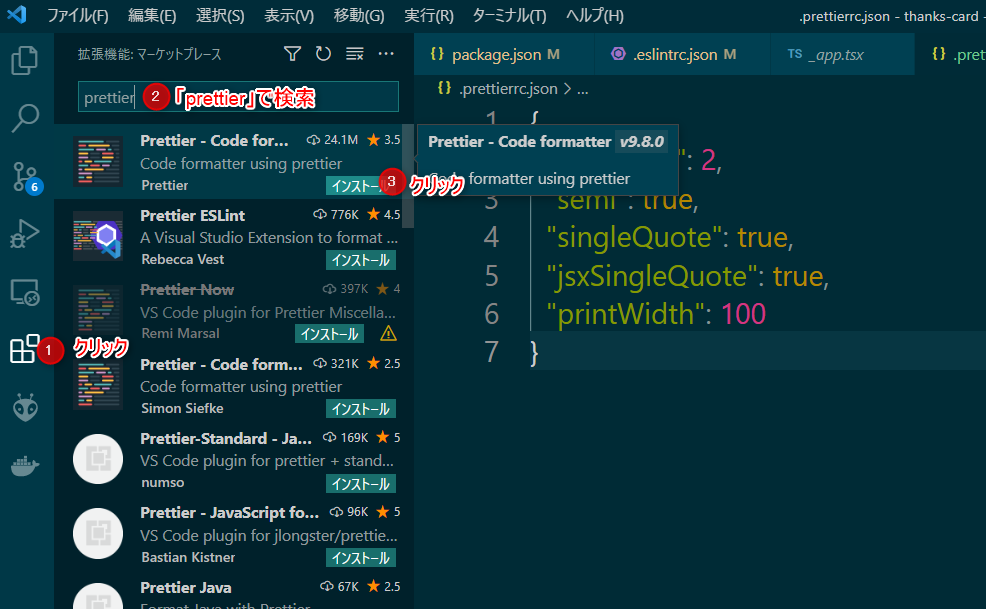

#  コード静的解析ツールとコード整形ツールの設定

大半の開発プロジェクトでは、誰が書いても同じようなコードにするために、
コードの書き方の取り決め「コーディング規約(coding standards)」を決めます。

ここでは、 TypeScript のコードがコーディング規約に沿っているか自動でチェックする
ためのツール `ESLint` をインストールします。

また、規約に沿っていないコードを自動で整形するためのツール `prettier` もインストールします。


> ESLintは一般的に「リンター(linter)」というジャンルのツールです。リンターは、プログラムを静的に解析し、バグや問題点を発見するツールを言います。リンターを使って、問題点を解析することを「リントする(lint)」と言います。

> Prettier（プリティア）とは、Node.js上で動作するコード整形ツールです。JavaScriptをはじめとし、HTML,、CSS、TypeScript、GraphQLなどでもサポートされています。

参考リンク
- [ESLintでTypeScriptのコーディング規約チェックを自動化しよう](https://typescriptbook.jp/tutorials/eslint)

## npm パッケージのインストール

`create-next-app` で作成したプロジェクトには既に `ESLint` が組み込まれています。
ここででは `prettier` のみのインストールでOKです。

```shell
npm install --save-dev prettier eslint-config-prettier
```

- prettier: 本体
- eslint-config-prettier: prettierと競合するeslintのルールを無効化するためのパッケージ

## ESLint の設定

`.eslintrc.json` を以下のように書き換えてください。

```json title=".eslintrc.json" showLineNumbers
{
  "extends": [
    "next/core-web-vitals",
    //"plugin:@typescript-eslint/recommended",
    //"eslint:recommended",
    "prettier"
  ],
  "rules": {
    "react/react-in-jsx-scope": "off"
  }
}
```

## prettier の設定

プロジェクトの直下に `.prettierrc` を作成し、以下のように記述してください。

```json title=".prettierrc" showLineNumbers
{
  "tabWidth": 2,
  "semi": true,
  "singleQuote": true,
  "jsxSingleQuote": true,
  "printWidth": 100
}
```

## npm-script の追加

npm-script とは `package.json` に設定するスクリプトのことで、
`npm run dev` や `npm run build` のようにスクリプトを実行できます。

npm-script に ESLint の実行と prettier の実行(実際にソースコードを整形して書き換える)を行うスクリプトを追記します。
(既にあった行 `"lint": "next lint"` の行末に `,` を追記するのも忘れないでください。)

`package.json` の scripts を以下のように書き換えてください。

```json title="package.json" showLineNumbers
  "scripts": {
    "dev": "next dev",
    "build": "next build",
    "start": "next start",
    "lint": "next lint",
    "lint:fix": "next lint --fix",
    "format": "prettier --write --ignore-path .gitignore ./**/*.{js,jsx,ts,tsx,json}"
  },
```

## prettier の実行

プロジェクトの直下に移動し、コマンドプロンプトで以下のコマンドを実行すると npm-script が実行され、prettier が実行されます。この時、実際にファイルが整形されて上書きされます。

`pages/index.tsx` などのファイルが整形前後でどう変化しているか確認してください。(行末に `;` が追記されたりしているはずです。)

```shell
npm run format
```


## vscode 拡張機能のインストール

vscode の拡張機能の一つ `eslint` をインストールすると、
vscode でコーディング中に eslint が実行され、
不適切な箇所があればプログラマに指摘してくれるようになります。

また、拡張機能 `prettier` をインストールすると、
ここでは割愛しますが、設定することで「vscode でファイルを保存するタイミングで prettier を実行し、ソースコードを整形して保存する」ことも可能です。
(設定方法を検索し、設定してみてください。)

以下の手順で vscode に `eslint`、`prettier` 拡張機能をインストールしてください。



