# テスト

これまで作成したページやコンポーネントの自動テストプログラムを作成し、実行します。

テストプログラマが手動で行うこともできますが、その場合、テスト実行のための時間が必要になりますし、また、人がテストを行うということは確認ミス(ヒューマンエラー)も起こりえます。

テストを行うプログラムを開発しておくことで、上記の問題を解決することができます。
開発の状況により異なりますが、可能な限りテストプログラムは開発しておくべきです。そうすれば、新規機能の追加や機能改修により思わぬバグが発生していないか簡単にチェックすることができます。
また、プログラムの改善(リファクタリング)をする際にも、リファクタリングによってバグが発生していないか簡単にチェックすることができます。

当然、テストプログラムの開発にも時間(コスト)がかかりますので「可能な限りテストプログラムは開発しておくべき」ということになります。

## Jest によるコンポーネントのテスト

### npm パッケージのインストール

```shell
npm install --save-dev jest @testing-library/react @testing-library/jest-dom jest-environment-jsdom
```

### Jest の設定


`Jest` の設定はプロジェクト直下に `jest.config.js` というプログラムを配置することで行います。

プロジェクト直下に `jest.config.js` を作成し、以下のように記述してください。

```js title="jest.config.js" showLineNumbers
// reference: https://nextjs.org/docs/testing#jest-and-react-testing-library
const nextJest = require("next/jest");

const createJestConfig = nextJest({
  // Provide the path to your Next.js app to load next.config.js and .env files in your test environment
  dir: "./",
});

// Add any custom config to be passed to Jest
const customJestConfig = {
  // jest.setup.jsを作成する場合のみ定義。
  // setupFilesAfterEnv: ["<rootDir>/jest.setup.js"],
  //transformIgnorePatterns: ["/node_modules/(?!(xxxx.*?\\.js$))"],
  //moduleDirectories: ["node_modules", "<rootDir>/"],
  moduleNameMapper: {
    // Handle module aliases (this will be automatically configured for you soon)
    "^@/(.*)$": "<rootDir>/$1",
  },
  testEnvironment: "jest-environment-jsdom",
};

// createJestConfig is exported this way to ensure that next/jest can load the Next.js config which is async
module.exports = createJestConfig(customJestConfig);
```

Jest を実行するための script を `package.json` に追記します。

(カンマ(,)の有無に注意してください)

```json "package.json"
  "scripts": {
    "dev": "next dev",
    "build": "next build",
    "start": "next start",
    "lint": "next lint",
    "lint:fix": "next lint --fix",
    "format": "prettier --write --ignore-path .gitignore '**/*.{js,jsx,ts,tsx,json}'",
    // highlight-start
    "test": "jest --watch"
    // highlight-end
  },
```


### テストプログラムの作成

Jest では `__tests__` というディレクトリを作成し、その中にテストプログラムを作成します。

プロジェクト直下に `__tests__/index.test.tsx` を作成し以下のように記述してくさい。


```js "__tests__/index.test.tsx" showLineNumbers
import { render, screen } from "@testing-library/react";
import "@testing-library/jest-dom";
import Home from "@/pages/index";

describe("Home", () => {
  it("renders a Home heading.", () => {
    render(<Home />);

    //screen.debug();
    const head = screen.getByRole("heading", {
      name: /Home/i,
    });

    expect(head).toBeInTheDocument();
  });
});
```

### テストプログラムの実行

以下のコマンドでテストプログラムを実行することができます。

```shell
npm run test
```

以下のように表示されればテストをパス(テスト成功)しています。


```
 PASS  __tests__/index.test.tsx
  Home
    √ renders a Home heading. (88 ms)

Test Suites: 1 passed, 1 total
Tests:       1 passed, 1 total
Snapshots:   0 total
Time:        5.904 s
Ran all test suites related to changed files.

Watch Usage: Press w to show more.
```

このテストプロンプトは「q」で終了することができます。

### モックを使用したテストプログラムの作成

例えば `layout/AccountInfo.tsx` は「ログイン済みのユーザ名」を表示するため、ログイン済みであることを前提に作られている。

`AccountInfo` を単体でテストするために「あたかもログイン済みであるかのような状態」を再現しテストを実施します。

具体的には next-auth の `useSession` の動作をモック化(テストに必要な部品の値を擬似的に設定すること)し、テストを実行します。


(参考) [モック関数 - Jest](https://jestjs.io/ja/docs/mock-functions)

プロジェクト直下に `__tests__/AccountInfo.test.tsx` を作成し以下のように記述してくさい。


```js "__tests__/AccountInfo.test.tsx" showLineNumbers
import { render, screen } from "@testing-library/react";
import "@testing-library/jest-dom";
import AccountInfo from "@/layout/AccountInfo";

// ログイン済みかをチェックする useSession をモックにし、
// 常にログイン済み状態で user.name: testing を返すようにする。
jest.mock("next-auth/react", () => {
  // Require the original module to not be mocked.
  const originalModule = jest.requireActual("next-auth/react");
  // セッションに保存する情報をモックとしてリテラルで作成する。
  const mockSession = {
    expires: new Date(Date.now() + 2 * 86400).toISOString(),
    user: {
      //id: "cl7ts8yvu0045ssa2e2vcrezk",
      name: "testing",
      email: "testing@ts.occ.co.jp",
    },
  };
  return {
    __esModule: true,
    ...originalModule,
    useSession: jest.fn(() => {
      return { data: mockSession, status: "authenticated" };
    }),
  };
});

describe("AccountInfo", () => {
  it("renders a logged in user.", () => {
    render(<AccountInfo />);

    //screen.debug();
    const logged_in_user = screen.getByText("Signed in as testing");

    expect(logged_in_user).toBeInTheDocument();
  });
});
```

## Cypress による統合テスト(e2eテスト)

Cypress を使用すると、あたかもユーザがブラウザを通じてWebアプリケーションを操作する動作をプログラムから制御することができます。

このようにアプリケーションを実際の環境に合わせてテストすることを `統合テスト` や `e2e(End to End)テスト` と呼びます。

### npm パッケージのインストール

```shell
npm install --save-dev cypress
```

### Cypress の設定

Cypress を実行するための script を `package.json` に追記します。

(カンマ(,)の有無に注意してください)

```json "package.json"
  "scripts": {
    "dev": "next dev",
    "build": "next build",
    "start": "next start",
    "lint": "next lint",
    "lint:fix": "next lint --fix",
    "format": "prettier --write --ignore-path .gitignore '**/*.{js,jsx,ts,tsx,json}'",
    "test": "jest --watch",
    // highlight-start
    "cypress": "cypress open"
    // highlight-end
  },
```

Cypress を初回起動して Cypress の推奨のフォルダ構造を使ったテンプレートを生成します:

```shell
npm run cypress
```

Cypressの管理画面が表示されますので、以下の手順で「login.cy.ts」を作成してください。

  1. 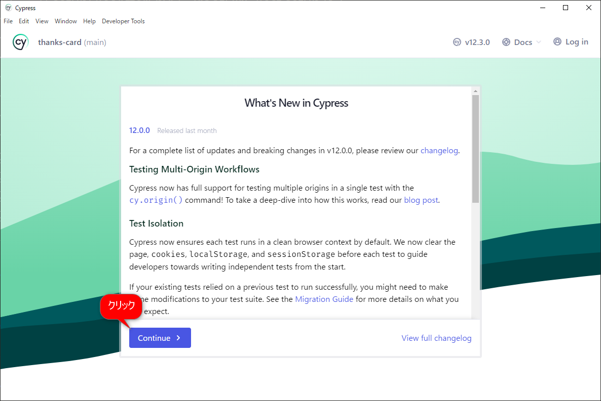
  1. 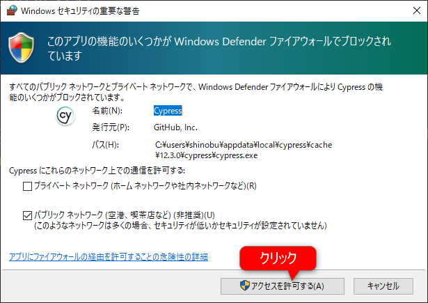
  1. 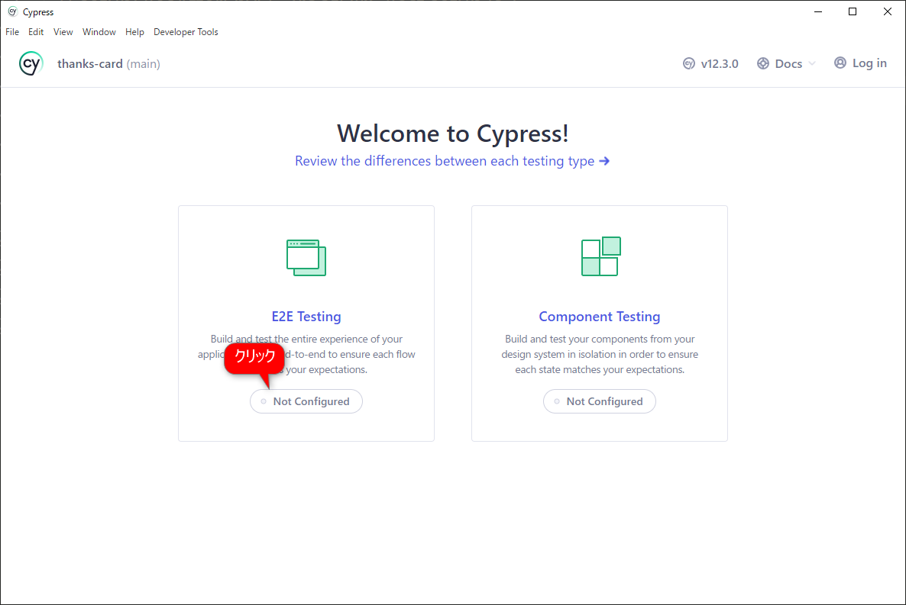
  1. 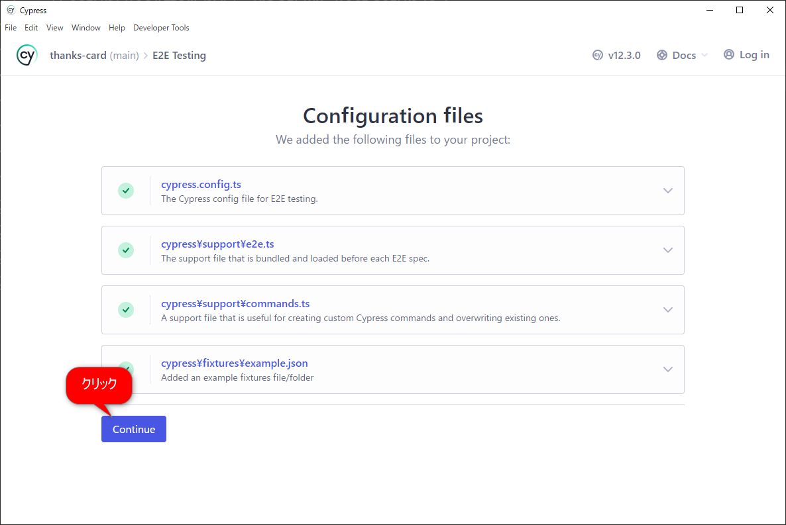
  1. 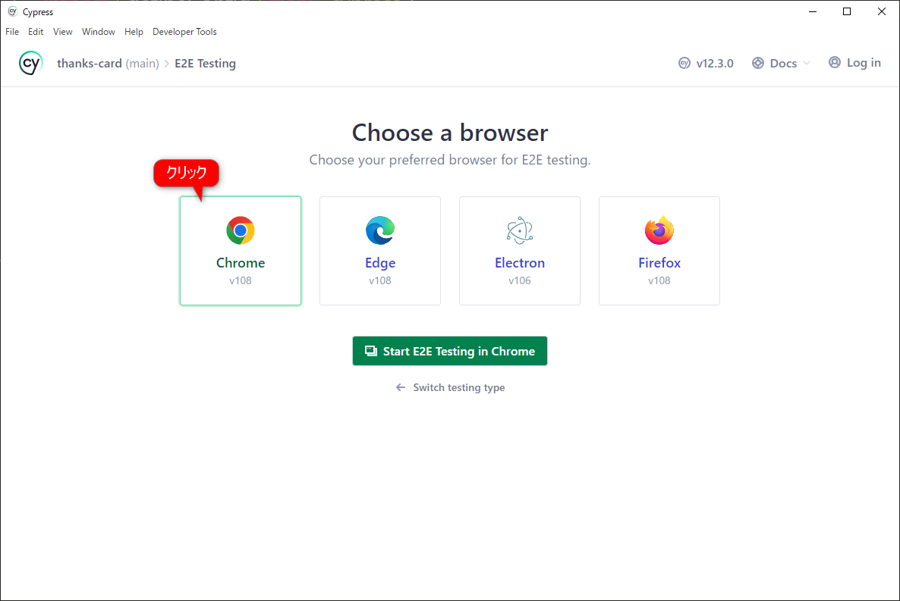
  1. 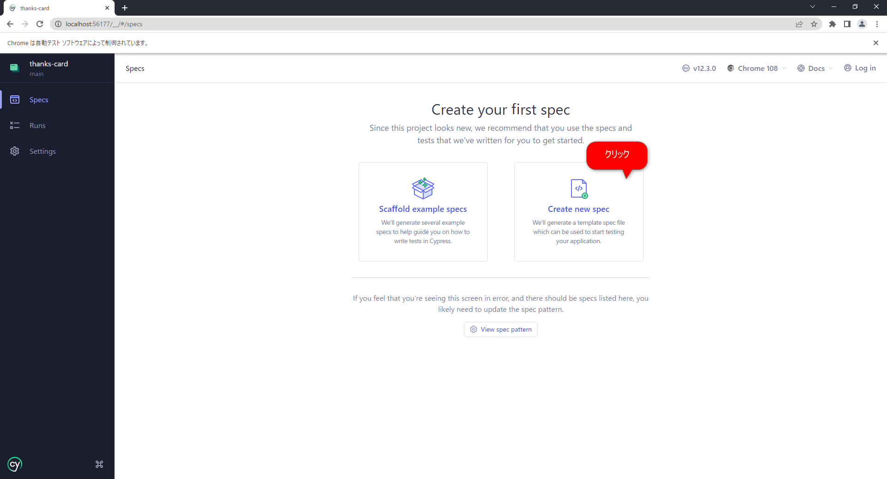
  1. 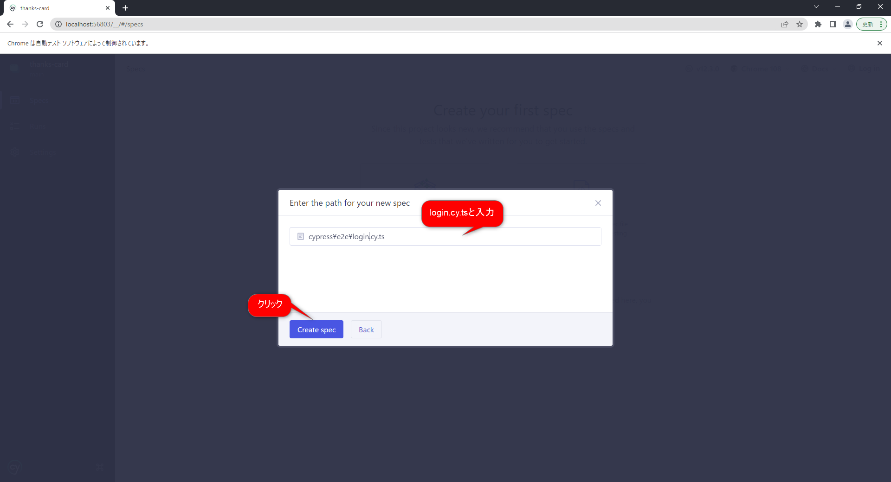
  1. 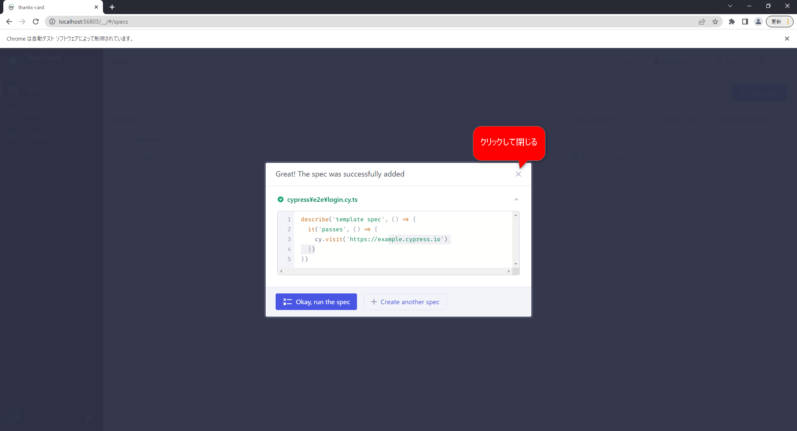

分かりやすくするため、ここで一旦 Cypress の管理画面を閉じてください。

### テストプログラムの作成

vscode で `cypress/e2e/login.cy.ts` を開き、以下のように書き換えてください。

```ts title="cypress/e2e/login.cy.ts" showLineNumbers
describe('ThanksCard', () => {
  it('login', () => {
    cy.visit('http://localhost:3000')

    // ログイン情報を入力する
    cy.get('input[name="email"]').type('admin@ts.occ.co.jp')
    cy.get('input[name="password"]').type('admin')
    //フォームのsubmitボタンをクリック
    cy.get('form').submit()

    // Home 画面が表示されていることを確認する
    cy.contains('Home')
  })
})
```

### テストプログラムの実行

```shell
npm run cypress
```

Cypressの管理画面が表示されますので、以下の手順でテストを実行します。

  1. 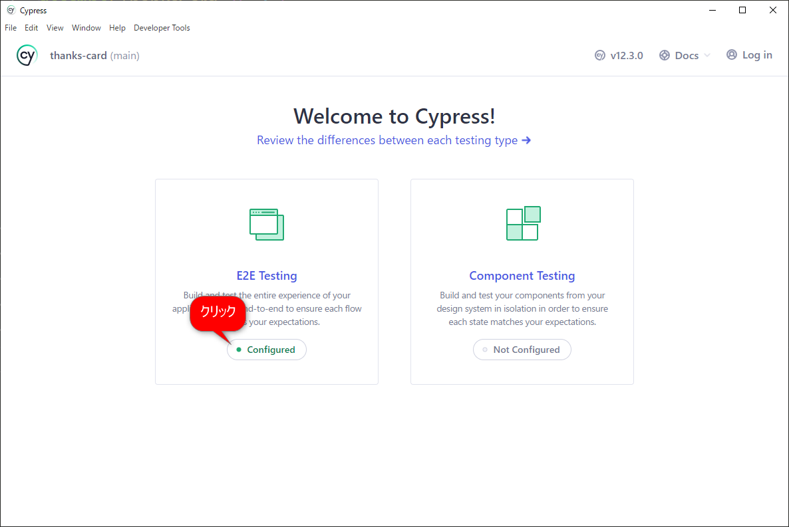
  1. 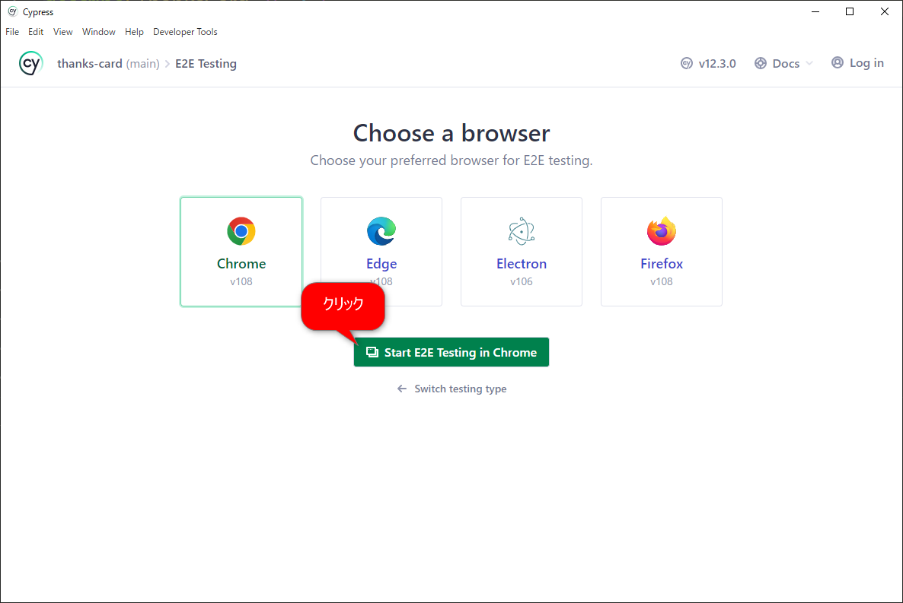
  1. 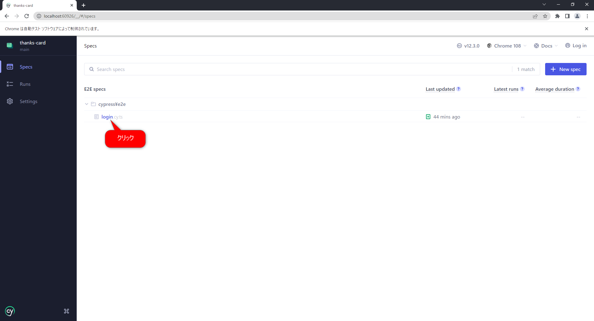
  1. 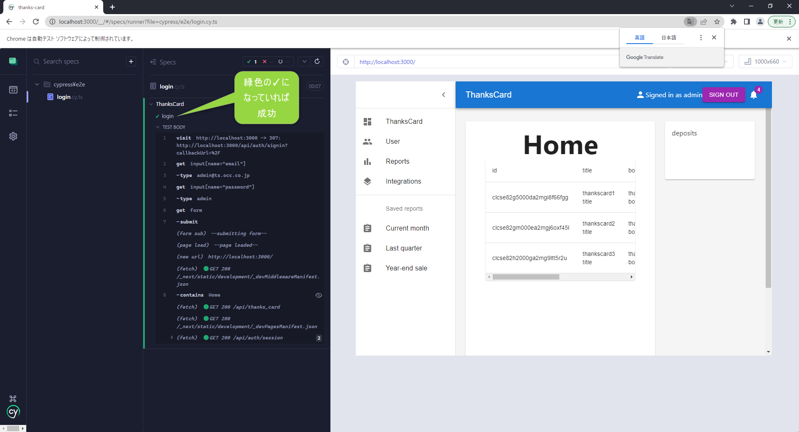

Cypress でも jest watch のようにテストプログラムの変更を監視しています。

試しに `login.cy.ts` の `cy.contains('Home')` を `cy.contains('Top')` に変更して保存すると、直ちにテストが再実行されテストが正しく失敗します。
