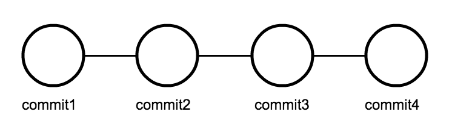
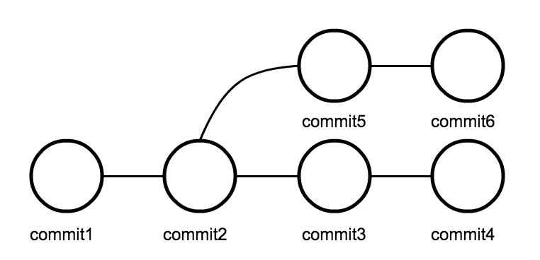

# branch とは

今まで変更の履歴は一直線だった。



branch ( ブランチ ) とは変更の履歴の枝分かれのこと。



目的に応じ branch を作成し、変更の履歴を管理する。デフォルトでは `master` という branch が存在する。 branch の状況を確認するには以下のコマンドを使用する

`$ git branch`

`*` は現在の branch を表す。

この章では branch 操作について学ぶ


# branch を作成する

新たに branch を作成するには以下のコマンドを使用する

`$ git branch <branch名>`

```
$ cd ~/first_repo
$ git branch first-branch
```

branch を作成できたはずなので、確認する

`$ git branch`

```
first-branch
* master
```

# branch を移動する

`first-branch` を作成しただけなので、次に、作成した branch に移動する。

 `$ git checkout <branch名>`

 で好きな branch に移動できる。

### ミニ演習

`first-branch` に移動せよ

```
Switched to branch 'first-branch'
```

移動した際に上記のコマンド結果が出力され、さらに `$ git branch` コマンドで現在の branch を確認し

```
* first-branch
  master
```

という結果になることを確認せよ

# branch を削除する

branch を作成することができたので、次に削除の仕方を確認する。以下のコマンドで任意の branch を削除することができる。

`$ git branch -d <branch名>`

### ミニ演習

`first-branch` を削除せよ。その時

```
error: Cannot delete the branch 'first-branch' which you are currently on.
```

というエラーがでた場合には、注意してエラー文を読み、対処せよ。

> Hint 今までに出てきた git のコマンドで対処できる。

削除が成功すると、以下の結果が出力される

`Deleted branch first-branch (was 87fa83f).`

`$ git branch` で branch を表示すると以下のように `master` のみになっていると成功

```
* master
```

# branch を再度作成し commit する

```
$ git branch try-commit
$ git checkout try-commit
$ touch for_commit.txt
```

### ミニ演習

1. 「`for_commit.txt` ファイルを作成した」という変更を `try-commit` branch に commit せよ。commit message はなんでも良い
2. commit 後 `master` branch へ移動し `try-commit` branch との差を見つけよ

> Hint : 指定したブランチに commit するにはそのブランチ上で commit するだけでよい  
> 変更を commit するにはふたつの git コマンドが必要だった

> - `git add`
> - `git commit`

> commit の履歴を確認するには、 `git log` コマンドを用いる

# branch を merge する

merge (マージ) とは「ひとつに結合する」ということ。枝分かれした branch を 以下のコマンドによって merge することができる。

`$ git merge <マージしたい branch 名>`

### ミニ演習

1. `master` branch に `try-commit` branch の変更を merge せよ。( どちらの branch で `git merge` コマンドを実行するか注意せよ。)
2. merge が成功したら `try-commit` branch を削除せよ

> Hint : 誤って commit した場合や merge した場合は、`git reset` コマンドを使って commit 履歴を削除できる

merge すると以下のような結果が出力される。

```
Updating 87fa83f..80eb2a1
Fast-forward
 for_commit.txt | 0
 1 file changed, 0 insertions(+), 0 deletions(-)
 create mode 100644 for_commit.txt

```

以下のコマンドを打って、同じ結果が出力されれば正解

`$ git branch`

```
* master
```

`$ ls`

```
for_commit.txt  hoge.txt
```

# まとめ

branch 操作コマンド

- `git branch` ブランチの確認
- `git branch <branch名>` ブランチの作成
- `git branch -d <branch名>` ブランチの削除
- `git checkout <branch名>` ブランチの移動
- `git merge <branch名>` ブランチの結合

# アドバンス演習

```
$ git branch <branch名>
$ git checkout <branch名>
```

上記の２つのコマンドで、ブランチの作成と移動を行ったが、`git checkout` には作成と移動を同時に行えるオプションがある。
そのオプションを調べて実験せよ。

> Hint 次のコマンドでオプションを調べることができる `git checkout -h` 
