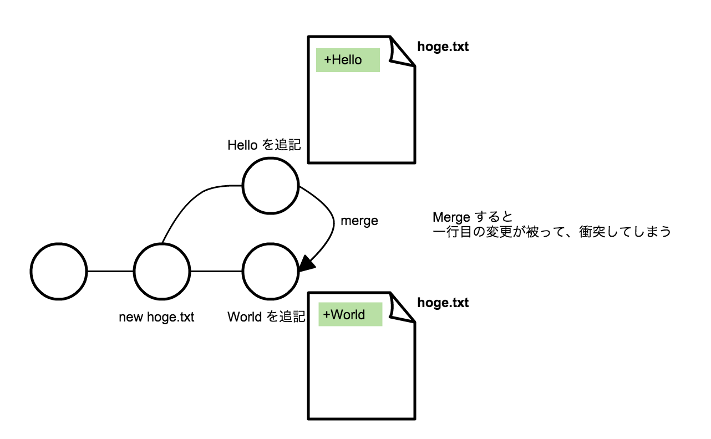

# Conflict とは

Conflict (コンフリクト)　とは「衝突」という意味がある。 バージョン管理において、変更が被ることがあり、それを `conflict` と呼ぶ。



`conflict` がおきた場合には、コンピュータでは解決できないので、人間が手動で解決する必要がある。
なので、`conflict` の解決方法について知る必要がある。

# Conflict を起こす

`conflict` を起こすためには、変更を被らせる必要がある。`branch` を作成し、二つの `branch` 間で同じファイルの行に変更を加える。

`$ git checkout -b try-conflict` 

`try-conflict` で `hoge.txt` を変更し、 commit する。

`$ vi hoge.txt`  
`$ cat hoge.txt`

```
File is changed.
File is changed by try-conflict
```

```
$ git add hoge.txt
$ git commit -m "update hoge.txt"
```

```
[try-conflict 6c439cd] update hoge.txt
 1 file changed, 1 insertion(+)
```

`master` ブランチに移動して、conflict させるために同じように `hoge.txt` に変更を加える。

```
$ git checkout master
$ vi hoge.txt
$ cat hoge.txt
```

```
File is changed.
File is changed by master
```
```
$ git add hoge.txt
$ git commit -m "update hoge.txt"
```

準備が整ったので `merge` して conflict させる。

`$ git merge try-conflict`

```
Auto-merging hoge.txt
CONFLICT (content): Merge conflict in hoge.txt
Automatic merge failed; fix conflicts and then commit the result.
```

> Merge conflict in hoge.txt

conflict がおこったことが確認できる。

`$ cat hoge.txgt`

```
File is changed.
<<<<<<< HEAD
File is changed by master
=======
File is changed by try-conflict
>>>>>>> try-conflict
```

`<<<<<<< HEAD` と `=======` の間は今いるブランチが持っていた変更 ( master で行ったの変更 )  
`=======` と `>>>>>>> try-conflict` の間は `try-conflict` ブランチが持っていた変更

# Conflict を解決する

`git merge` は基本的に自動で行われるが、変更箇所が conflict (衝突) すると人間が手で merge する他、手はない。  
今回は`=======` と `>>>>>>>` を削除して両方の変更を取り入れた形にする。

```
$ vi hoge.txt
$ cat hoge.txt
```

```
File is changed.
File is changed by master
File is changed by try-conflict
```

手動マージが完了したら、変更を commit する。merge した時も commit しなければならない。

```
$ git add hoge.txt
$ git commit -m "merge"
```

コミットログを確認して、merge が commit されたことを確認する。

`$ git log`

```
commit fc446d5d9ffa796966999f9393776426b031c7c0
Merge: 9dffffb 6c439cd
Author: yutakakinjyo <yutakakinjyo@gmail.com>
Date:   Thu Apr 16 17:11:00 2015 +0900

    merge

commit 9dffffb0705e9e69052fe3e2c4dcc773fa0c4991
Author: yutakakinjyo <yutakakinjyo@gmail.com>
Date:   Thu Apr 16 16:47:59 2015 +0900

    update hoge.txt

commit 6c439cd35658899597cde36ef7cfe7fb84f09a17
Author: yutakakinjyo <yutakakinjyo@gmail.com>
Date:   Thu Apr 16 16:27:30 2015 +0900

    update hoge.txt

commit 76ed47e039ed71ab3039339c0dd91a976a326f15
Author: yutakakinjyo <yutakakinjyo@gmail.com>
Date:   Thu Apr 16 15:31:17 2015 +0900

    add for_commit file

commit 6202c613d4392578713287f4c82ff8ea5d8b6904
Author: yutakakinjyo <yutakakinjyo@gmail.com>
Date:   Thu Apr 16 15:28:50 2015 +0900

    write contents

commit a22c28a4b9eb1662cd08ac7304c6ee1fd00751af
Author: yutakakinjyo <yutakakinjyo@gmail.com>
Date:   Thu Apr 16 15:27:00 2015 +0900

    add hoge.txt
```

作成したブランチを削除する。

`$ git branch -d try-conflict`

# まとめ

- 変更同士を merge する時に、変更箇所が被っていた場合には、conflict(衝突) が起きる。
- merge が conflict した場合には、手動で変更を加えて、再度 commti し直す。

conflict した場合に、conflict 箇所は例えば以下のように、現在の変更と、merge しようとしたブランチ名が表示された形になるので、それを手がかりに手動で merge する。

```
File is changed.
<<<<<<< HEAD
File is changed by master
=======
File is changed by try-conflict
>>>>>>
