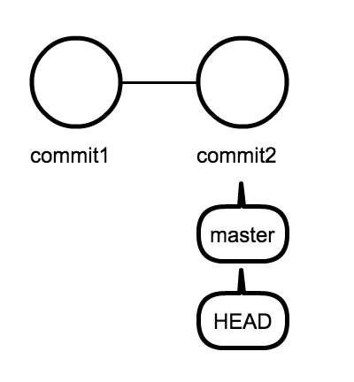
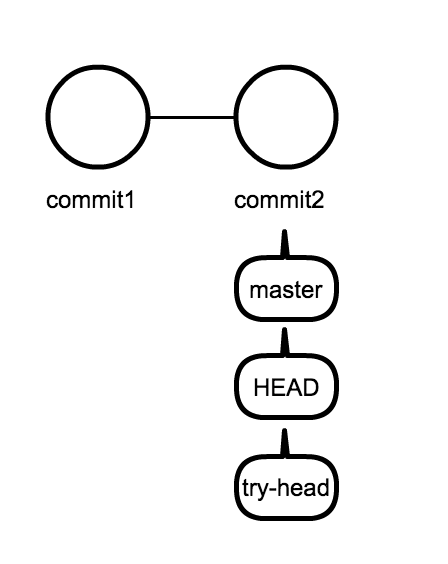
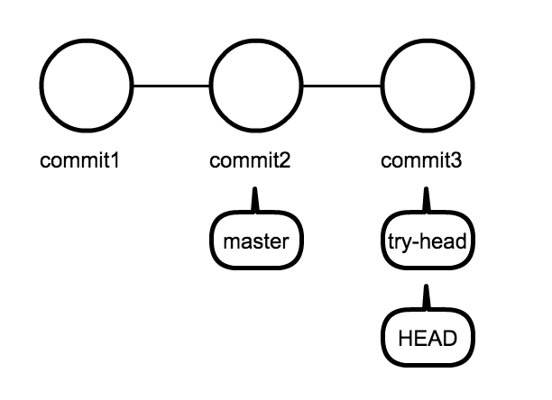
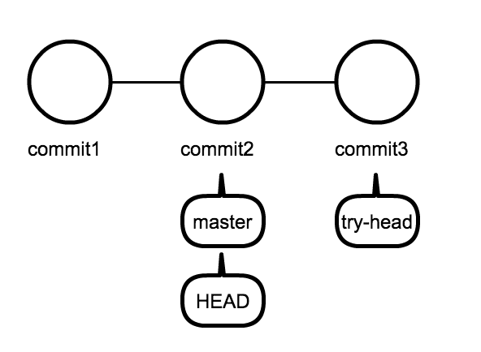
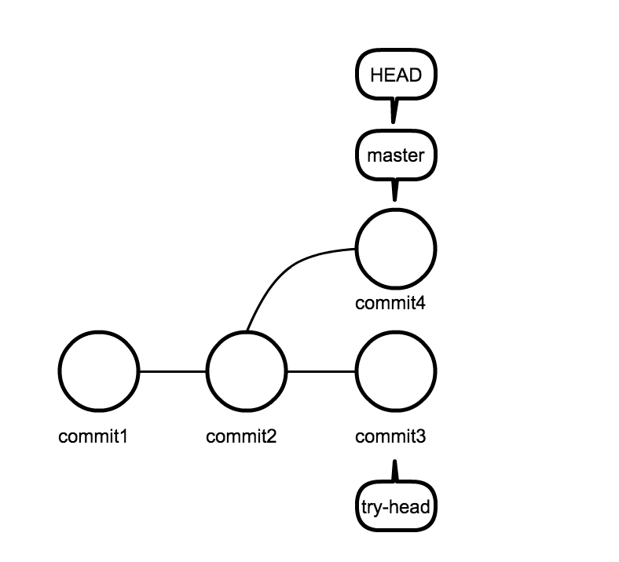

# HEAD について

まずは `master` ブランチから `try-head` ブランチを作成して移動せよ。

`HEAD` について詳しくみていく。  
`HEAD` はその branch の最新の commit を表す。  
`$ git log` でもう一度、commit の log を見直す。

```
commit 6f988bd77b79f535c797e4806f9aaa3740e11d9d <-- HEAD
Merge: 9e7f11c dc19662
Author: yutakakinjyo <yutakakinjyo@gmail.com>
Date:   Thu Apr 30 12:58:34 2015 +0000

    merge

commit 9e7f11c02dced6a86c3c7de22380f82e807371fe <-- HEAD^
Author: yutakakinjyo <yutakakinjyo@gmail.com>
Date:   Thu Apr 30 11:57:55 2015 +0000

    update hoge.txt

commit dc19662c35c1f3d42495ef29c881b2ff7deb45de <-- HEAD^^
Author: yutakakinjyo <yutakakinjyo@gmail.com>
Date:   Thu Apr 30 11:57:22 2015 +0000

    update hoge.txt

commit e7c58dcca599037ee69f09d4764212e4653d061e <-- HEAD^^^
Author: yutakakinjyo <yutakakinjyo@gmail.com>
Date:   Thu Apr 30 11:37:18 2015 +0000

    add for_commit.txt

commit f33895c1dd26365531bfc987dc72ef34664ddf5a
Author: yutakakinjyo <yutakakinjyo@gmail.com>
Date:   Thu Apr 30 11:21:49 2015 +0000

    write contents

commit df4c8dcef4a98398b6ca32c5ecc0e7ec363df812
Author: yutakakinjyo <yutakakinjyo@gmail.com>
Date:   Thu Apr 30 11:17:27 2015 +0000

    my first commit

```

commit にはそれぞれ、

> commit 6f988bd77b79f535c797e4806f9aaa3740e11d9d

のようなハッシュ値が存在する。これはリポジトリ内で、一意のもので、被ることはない。
`Git` はこのハッシュ値を確認して、データを戻したり、進めたりする。 branch も commit のハッシュ値をもとに処理されている。

`HEAD` は現在のブランチの最新の commit を表す。  
ブランチ名もそのブランチの最新の commit を表す。  
つまり以下のようになる。  

```
HEAD = 現在のbranch 名 = 現在のブランチの最新コミット
```


実際に確かめて見よう。

`HEAD` の情報は、リポジトリの情報がある `.git` からみることができる。  

### ミニ演習

1. `.git` のディレクトリの中にある `HEAD` ファイルの中身を確認せよ
    - 結果は `ref: refs/heads/try-head` となっているはず。
2. `.git` のディレクトリの中にある `refs/heads` ディレクトリに対して `ls` を試せ。  

> Hint : `.git` はリポジトリの最も上のディレクトリにある。Git リポジトリの構成を再確認せよ。

`ls` が成功すると以下のようなファイルが確認できる。

```
master  try-head  try-move  try-remove  try-reset  try-stash1  try-stash2
```

---

`.git/HEAD` の中身は `ref: refs/heads/try-head` だった。

> ref は reference(参照) の略。

つまり、HEAD は `.git/refs/heads/try-head` を参照していることになる。
実際に `try-head` の中身を覗いてみる

`$ cat .git/refs/heads/try-head`

他に`try-remove` 中身を覗いてみると

`$ cat .git/refs/heads/try-remove`

```
ae7209e7e8c192ce9060e8e0b70960064ab96d1d
```

という値がみれる。

### ミニ演習

1. `try-remove` ブランチに移動し
    - 最新のコミットのハッシュ値　と `.git/refs/heads/try-remove`の値が同値であること
    - `.git/HEAD` が参照している先が `.git/refs/heads/try-remove` であることを確認せよ
2. 確認後 `try-head` ブランチへ戻れ。
3. `try-head`ブランチ と `master` ブランチのハッシュ値が同一であることを確かめ、それが何故か考察せよ。

## 新しいブランチのハッシュ値はなに？

`try-head` ブランチは `master` ブランチから枝分かれさせた。  
`master` と `try-head` ブランチのハッシュ値は同様だった。  
新しくブランチを作成した際には、実際にはすぐに枝分かれせずに、同様のハッシュ位置をもったブランチが増える。  
どちらかブランチで変更がコミットされた時にハッシュ値の違いがでてくる。

**master ブランチ上にいる時**



**try-head ブランチを作成**



**try-head ブランチに移動して commit**



**master ブランチに移動**



**master ブランチ上で commit**



## まとめ

`HEAD` はその branch の最新の commit を表す。
- `.git/HEAD` に現在参照している情報がある。
- それぞれブランチのHEAD のハッシュ値は `.git/refs/heads` で管理されている。
- ブランチ名自体もそのブランチの最新の commit を表す。  

つまり以下のようになる。  

```
HEAD = 現在のbranch 名 = 現在のブランチの最新コミット
```

ハッシュ値を指定するような`git`コマンドには、`HEAD`, `ブランチ名`, `ハッシュ値`　のいずれかを指定できる。

