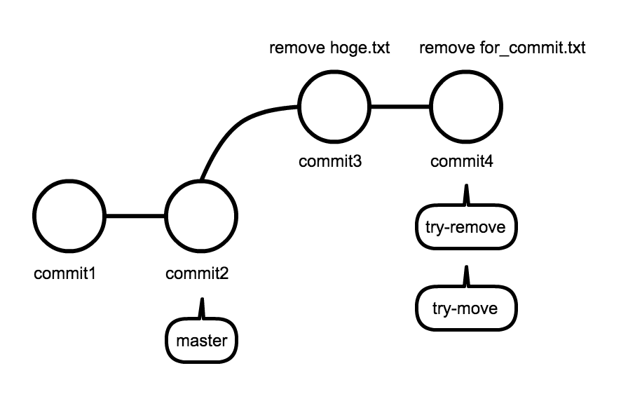
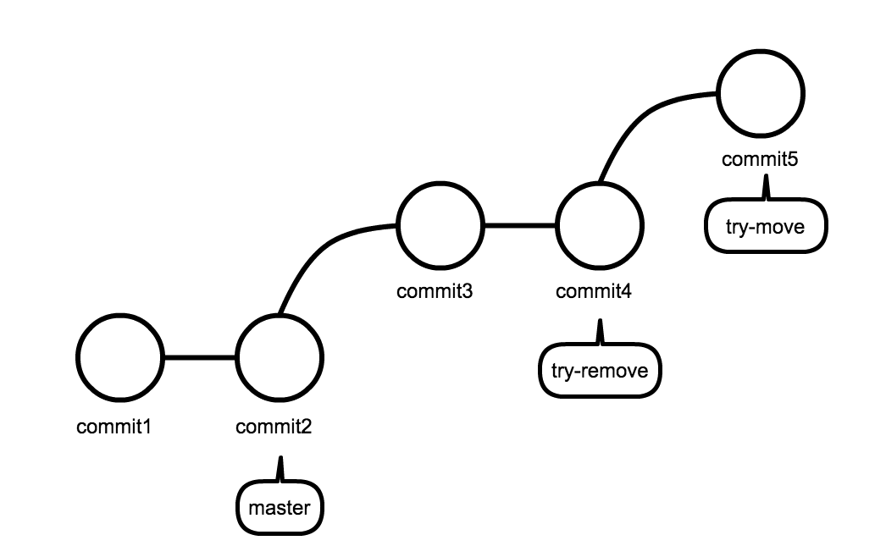
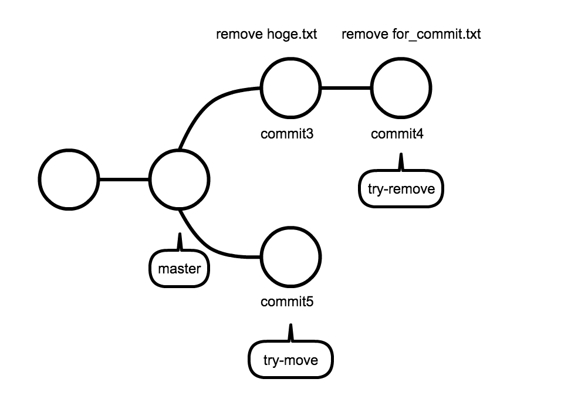

# ファイルの移動

ここでは、ファイルを移動するためのコマンド `git mv` について学ぶ。

# 準備

まずは、`git mv` コマンドの練習用に branch を作成する。現在のブランチが `try-remove` の場合、`git branch` コマンドでブランチを作成すると、`try-remove` ブランチから派生したブランチになってしまう。



この場合、`try-remove` のコミットが混ざってしまう。



ブランチからブランチを派生させた方が好ましい場合もあるが、通常は目的別に `master` ブランチからブランチを派生させた方が「なぜその編集を行ったのか」が明確になる。そのため、`master` ブランチからブランチを作成する。
`master` ブランチに移動した後にブランチを作成することでもできるが、以下のように指定したブランチからブランチを作成することもできる。

`$ git branch <作成したいブランチ名> <ブランチ元>`

上記は以下と同義。

`$ git checkout <ブランチ元>`  
`$ git branch <作成したいブランチ名>`

以下のように、ブランチ元を指定しない場合には、現在のブランチから新しいブランチが作成されるというパターンを覚えておいて欲しい。

`$ git branch <作成したいブランチ名>`

# ミニ演習

`master` ブランチから `try-move` ブランチを作成せよ



> Hint : この際にも、`git checkout -b` は使用できる

以下のコマンドを入力し、出力が同様ならば成功

`$ git branch `

```
  master
* try-move
  try-remove
```

`$ ls`
master ブランチからブランチを作成したので、ファイルが残っている。もし、`try-remove` からブランチを作成していると、ここでファイルは何も表示されない。

```
for_commit.txt  hoge.txt
```

--

> Tips : 一つ前に居たブランチに戻るには `$ git checkout -`
> `-` マイナスなので、一つ前に戻るイメージを持つといい

# ファイルの移動 `mv` コマンドを試す

以下、`mv` コマンドと `git mv` コマンドの違いを確認する。

新しいディレクトリを作成する

```
$ mkdir tmp
```

> Tips : `tmp` は `temporary` の略で、「一時的な」という意味がある

```
$ mv hoge.txt tmp/
$ ls tmp/
```

```
hoge.txt
```

`$ git status`

```
On branch try-move
Changes not staged for commit:
  (use "git add/rm <file>..." to update what will be committed)
  (use "git checkout -- <file>..." to discard changes in working directory)

  deleted:    hoge.txt

Untracked files:
  (use "git add <file>..." to include in what will be committed)

  tmp/
```

```
$ git add hoge.txt
$ git add tmp/
$ git status
```

```
On branch try-move
Changes to be committed:
  (use "git reset HEAD <file>..." to unstage)

  renamed:    hoge.txt -> tmp/hoge.txt

```

> renamed

path が変わることを、名前の変更とみなしている。 commit して終わり。

`$ git commit -m "move hoge.txt in tmp dirctory"`

# `git mv` コマンドを試す

まず同じ手順を行うために、先ほどの変更をリセットする。

`$ git log`

```
commit 96a83129d2917a3c01235c4ec73087bd7371bd52
Author: yutakakinjyo <yutakakinjyo@gmail.com>
Date:   Sun Apr 19 05:26:33 2015 +0000

    move hoge.txt in tmp dirctory

commit 1d57efd3de77ed03e525c0792c98c75ca6287be4
Author: yutakakinjyo <yutakakinjyo@gmail.com>
Date:   Wed Apr 15 16:04:28 2015 +0000

    add for_commit.txt

commit 2d08bf631566bccb0dd9ee0395502f4eabbfcbf5
Author: yutakakinjyo <yutakakinjyo@gmail.com>
Date:   Sat Apr 18 23:15:33 2015 +0000

    write contents

commit 87fa83f6c8111dc2415255bae43320504f34e0d8
Author: yutakakinjyo <yutakakinjyo@gmail.com>
Date:   Wed Apr 15 14:58:12 2015 +0000

    my first commit

```

```
$ git reset --hard 1d57efd3de77ed03e525c0792c98c75ca6287be4
$ mkdir tmp
$ git mv hoge.txt tmp/
```

```
On branch try-move
Changes to be committed:
  (use "git reset HEAD <file>..." to unstage)

  renamed:    hoge.txt -> tmp/hoge.txt
```

`mv hoge.txt tmp/` と `git add hoge.txt` と `git add tmp` を同時に行っていることがわかる。


`$ git commit -m "move hoge.txt in tmp dirctory"`

再度コミットして終わり

# まとめ

ファイルの移動をするには

1. `mv <ファイル名> <移動先>`
- `git add <ファイル名>` delete を commit する
- `git add <移動先>` 移動先を commit する
- `git commit -m "コミットメッセージ"`

--

以下の2つのコマンドを使って `tmp/fuga.txt` を `tmp/hoge.txt` に変更し、その変更をコミットせよ

- `git mv`
- `git commit`

# 演習3

1. git reset を使い、ブランチ作成時の状態に戻せ
- 以下の３つのコマンドを使って `hoge.txt` を `tmp/hoge.txt` に変更せよ。この時 `git add` 後に `git status` でステータスが `renamed` になっていること確認せよ。


- `cp`
- `rm`
- `git add`
- `git commit`
