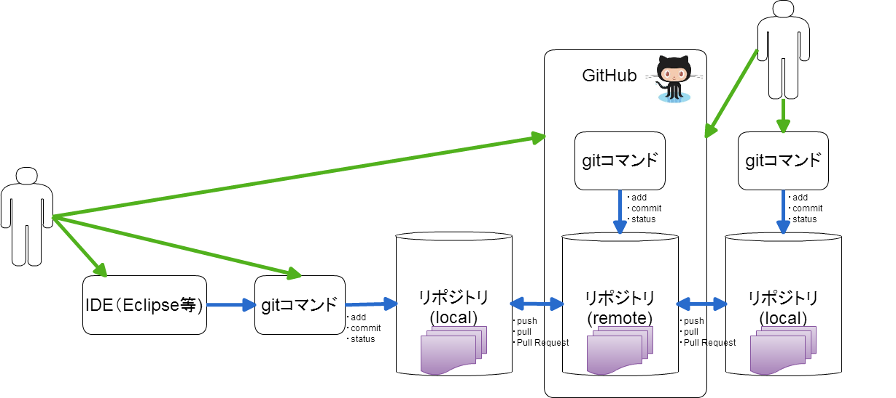

# Git

- [目標](goal.md)
- [バージョン管理を考える](intro_version.md)
- [Git 導入 ~ 初めてのリポジトリ作成 ~](intro_git.md)
- [ファイルのコミット](vc_file.md)
- [バージョン操作](reset_version.md)
- [branch 操作](branch.md)
- [コンフリクト解決](conflict.md)
- [ファイルの削除](git_rm.md)
- [ファイルの移動](git_mv.md)
- [stash 操作](git_stash.md)
- [reset の種類](kind_of_reset.md)
- [HEAD について](git_head.md)
- [Git によるデバック方法 〜バイナリサーチでバグを探す〜](git_bisect.md)
