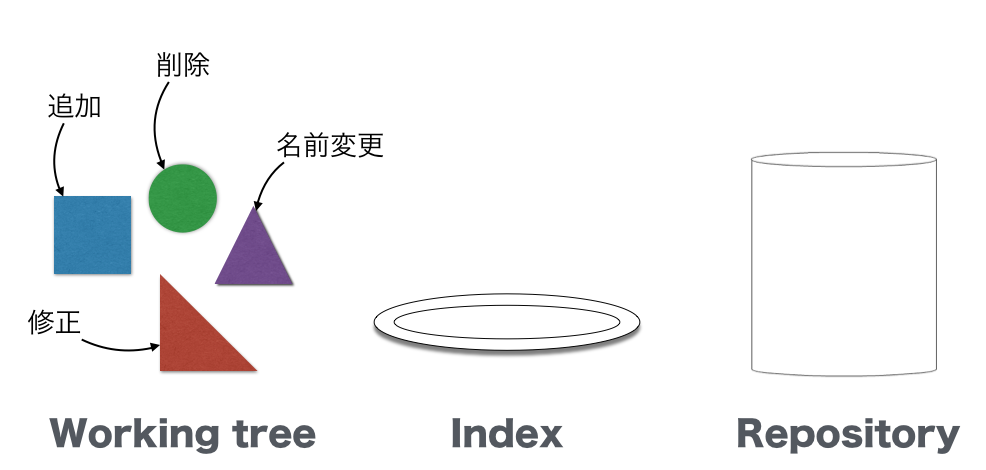
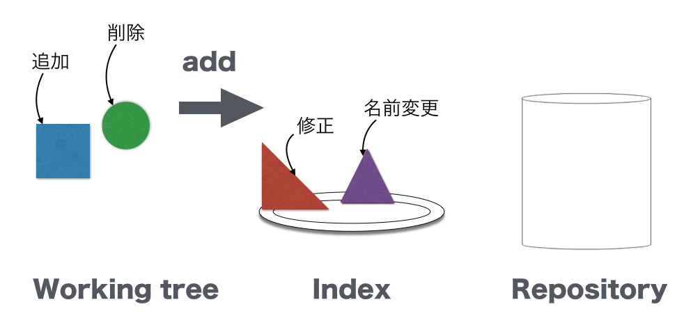
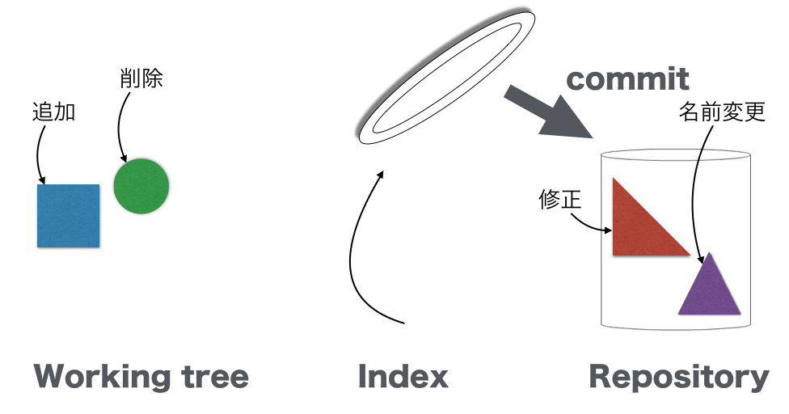

### ファイルをコミットしバージョン管理する

リポジトリを作成し、そのディレクトリ内でファイルを作成、保存をしただけでは、自動でバージョン管理はされない。
バージョン管理を行うには、リポジトリに対してファイルの変更を`commit`(コミット)する。

> commit は「反映させる」というニュアンスを持つとよい。

ファイルの「変更」を commit することについて詳しく説明する。

リポジトリに commit するには、二つの Git コマンドを使用する

- `git add`
- `git commit`

`git add` と `git commit` コマンドは３つの領域を移動するために使う

```
Working tree -- add --> Index -- commit --> Repository
```

Git では「変更」に三つの領域がある

- Working tree : 変更がファイル上だけでしか行っていない状態
- Index (Staging area) : 変更が commit される候補として選ばれた状態
- Repository : 変更が commit された状態


  

  




Repository に commit された状態でなければ、変更は管理されない

「変更をリポジトリに commit する」とうことが、「バージョンが管理される」と考えていい

例えば

> 先輩社員「このファイルはバージョン管理されているの？」
>


と聞かれた場合には、そのファイルの変更が Repository に commit されていれば、

> 「はい、管理されています」

commit されていなければ、

> 「いいえ、管理されていません」

と答えるとよい


> Tips : 変更とは
- ファイルの作成
- ファイルの削除
- ファイルの内容修正
- ファイルの名前変更

> といように情報が変わる全てのことを指している

### ファイルを作成し、バージョン管理の対象にする

作成したリポジトリ(ディレクトリ)の中に移動  
`$ cd ~/first_repo`  
内容が空の `hoge.txt` ファイルを作成  
`$ touch hoge.txt`

> touch コマンドは既にファイルが存在している場合には、タイムスタンプ(更新日付)を新しくし、存在しないファイルが指定された場合には、中身が空のファイルを作成するコマンド
> See also `man touch`

現在のリポジトリの状態を確認するコマンドを入力する
`$ git status`

```
On branch master

Initial commit

Untracked files:
  (use "git add <file>..." to include in what will be committed)

  hoge.txt

nothing added to commit but untracked files present (use "git add" to track)
```

## ミニ演習

`$ git status`

の結果について、意訳せよ。

---

> Untracked files

track は 追跡という意味があるので、バージョン管理で追跡していない(管理していない)ファイルを示す。
つまり、hoge.txt はバージョン管理に追加されていない状態を示す。

> Tips : git status コマンドは現状を確認するための強力なコマンドである。Git操作に迷ったらとりあえず git status コマンドを打ってみることにしよう。

## インデックスに追加

次に `hoge.txt` をインデックス領域に追加する。( インデックス領域はステージング領域とも呼ばれる )。Working tree 上にだけあるファイルの変更を `git add <ファイル名>` を使ってインデックスに追加する。

### ミニ演習

1. `git add` コマンドを使って、新規作成した `hoge.txt` をインデックスに追加せよ。  
- 成功し、`git status` コマンドを使用すると、以下のような結果になることを確認せよ。
- 結果を意訳せよ。

`$ git status`  

```
On branch master

No commits yet

Changes to be committed:
  (use "git rm --cached <file>..." to unstage)

        new file:   hoge.txt

```

> Changes to be committed:

commit される段階になったファイルの一覧を示すメッセージ。
つまり、hoge.txt はステージング領域に置かれ、commit される候補に選ばれた状態になっている

## ファイルにコミット

いよいよ、リポジトリに「変更」を commit する。commit するには  
`$ git commit -m "<コミットメッセージ>"`  
コマンドを使う。またオプションなしの  
`$git commit` を実行するとエディタが立ち上がってコミットメッセージをエディタで書くことができる。しっかりとコミットメッセージを書くときはエディタを使う。

> Tips : 立ち上げるエディタは以下のコマンドで変更できる。
>
> vi の例
> `$ git config --global core.editor vi`

### ミニ演習

- `hoge.txt` をインデックスに追加したので、その変更をリポジトリに commit せよ。コミットメッセージはなんでもよい。
- 成功すると以下のような結果が出力される。以下の例では `my first commit` をメッセージとして登録している。

```
[master (root-commit) d26bc8f] my first commit
 1 file changed, 0 insertions(+), 0 deletions(-)
 create mode 100644 hoge.txt
```

commit する際には、かならず commit message が必要になる。commit message を付けない場合には、その commit はキャンセルされる

## 変更の履歴の確認方法

commit の履歴を以下のコマンドで確認することができる。

`$ git log`

```
commit cf8aea8d002b615783f78fd2f884e1f05796ab9f
Author: yutakakinjyo <email@sample.co.jp>
Date:   Sun Mar 29 00:54:02 2015 +0900

    my first commit
```

> Tips : git log コマンドは git status コマンド同様、現状を確認するための強力なコマンドである。Git操作に迷ったらとりあえず git log コマンドを打ってみることにしよう。

## Git の管理下にあるファイルの一覧を確認する

以下のコマンドで commit されているファイル名の一覧がみれる。

`$  git ls-files`

結果が以下になれば、成功

```
hoge.txt
```

## もう一度状態を確認する


`git commit` が成功した時点で `git status` の結果は以下になる。

```
On branch master
nothing to commit, working directory clean
```

## まとめ

- ファイルの作成とリポジトリへの追加
  - `touch <ファイル名>` ファイルを作成 
  - `git add <ファイル名>` ファイルをステージング領域に追加 
  - `git commit -m "<コミットメッセージ>"` ファイルをリポジトリにコミット 
- git の確認方法
  - `git status` 状態確認
  - `git log` commit log (変更の履歴) の確認
  - `git ls-files` Git 管理下にあるファイル一覧確認

hoge.txt ファイルはリポジトリに commit (関係させる) され変更が管理(追跡)されるようになった。

> Tips : Working tree は始め、何のファイルも無い状態から、`touch` コマンドによって、新規のファイルが出来上がる**変更**が加わった。この「ファイル新規作成の変更」に対して、`git add`, `git commit` を行っている

hoge.txt を再編集し、その編集を再度 commit する場合も手順は同じ。

> 一度 `git add` したファイルは次回から `git add` する必要はないと考えてしまうかもしれないが、毎回必要な手順である。
`add` というのは、リポジトリに `add` ではなくて、ステージング領域へ追加(つまり、`commit` 対象とする) という意味である。

### 演習1

リポジトリの作成と、ファイルの commit の演習

1. ホームディレクトリに `second_repo` という名前のディレクトリを作成する
- そのディレクトリを Git のリポジトリとする
- そのディレクトリ内で `fuga.txt` ファイルを新規作成し、リポジトリに commit する
  - commit message はなんでも良い

### 演習2

すでにあるリポジトリの中で新たにファイルを作成し、 commit する演習

1. 続けて`piyo.txt` ファイルを新規作成し、リポジトリに commit する
  - commit message はなんでも良い

> Hint :
- 必要なコマンドは全てこれまでの説明で紹介されている
- エラーが出た場合には、エラーメッセージをよく読むとヒントが多くある


演習1,2が成功すると以下のような結果になる

`$ pwd`
```
/<それぞれのパス>/second_repo
```

`$ ls`
```
fuga.txt	piyo.txt
```

`$ git log`
> commit message は各々が入力したもの


```

commit 795aa4e143a796e3fb938f42d66b2dbd0b1dc22c
Author: yutakakinjyo <yutakakinjyo@gmail.com>
Date:   Sun Mar 29 02:35:05 2015 +0900

    add piyo.txt

commit 649d1da5664af0e7753273f32e8a560f502bccaa
Author: yutakakinjyo <yutakakinjyo@gmail.com>
Date:   Sun Mar 29 02:27:22 2015 +0900

    add fuga.txt
```

`$ git ls-files`  
> `git ls-files` コマンドはカレントディレクトリ以下の git で管理されているファイルを一覧表示する

```
fuga.txt
piyo.txt
```

### 演習3

複数のファイルを作成し、一部のファイルだけを選択して　commit する演習。

1. さらに続けて `foo.txt`, `bar.txt` という名前のファイルを作成する。(作成するだけ)
2. `foo.txt` だけを `add` し、`commit` する

うまくいくと以下の結果になる。

`$ git status`

```
Untracked files:
  (use "git add <file>..." to include in what will be committed)

	bar.txt

nothing added to commit but untracked files present (use "git add" to track)
```

`$ git ls-files`

```
foo.txt
fuga.txt
piyo.txt
```

## Mini Quiz1

以下の３つの領域とその状態の説明をそれぞれ結びつけよ

- 領域
  - Working tree
  - Index (Staging area)
  - Repository
- 状態の説明
  - 変更が commit された状態
  - 変更がファイル上だけの状態
  - 変更が commit される候補として選ばれた状態

## Mini Quiz2

`git status` で以下の結果から読み取れる状況の説明を、選択せよ。

```
Untracked files:
  (use "git add <file>..." to include in what will be committed)

	bar.txt

nothing added to commit but untracked files present (use "git add" to track)
```

1. bar.txt は Repository に commit された状態
- bar.txt は Working tree 上のみに変更がある状態
- bar.txt は Index に add された状態

## Mini Quiz3

`git status` で以下の結果から読み取れる状況の説明を、選択せよ。

```
On branch master
Changes to be committed:
  (use "git reset HEAD <file>..." to unstage)

  new file:   bar.txt

```

1. bar.txt は Repository に commit された状態
- bar.txt は Working tree 上のみに変更がある状態
- bar.txt は Index に add された状態

## Mini Quiz4

`git status` で以下の結果から読み取れる状況の説明を、選択せよ。

```
On branch master
nothing to commit, working directory clean
```

1. commit するべき変更がない状態
- Working tree 上に変更がある状態
- Index に add された状態
