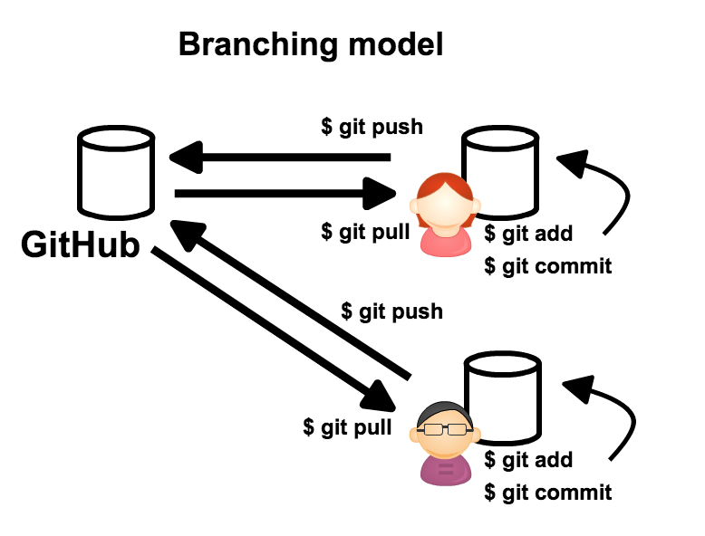
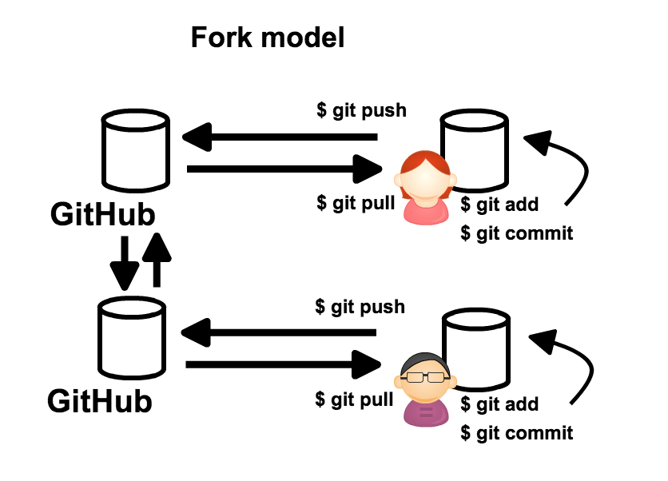

# 初めてのコラボレーション

GitHub上で複数人で共有しながら情報に変更を加えるやり方には二通りある。

- Forking model
- Branching model




今回は Branching model について解説する

## コラボレータに追加

Branching model を行うには、自分のリポジトリに他の人を  Collaborator(協力者) として登録する必要がある。

1. リポジトリのページの右側の `Settings` をクリック
- 左側の `Collaborators` をクリック
- フォームに隣の人の GitHub account 名を入力
- `Add collaborator` をクリックして、collaborator に追加する :warning: 誤って違う人を追加しないように注意しよう

## 隣の人のリポジトリに commit し push

### ミニ演習1

以下のように `HelloGitHub.txt` に変更を加え commit せよ

```
$ cd ~/other_repo
$ vi HelloGitHub.txt
$ cat HelloGitHub.txt
```

```
My first Collaborate.
```

続いて変更をリモートリポジトリに push せよ。以下のコマンドで push できる。

`git push <リモートリポジトリ名> <ブランチ名>`

> Hint : リモートリポジトリ名は clone した場合デフォルトで `origin` になる

その後変更が push できたか確認せよ

### ミニ演習2

その後自分のリポジトリ(first_repo)に戻り以下のコマンドを実行せよ

```
$ git pull
$ cat HelloGitHub.txt 
```

```
My first Collaborate.
```

と表示されることを確認せよ

> :warning: master ブランチに変更が push されたので、確認する際には現在いるブランチに注意せよ
