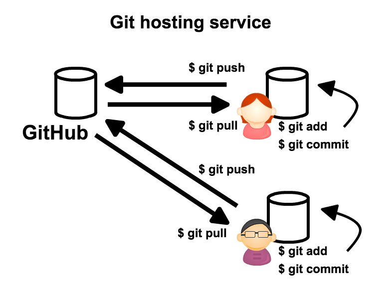

# Git リポジトリは増える

`Git` は `分散バージョン管理`という特徴を持っている。
`Git` のリポジトリは `clone(複製)` することができる。`git clone <リポジトリのパス>`　コマンドを使用する。


`clone` した後は、`sync` (同期)することができる。それには主に２つのコマンドを使う

- `git pull`
- `git push`

`git pull` は `clone` 元の変更を取り込む。
`git push` は `clone` 元に変更を送る。

`clone` したリポジトリのことを `ローカルリポジトリ` といい、他のリポジトリのことを `リモートリポジトリ` と呼ぶ。


# Git をホスティングするサービス **GitHub**

GitHub は Git のリポジトリをホスティングするサービス。
まず GitHub に共有するためのリポジトリを初期化する。


その後、GitHub にホスティングしたリポジトリを介して、情報を共有する。



# 初めての GitHub リポジトリを作成

GitHub :octocat: https://github.com/ にアクセスして、リポジトリを作成する。リポジトリには２つの種類がある

- public : 公開されるが無料
- private : 無制限のプライベートリポジトリに加え、プライベートリポジトリで最大3名までの共同作業者がサポートされる

今回は public を作成する。

**手順**

1. ページの右上にある `+` ボタンを押して、`New repository` を選択
- Repository name に `first_repo` を書き込む ( Repository name は必須 )
- Description は説明という意味がある。リポジトリの説明を書きたいときに書く。後に変更もできる。
- public を選択
- `Initialize this repository with a README` はチェックしない
- `Add .gitignore` は `None` のまま
- `Add license` も `None` のまま
- 最後に `Create Repository` ボタンを押して、リポジトリを作成する。( GitHub 上にリポジトリが作成される)

# 初めての git push

## 下準備

SSH の公開鍵を登録する。

```
$ ssh-keygen -t rsa -C <GitHub に登録したメールアドレス>
$ ls ~/.ssh
```

以下の２つのファイルが作成できていれば成功

```
id_rsa  id_rsa.pub
```

`$ cat ~/.ssh/id_rsa.pub`

> :warning: id_rsa ではなく id_rsa.pub を指定せよ

1. 出力された結果をコピーする
- GitHub のページの右上にある、アカウントのアイコンから[Settings](https://github.com/settings/profile)を選択しクリック
- 左側にある `SSH and GPG keys` をクリック
- 右上の `New SSH key` をクリック
- `Title`フォーム はいれない
- `Key`フォーム にコピーしたキー情報を貼り付ける
- `Add SSH key` をクリック 


## 作成したリポジトリに push する

現在は、GitHub 上に空のリポジトリを使っただけの状態なので、中身を push する。


push する前に、ローカルリポジトリにリモートリポジトリの名前と場所を教える必要がある。以下のコマンドで登録することができる。リモートリポジトリは複数登録できる。

`$ git remote add <リモートリポジトリ名> <クローンパス>`

現在登録されているリポジトリの一覧は以下のコマンドで確認できる

`$ git remote` 

登録を削除したい場合には、以下のコマンドを使用する

`$ git remote remove <リモートリポジトリ名>`


### ミニ演習1

- リポジトリのトップページから SSH の `clone URL` をコピーせよ
- Linux に戻り以下のコマンドを実行せよ

```
$ cd ~/first_repo
$ git remote add origin <コピーしたリポジトリのSSH パス>
```

---

ローカルリポジトリの変更をリモートリポジトリに push(反映) するには `git push` コマンドを使用する。push する際には、リモートリポジトリ名とブランチ名を指定する

`$ git push <リモートリポジトリ名> <ブランチ名>`

### ミニ演習2

変更をリモートリポジトリへ push せよ

- 以下のコマンドを実行する

```
$ git push -u origin master
```

origin と名付けたリモートリポジトリに対して、ローカルリポジトリにある `master`ブランチを push する。
`-u` オプションはローカルリポジトリの`master`ブランチからみて、リモートリポジトリは`origin`リポジトリであるということを登録している。次回から引数なしでも `master`ブランチで `push` する際には、自動的に `origin` に向けて `push`される。

> Are you sure you want to continue connecting (yes/no)?  と聞かれたら yes と入力して Enter

以下のように出力された成功

```
Counting objects: 17, done.
Compressing objects: 100% (11/11), done.
Writing objects: 100% (17/17), 1.46 KiB | 0 bytes/s, done.
Total 17 (delta 1), reused 0 (delta 0)
To git@github.com:yutakakinjyo/first_repo.git
 * [new branch]      master -> master
Branch master set up to track remote branch master from origin.
```

### ミニ演習3

GitHub のリポジトリページに行き push が正しく行われたことを確認する

- `commits` をクリックして、ローカルリポジトリでの　`$ git log` の結果と同一であることを確認せよ

変更して push する

- `HelloGitHub.txt` という名前の空ファイルを新規作成し、commit せよ。
- この時点ではリモートリポジトリでは変更が反映されていないことを確認せよ。
- `$ git push` で変更を push せよ
- 変更が反映されたことを確認せよ

## git clone

リモートリポジトリをローカルリポジトリとして clone するには

`git clone <リポジトリのパス> <ディレクトリ名>`　

を指定する。`<ディレクトリ名>` は好きなものを指定できる。指定しない場合にはリポジトリ名と同一のディレクトリ名になる。

#### ミニ演習

隣の人のリポジトリを clone せよ。  
またリポジトリ名と既存のディレクトリ名が同一なので、`other_repo` というディレクトリ名を指定せよ

```
$ cd ~/
$ git clone <リポジトリのパス> <ディレクトリ名>
```

## git pull

一度 `clone`したリポジトリで、その後リモートリポジトリの変更を取り込みたい場合には `git pull` コマンドを使う。

`$ git pull <リモートリポジトリ名> <ブランチ名>`

`clone` した時点で、`master` ブランチには リモートリポジトリ先が登録されているので、引数は不要。  
各ブランチに登録されているリモートリポジトリを見るには 

`$ git branch -vv`

コマンドで確認できる。では変更を加えて `pull` を試してみる。

### ミニ演習

> `git push` の前に `git config --global push.default simple` を実行せよ

1. `first_repo` リポジトリに戻り、`pull_test.txt` ファイルを作成せよ
- `pull_test.txt` を commit し、その変更を push せよ
- `other_repo` に移動し、`$ git pull` コマンドを試せ
- `ls` を試し、`pull_test.txt` ファイルが増えていることを確認せよ
- `git log` でコミット履歴も確認せよ
- GitHub :octocat: のリポジトリページに行き、`commits` も確認せよ 

# まとめ

リポジトリの複製と同期

- `git clone` リポジトリをローカルに複製する
- `git pull` clone 元の変更を取り入れる
- `git push` clone 元に変更を送る

`Git` のリポジトリには 

- `ローカルリポジトリ` 
- `リモートリポジトリ`

という２つのリポジトリの種類がある。
