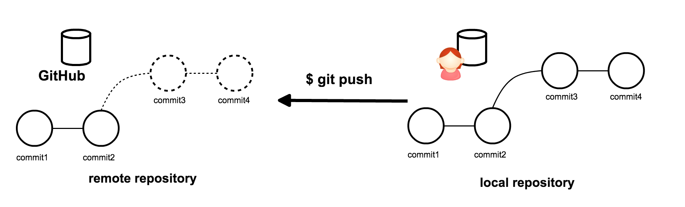
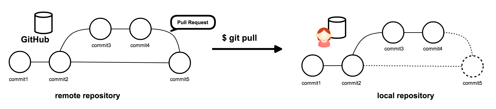

# 最高の機能 Pull Request をためして見る

## branch を切って push する



- `update-file` ブランチを作成し、ファイルを以下のように変更し、commit し push する。

```
$ cd ~/other_repo
$ git checkout -b update-file
$ vi hoge.txt 
$ git diff
```

```diff
diff --git a/hoge.txt b/hoge.txt
index a32d114..adde864 100644
--- a/hoge.txt
+++ b/hoge.txt
@@ -1,3 +1,4 @@
 File is changed.
 File is changed by master
 File is changed by try-conflict
+File is changed by Collaborator
```

```
$ git add hoge.txt
$ git commit -m "modify hoge.txt"
```

```
$ git branch
  master
* update-file
```

```
$ git push origin update-file 
```

```
Counting objects: 3, done.
Compressing objects: 100% (3/3), done.
Writing objects: 100% (3/3), 298 bytes | 0 bytes/s, done.
Total 3 (delta 2), reused 0 (delta 0)
To git@github.com:yutakakinjyo/first_repo.git
 * [new branch]      update-file -> update-file
```

## Pull Request を作成する

1. パートナーのGitHub上のリポジトリトップページにいく
- `Compare & pull reqeust` のボタンをクリックする
- `Create pull request` のボタンをクリックする

これはパートナーのリポジトリに対して自分が変更した内容の取り込み(マージ)依頼を出している。依頼が出せたらパートナーの依頼をチェックし、マージする。

## Pull Reqeust を merge する

パートナーに出してもらった Pull Request を取り込む。

1. 自分のリポジトリのトップページに移動する
- 右側にある Pull Request のリンクをクリックする
- Pull Request の一覧が表示されるので、`modify hoge.txt` を選択する。
- commit 履歴をクリックして、変更を内容を確認する。( スペルミス等はないか。あったらもう一度 commit してもらおう )
- `Merge pull request` ボタンを押す
- `Confirm merge` ボタンを押す
- `Delete branch` を押す

基本的に merge したらブランチを削除する。削除はマージした人が行う。

> Tips : 一時的な目的のために作られるブランチのことを topic branch と呼ぶ。



## まとめ

`Pull Request` は「変更の取り込み依頼」。

- まず `master` ブランチをメインのブランチと捉える。
- メインのブランチに直接変更を加えずに、一旦別のブランチに変更を行う。
- メインのブランチに別ブランチの変更を merge する際に、レビューが行える。

つまり、Pull Request は変更を一旦安全な領域に置いて、本番の領域へ取り込む際に入念なチェックを行うことができる。この機能を開発のフローに使うことで、安全にコードを変更する。
